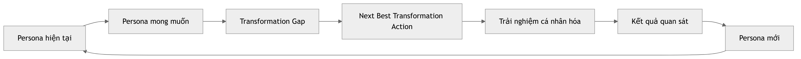
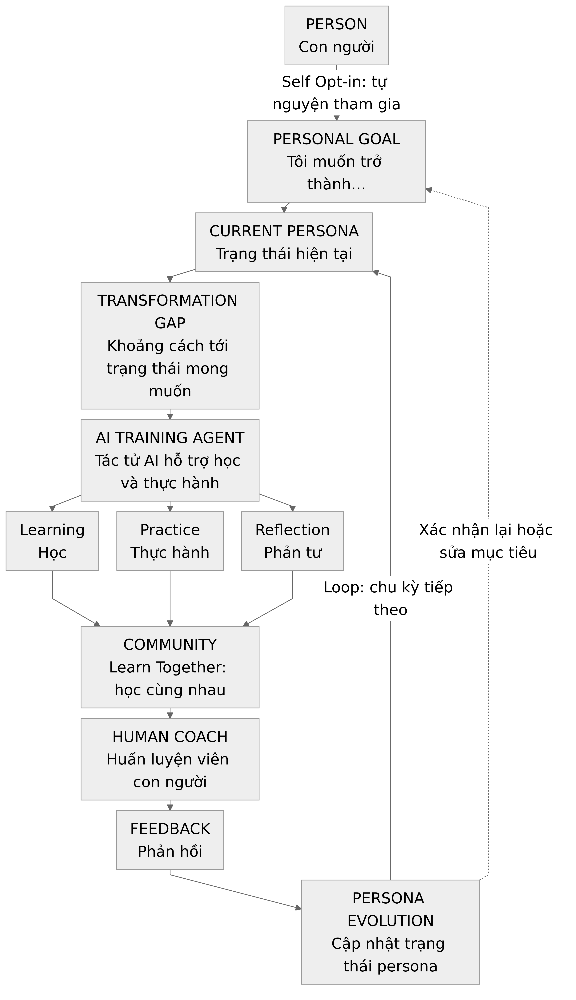
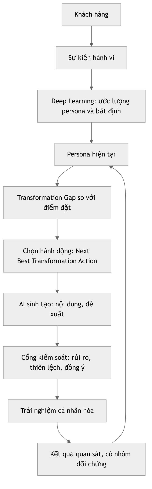
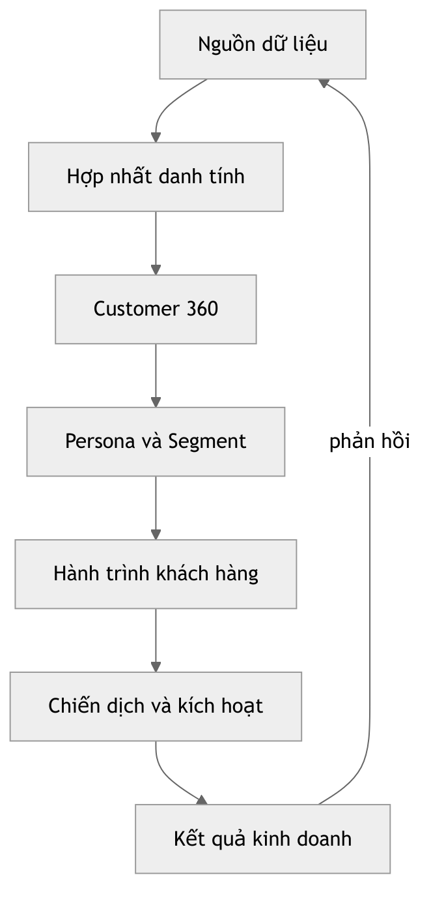

## Tóm tắt

Cá nhân hóa dựa trên trí tuệ nhân tạo (AI) cho phép khai thác dữ liệu hành vi để ước lượng trạng thái, tạo trải nghiệm phù hợp và liên tục điều chỉnh tương tác. Tuy nhiên, việc chỉ tối ưu lượt nhấp, đăng ký hay mua hàng có thể bỏ qua câu hỏi quan trọng hơn: một người hiện đang ở trạng thái nào, muốn trở thành ai và cần được hỗ trợ ra sao để thực hiện mục tiêu đã chọn?

[](/LEO-CDP/leo-customer360/blob/main/docs/research-papers/kotler_jung_einstein.png){width=95%}

Bài báo đề xuất **Persona as a Vector**, một khung lý thuyết về cá nhân hóa hướng chuyển hóa trong Marketing 8.0. Persona được biểu diễn bằng một **vector trạng thái nhiều chiều**, phụ thuộc thời gian, ngữ cảnh và độ bất định, thay vì một nhãn phân đoạn cố định hay mô tả đầy đủ về con người. **Current Persona** là trạng thái hiện tại được ước lượng; **Desired Persona Vector** là trạng thái mong muốn do người tham gia xác nhận; **Transformation Gap** là khoảng cách giữa hai trạng thái. Trạng thái mong muốn đóng vai trò **điểm đặt (setpoint)** của một hệ điều khiển vòng kín, không phải lực hút vật lý hay chuẩn mực chung áp đặt cho mọi người.

Luồng cốt lõi bắt đầu từ **sự tự nguyện tham gia (Self Opt-in) và mục tiêu cá nhân**, rồi mới ước lượng persona hiện tại và xác định khoảng cách cần hỗ trợ. Tác tử AI đề xuất **Next Best Transformation Action (NBTA)** thông qua học, thực hành và phản tư; cộng đồng tạo điều kiện đồng hành, còn giáo viên, người hướng dẫn hoặc huấn luyện viên bổ sung phán đoán và giám sát của con người. Phản hồi cập nhật persona, độ bất định và kế hoạch cho chu kỳ tiếp theo. Người tham gia giữ quyền sửa mục tiêu, từ chối đề xuất hoặc dừng hành trình.

Về kỹ thuật, **Deep Learning** và cập nhật Bayes hỗ trợ ước lượng trạng thái cùng độ bất định; **Persona Conversion Scoring** đo mức sẵn sàng thực hiện một hành động được định nghĩa rõ; **Generative AI** tạo nội dung, lời giải thích và trải nghiệm phù hợp với trạng thái và mục tiêu. PCS là điểm thô, không mặc nhiên là xác suất chuyển đổi; diễn giải xác suất cần hiệu chuẩn và kiểm định. Phân đoạn bằng tác tử, cổng kiểm soát và nhóm đối chứng hỗ trợ lựa chọn, giám sát và đánh giá tác động của can thiệp trong vòng phản hồi:

{width=95%}

Khung được minh họa bằng **bốn ca thuộc bốn lĩnh vực**. Trong **giáo dục**, người học chuyển từ chủ yếu xem nội dung sang thực hành, tự học và tự thực hiện dự án, với nền tảng học tập cá nhân kết hợp AI, cộng đồng và giáo viên hoặc người hướng dẫn. Trong **ngân hàng bán lẻ**, khách hàng hướng từ lo âu tài chính tới hành vi tiết kiệm và sự tự tin tài chính. Trong **bán lẻ**, người mua được hỗ trợ vượt qua do dự bằng thông tin, so sánh và giải thích mức phù hợp để ra quyết định hiểu biết và tự tin. Trong **phòng tập và thể hình**, người có khát vọng nhưng ít vận động được hỗ trợ hình thành thói quen tập luyện đều đặn. Mỗi ca nối persona hiện tại, trạng thái mong muốn, khoảng cách chuyển hóa, NBTA và kết quả cần quan sát; giao dịch hay đăng ký không tự chứng minh năng lực học tập, thay đổi hành vi hoặc sự chuyển hóa.

Các tình huống, vector và dữ liệu đều **tổng hợp, mang tính minh họa**; các ví dụ Python trình bày phép tính và hành vi thuật toán, không phải bằng chứng thực nghiệm về hiệu quả trên người thật. Tiến bộ được xem xét qua mức căn chỉnh, khoảng cách, tốc độ chuyển hóa và giá trị tạo ra, đồng thời phân biệt thay đổi quan sát được với tác động nhân quả của can thiệp. Là một đóng góp khái niệm cho Marketing 8.0 của tác giả, khung mở rộng cách nhìn lấy tâm trí làm trung tâm sang **chuyển hóa có trách nhiệm**: tạo giá trị cho người tham gia, doanh nghiệp và xã hội, tôn trọng quyền tự chủ, tối thiểu hóa dữ liệu và không khai thác điểm yếu để tăng chuyển đổi.

**Từ khóa:** Persona, Customer 360, cá nhân hóa, chuyển hóa, giáo dục, ngân hàng bán lẻ, bán lẻ, thể hình, Deep Learning, Generative AI, điểm đặt, tác tử AI, phân đoạn, Marketing 8.0, Next Best Transformation Action

---

# 1. Giới thiệu

Marketing luôn trả lời một câu hỏi cơ bản: vì sao một người lựa chọn sản phẩm này thay vì sản phẩm khác? Marketing đại chúng trả lời bằng sản phẩm, giá, xúc tiến và phân phối. Các cách tiếp cận sau đó đưa vào phân đoạn, nhắm mục tiêu, quản trị quan hệ khách hàng, hành vi số và cá nhân hóa dựa trên dữ liệu. AI hiện đại mở rộng quá trình này bằng cách dự đoán sở thích, sinh nội dung và tối ưu tương tác ở quy mô từng người.

Cuốn *Marketing 7.0: A Guide for Thinking Marketers in the Age of AI* của Kotler, Kartajaya và Setiawan (2026) nhấn mạnh cách nhìn lấy tâm trí làm trung tâm: hiểu con người suy nghĩ, kết nối và mua sắm ra sao trong thời đại AI. Bài viết này tiến thêm một bước và đặt ra một câu hỏi căn bản hơn:

> **Marketing có thể hiểu không chỉ khách hàng sẽ mua gì, mà còn khách hàng đang là ai, muốn trở thành ai, và thương hiệu có thể hỗ trợ sự chuyển hóa đó một cách có trách nhiệm bằng cách nào?**

Câu hỏi này thay đổi đơn vị phân tích:

$$
\text{Khách hàng là mục tiêu}
\rightarrow
\text{Khách hàng là hồ sơ}
\rightarrow
\text{Khách hàng là persona động}
$$

Phân đoạn truyền thống vẫn hữu ích, nhưng nhãn tĩnh không phản ánh được việc con người thay đổi. Nhu cầu, ý định, giá trị, bối cảnh và hành vi đều thay đổi. Một khách hàng hiện không vận động có thể khao khát trở nên khỏe mạnh. Một người lo âu tài chính có thể muốn trở nên tự tin. Một người mới mua sắm có thể muốn trở thành người tiêu dùng hiểu biết và cân nhắc.

Vì vậy, tiền đề trung tâm của bài là:

$$
\boxed{\text{Persona không chỉ là một nhãn. Persona là một trạng thái đang chuyển động.}}
$$

Tiền đề thứ hai nói về chính sự lựa chọn của người tiêu dùng. Giao dịch thường không phải điểm bắt đầu, mà là hệ quả của một trạng thái nền gồm bản sắc, khát vọng, nhu cầu, ý định và bối cảnh:

$$
\text{Bản sắc / Nhu cầu / Khát vọng / Bối cảnh}
\rightarrow
\text{Ý định}
\rightarrow
\text{Hành vi}
\rightarrow
\text{Lựa chọn}
\rightarrow
\text{Mua hàng}
$$

Từ đó, logic cá nhân hóa thay đổi. Thay vì bắt đầu bằng đề xuất sản phẩm, một hệ thống hướng chuyển hóa bắt đầu bằng persona hiện tại và persona mong muốn, rồi xác định trải nghiệm nào hỗ trợ tốt nhất cho bước kế tiếp:

$$
\boxed{\text{Persona hiện tại}\rightarrow\text{Persona mong muốn}\rightarrow\text{Hành trình chuyển hóa}\rightarrow\text{Sản phẩm / Trải nghiệm}}
$$

Trong bài này, Marketing 8.0 là **một khung đề xuất hướng tương lai**, không phải khẳng định về một ấn bản Marketing 8.0 chính thức. Tiền đề đặc trưng của nó là AI nên được dùng không chỉ để cải thiện dự đoán và chuyển đổi, mà còn để hỗ trợ sự chuyển hóa có ý nghĩa của khách hàng.

**Thuật ngữ cần phân biệt.** "Persona" trong bài này không phải "user persona" của Cooper (1999), tức nhân vật hư cấu đại diện cho một nhóm người dùng trong thiết kế. Nó cũng không đồng nhất hoàn toàn với "persona" của Jung. Ở đây, persona là **trạng thái ước lượng của một cá nhân cụ thể tại một thời điểm**, được mã hóa thành vector.

## 1.1 Persona là gì trong bài báo này?

Có thể hiểu persona bằng một câu hỏi gần gũi: **"Trong hành trình tôi đã chọn, hiện tại tôi đang ở trạng thái nào?"** Một người muốn tập luyện đều đặn có thể có khát vọng mạnh nhưng chưa hình thành thói quen, chưa biết cách bắt đầu và chưa tìm được nhóm đồng hành. Persona mô tả tổ hợp trạng thái đó tại một thời điểm. Sau một thời gian học, thực hành và nhận phản hồi, tổ hợp này có thể thay đổi dù vẫn là cùng một người.

Trong bài báo, **persona là một biểu diễn có giới hạn, được ước lượng từ thông tin liên quan và được phép sử dụng**, không phải toàn bộ con người, chẩn đoán tâm lý hay phán xét về giá trị cá nhân. "Persona như một Vector" nghĩa là mô tả nhiều khía cạnh cùng lúc bằng một danh sách có thứ tự các tọa độ. Vector giúp so sánh các trạng thái và quan sát sự thay đổi; nó không biến con người thành một con số duy nhất.

## 1.2 Các khái niệm cốt lõi và điểm xuất phát của hành trình

Điểm xuất phát không phải là "doanh nghiệp muốn người này mua gì", mà là **một người tự nguyện tham gia (Self Opt-in) và nói rõ "Tôi muốn trở thành…"**. Mục tiêu cá nhân được chuyển thành trạng thái mong muốn thông qua các tiêu chí mà người đó hiểu và xác nhận. Hệ thống sau đó mới ước lượng persona hiện tại, tìm khoảng cách cần hỗ trợ và đề xuất trải nghiệm phù hợp.

| Khái niệm | Cách hiểu trong hành trình của một người |
| --- | --- |
| **Personal Goal** | Mục tiêu do người tham gia chọn; không mặc nhiên là mục tiêu bán hàng |
| **Current Persona** | Trạng thái hiện tại được ước lượng từ tự khai báo và bằng chứng được phép sử dụng |
| **Desired Persona / Setpoint** | Trạng thái đích do người tham gia xác nhận; có thể được sửa hoặc xác nhận lại |
| **Transformation Gap** | Khoảng cách giữa trạng thái hiện tại và trạng thái đích trên các chiều liên quan |
| **AI Training Agent / NBTA** | Tác tử hỗ trợ học và thực hành, đề xuất hành động tiếp theo để giảm khoảng cách một cách có trách nhiệm |
| **Community / Human Coach** | Cộng đồng đồng hành và huấn luyện viên con người, bổ sung hỗ trợ xã hội, phán đoán và giám sát |
| **Feedback / Persona Evolution** | Phản hồi tạo bằng chứng mới để cập nhật trạng thái, mức bất định và kế hoạch cho chu kỳ tiếp theo |

"Training" ở đây chỉ **hỗ trợ người tham gia rèn luyện**, không phải coi con người là đối tượng cần "huấn luyện" theo ý doanh nghiệp, và cũng không đồng nghĩa với huấn luyện trọng số của một mô hình học máy. Học, thực hành và phản tư là ba hoạt động bổ sung nhau: hiểu điều cần làm, thử làm trong hoàn cảnh thực tế và nhìn lại điều đã diễn ra. AI hỗ trợ các hoạt động này, còn người tham gia giữ quyền quyết định mục tiêu, mức chia sẻ dữ liệu và việc tiếp tục hay dừng hành trình.

Trong cách nhìn này, sản phẩm, dịch vụ, cộng đồng và huấn luyện đều có thể là công cụ hỗ trợ. Một giao dịch chỉ là một kết quả có thể xuất hiện, không phải bằng chứng đủ để kết luận rằng persona đã chuyển hóa. Chương tiếp theo dùng một tình huống cụ thể để nối luồng con người này với các thuật ngữ kỹ thuật và công thức của bài báo.

**Cấu trúc bài.** Mục 2 trình bày luồng cốt lõi và tình huống minh họa. Mục 3 trình bày nền tảng lý thuyết. Mục 4-7 xây dựng mô hình vector, khoảng cách, điểm đặt và hành trình. Mục 8-10 gắn ba năng lực AI vào mô hình. Mục 11-14 trình bày vòng điều khiển khép kín, phân đoạn bằng tác tử, chọn hành động và cổng kiểm soát. Mục 15-17 gồm kiến trúc, bốn ca minh họa và chỉ số. Mục 18-21 bàn về đạo đức, giả thuyết, hàm ý và giới hạn. Mục 22 kết luận.

# 2. Luồng cốt lõi: từ mục tiêu cá nhân đến sự tiến hóa của persona

## 2.1 Con người là chủ thể, AI là công cụ hỗ trợ

Luồng dưới đây đặt **con người và mục tiêu tự chọn** ở đầu hành trình. Desired Persona không phải một bước do AI tự áp đặt: đó là cách biểu diễn mục tiêu cá nhân thành trạng thái đích đã được người tham gia xác nhận. Tác tử chỉ bắt đầu đề xuất sau khi có mục tiêu, bằng chứng về trạng thái hiện tại và sự đồng ý phù hợp.

\clearpage

{height=22cm}

\clearpage

Đường quay lại **Current Persona** thể hiện việc dùng trạng thái mới cho chu kỳ tiếp theo. Đường nét đứt quay lại **Personal Goal** thể hiện quyền sửa hoặc xác nhận lại mục tiêu. Nếu người tham gia rút lại sự đồng ý, vòng hỗ trợ phải dừng theo phạm vi đã thỏa thuận; "Loop" không có nghĩa là hệ thống được phép tác động vô hạn.

Sơ đồ thể hiện luồng phối hợp, không phải yêu cầu mọi hoạt động luôn diễn ra đúng một lần theo thứ tự cứng. Học, thực hành và phản tư có thể đan xen. Huấn luyện viên có thể tham gia ngay khi xác lập mục tiêu hoặc bất cứ khi nào cần rà soát; cộng đồng là một lựa chọn đồng hành, không phải điều kiện bắt buộc để được hỗ trợ.

## 2.2 Tình huống minh họa: "Tôi muốn trở thành người tập luyện đều đặn"

Xét **Minh, một nhân vật hư cấu**, hiện ít vận động nhưng muốn xây dựng thói quen tập luyện. Minh tự nguyện tham gia một chương trình hỗ trợ và nêu mục tiêu: **"Tôi muốn trở thành người tập luyện đều đặn, với lịch phù hợp để có thể duy trì."** Minh cùng huấn luyện viên xác định các tiêu chí thực tế, thời gian rà soát và giới hạn hỗ trợ. Đây là ví dụ giáo dục về mô hình, không phải một phác đồ tập luyện hay kết quả thực nghiệm.

| Bước trong luồng | Điều diễn ra trong tình huống | Ý nghĩa đối với hệ thống |
| --- | --- | --- |
| **Person / Self Opt-in** | Minh chọn tham gia, chọn loại dữ liệu được chia sẻ và có quyền rút lại sự đồng ý | Xác định phạm vi được phép quan sát và hỗ trợ |
| **Personal Goal** | Minh mô tả người mình muốn trở thành, rồi xác nhận tiêu chí cùng huấn luyện viên | Hình thành trạng thái đích $\mathbf{P}^{*}$, không suy ra đích từ doanh thu |
| **Current Persona** | Minh khai báo thói quen, rào cản và mức hỗ trợ hiện có; hệ thống đối chiếu với hoạt động đã ghi nhận | Ước lượng $\hat{\mathbf{P}}_0$ và độ bất định, không gán nhãn "lười vận động" như một đặc tính cố định |
| **Transformation Gap** | Khát vọng cao nhưng hành vi và điều kiện bắt đầu còn yếu | Xác định khoảng cách cần hỗ trợ thay vì chỉ tìm cơ hội bán thẻ thành viên |
| **AI Training Agent** | Tác tử đề xuất nội dung cho người mới và một bước thực hành đã được duyệt, cho phép Minh chọn hoặc từ chối | Chọn NBTA trong phạm vi an toàn và mục tiêu đã xác nhận |
| **Learning / Practice / Reflection** | Minh học cách bắt đầu, thực hành theo kế hoạch được duyệt và nhìn lại điều dễ hoặc khó thực hiện | Thu nhận bằng chứng về hiểu biết, hành vi và rào cản thực tế |
| **Community: Learn Together** | Nếu đồng ý, Minh học cùng nhóm, trao đổi kinh nghiệm và tìm bạn đồng hành | Bổ sung hỗ trợ xã hội; không công khai vector persona hay dữ liệu nhạy cảm |
| **Human Coach** | Huấn luyện viên xem phản hồi, kiểm tra tính phù hợp của đề xuất và điều chỉnh cùng Minh | Cung cấp phán đoán con người; AI không thay thế chuyên môn hay quyền quyết định của Minh |
| **Feedback / Persona Evolution** | Minh xác nhận điều đã làm được, điều chưa phù hợp và mục tiêu có còn đúng không | Cập nhật trạng thái và kế hoạch cho chu kỳ tiếp theo |

Trong tình huống này, câu hỏi cốt lõi không phải "Minh có mua thẻ thành viên không?", mà là **"Minh có hình thành được hành vi và điều kiện hỗ trợ phù hợp với mục tiêu đã chọn không?"** Thẻ thành viên, nội dung học, cộng đồng hay huấn luyện viên chỉ có giá trị khi thực sự hỗ trợ hành trình đó.

## 2.3 Từ câu chuyện tới vector và điểm đặt

Để nối tình huống với mô hình của bài báo, dùng đúng thứ tự bảy chiều $V,B,N,I,E,A,R$ được định nghĩa ở Mục 4. Các tọa độ dưới đây dùng lại ca phòng tập trong Ví dụ 1; **mọi giá trị đều là số tổng hợp do tác giả đặt**, không phải phép đo về một người thật.

$$
\hat{\mathbf{P}}_0=[0.55,\;0.20,\;0.30,\;0.45,\;0.40,\;0.90,\;0.50]
$$

$$
\mathbf{P}^{*}=[0.75,\;0.90,\;0.80,\;0.85,\;0.80,\;0.90,\;0.70]
$$

| Chiều | Cách đọc trong tình huống |
| --- | --- |
| $V$: giá trị | Mức phù hợp giữa mục tiêu tập luyện và các ưu tiên Minh tự xác nhận |
| $B$: hành vi | Mức hình thành hành vi tập luyện liên quan đến mục tiêu |
| $N$: nhu cầu được đáp ứng | Mức đáp ứng các nhu cầu để có thể bắt đầu và duy trì |
| $I$: ý định | Mức sẵn sàng thực hiện bước đã chọn |
| $E$: cảm xúc / tự tin | Ước lượng có giới hạn về sự tự tin; không phải chẩn đoán và không được dùng để gây áp lực |
| $A$: khát vọng | Mức rõ ràng và mạnh của mong muốn trở thành người tập luyện đều |
| $R$: hỗ trợ xã hội | Mức hỗ trợ Minh tự chọn từ gia đình, bạn bè hoặc cộng đồng |

Một **vector** là danh sách tọa độ có thứ tự: $B=0.20$ và $A=0.90$ nói rằng trong ví dụ, khát vọng mạnh nhưng hành vi còn yếu. Giá trị $0.20$ không mặc nhiên là xác suất 20% hay tỷ lệ hoàn thành 20%. Việc biến quan sát thành tọa độ cần tiêu chí đo lường, cách chuẩn hóa và kiểm chứng riêng cho từng lĩnh vực.

**Không gian persona** là không gian các tổ hợp tọa độ có thể có. **Quỹ đạo persona** là chuỗi trạng thái của cùng một người theo thời gian. **Điểm đặt (setpoint)** là trạng thái đích $\mathbf{P}^{*}$ mà người đó xác nhận, không phải lực hút tự nhiên hay chuẩn mực áp dụng cho mọi người. Cùng mục tiêu "tập đều", hai người có thể chọn lịch, mức hỗ trợ và điểm đặt khác nhau.

Sự đồng ý là điều kiện quản trị để sử dụng dữ liệu và đề xuất, **không phải một tọa độ tâm lý**. Mục tiêu cá nhân cũng không thể được suy ra chỉ từ việc người tham gia nhấp vào một quảng cáo. Nếu mục tiêu thay đổi, điểm đặt cần được xác nhận lại trước khi tiếp tục so sánh tiến bộ.

## 2.4 Transformation Gap: khoảng cách không phải phán xét con người

Khoảng cách Euclid đo độ chênh lệch của hai vector bằng cách bình phương từng chênh lệch, cộng lại rồi lấy căn bậc hai. Tuy nhiên, không phải mọi chiều quan sát được đều là chiều hệ thống được phép nhắm vào. Theo mặt nạ ở Mục 6 và cổng kiểm soát ở Mục 14, ví dụ này loại $V$ và $E$ khỏi can thiệp trực tiếp:

$$
\mathbf{M}=[0,\;1,\;1,\;1,\;0,\;1,\;1],\qquad
\mathcal{K}=\{B,N,I,A,R\}
$$

Với $\mathcal{K}$ là tập chiều được phép hỗ trợ, khoảng cách được báo cáo trên tập này:

$$
TG_{\mathcal{K},0}
=\sqrt{\sum_{i\in\mathcal{K}}\left(P_i^{*}-\hat{P}_{i,0}\right)^2}
=\sqrt{0.70^2+0.50^2+0.40^2+0.00^2+0.20^2}
\approx0.970
$$

Chênh lệch ở $B$ là lớn nhất, trong khi chênh lệch ở $A$ bằng 0. Trực giác là **Minh không thiếu khát vọng; Minh cần một bước hành động khả thi và điều kiện hỗ trợ**, không cần bị thuyết phục mạnh hơn để mua hàng. Việc nhìn thấy chênh lệch không tự nó xác định được nguyên nhân hay bảo đảm một can thiệp sẽ có hiệu quả.

Vì ví dụ dùng năm chiều trong $[0,1]$ với khoảng cách Euclid không trọng số, khoảng cách tối đa là $\sqrt{5}$. Điểm căn chỉnh trên cùng tập chiều là:

$$
PAS_{\mathcal{K},0}=1-\frac{TG_{\mathcal{K},0}}{\sqrt{5}}\approx0.566
$$

$TG$ đo khoảng cách còn lại, còn $PAS$ chuẩn hóa mức gần đích. **Cả hai không đo giá trị con người và không phải xác suất chuyển đổi.** Khoảng cách bảy chiều ở Ví dụ 1 là $1.068$; khoảng cách năm chiều ở đây là $0.970$. Hai con số khác nhau vì dùng tập chiều khác nhau, không phải vì dữ liệu bị thay đổi. Các lần đo tiến bộ phải giữ cùng tập chiều, thang đo và điểm đặt.

## 2.5 Từ khoảng cách tới hành động: AI, cộng đồng và huấn luyện viên

Trong luồng này, **Deep Learning** hoặc mô hình suy luận khác giúp ước lượng trạng thái từ dữ liệu được phép sử dụng. **Generative AI** giúp tạo lời giải thích, nội dung học và câu hỏi phản tư phù hợp với trạng thái và mục tiêu. **AI Training Agent** phối hợp các công cụ đó để đề xuất một bước hỗ trợ, còn **NBTA** là hành động tiếp theo được chọn; tác tử và hành động không phải cùng một khái niệm.

Ví dụ, tác tử có thể đề xuất Minh đọc một hướng dẫn ngắn, thực hiện một bước trong kế hoạch được huấn luyện viên duyệt và trả lời "Điều gì khiến bước này khó duy trì?". Ba nhánh **Learning, Practice, Reflection** tạo các loại bằng chứng khác nhau. Việc đọc hướng dẫn không chứng minh đã hình thành thói quen; việc từ chối một đề xuất có thể phản ánh lịch không phù hợp, không mặc nhiên là thiếu ý chí.

**Ngữ cảnh** $\mathbf{C}_t$ mô tả hoàn cảnh như lịch làm việc, thời gian sẵn có hay điều kiện tham gia. **Độ bất định** $\mathbf{U}_t$ mô tả mức chưa chắc chắn của ước lượng. Khi thiếu bằng chứng hoặc đề xuất có rủi ro, hệ thống cần hỏi thêm hay chuyển người duyệt, không tăng cường tác động dựa trên một suy đoán tâm lý.

Trong phương trình động lực ở Mục 6, $a_t$ là bước hỗ trợ đã được chọn; $g(a_t,\mathbf{C}_t)$ mô tả hiệu lực phụ thuộc ngữ cảnh; $\alpha_t$ là cỡ bước và $\lambda$ mô tả mức tiến về điểm đặt trong mô hình. Số hạng $\boldsymbol{\varepsilon}_t$ ghi nhận biến thiên chưa giải thích được, như thay đổi lịch sống hay tác động ngoài chương trình. Các đại lượng này cần được ước lượng và kiểm chứng, không thể đọc trực tiếp từ một hội thoại.

Cộng đồng có thể tạo điều kiện học cùng nhau và cung cấp hỗ trợ ở $R$, nhưng không cho phép hệ thống thao túng quan hệ hay ép công khai tiến bộ. Huấn luyện viên bổ sung phán đoán, kiểm tra tính phù hợp và giúp Minh diễn giải phản hồi. Việc hỗ trợ tự tin không được biến thành khai thác cảm xúc dễ tổn thương; mặt nạ $V,E$ ngăn hệ thống tối ưu trực tiếp vào các chiều này để phục vụ mục tiêu thương mại.

## 2.6 Phản hồi, cập nhật trạng thái và đo tiến bộ

Giả sử sau một tuần, thông tin Minh xác nhận và hoạt động được ghi nhận cho một ước lượng tổng hợp mới:

$$
\hat{\mathbf{P}}_1=[0.55,\;0.40,\;0.45,\;0.60,\;0.40,\;0.90,\;0.60]
$$

Giữ nguyên điểm đặt và tập chiều $\mathcal{K}$, ta có:

$$
TG_{\mathcal{K},1}
=\sqrt{0.50^2+0.35^2+0.25^2+0.00^2+0.10^2}
\approx0.667,\qquad
PAS_{\mathcal{K},1}\approx0.702
$$

**Transformation Velocity** đo khoảng cách giảm được trên một đơn vị thời gian. Với $\Delta t=1$ tuần:

$$
TV_{\mathcal{K},0}
=\frac{TG_{\mathcal{K},0}-TG_{\mathcal{K},1}}{\Delta t}
\approx0.302\;\text{đơn vị khoảng cách/tuần}
$$

Khoảng cách ước lượng giảm và tốc độ dương cho thấy trạng thái trong ví dụ đang tiến về điểm đặt. Đây chỉ là một phép tính minh họa; nó **không chứng minh AI gây ra tiến bộ**, không bảo đảm tuần tiếp theo tiếp tục tiến bộ và cần được diễn giải cùng độ bất định. Để quy gán hiệu ứng cho chương trình, cần thiết kế đánh giá có nhóm đối chứng và ước lượng uplift như Mục 13.1.

**Feedback** là bằng chứng để cập nhật, không chỉ là điểm hài lòng hay một tín hiệu thưởng. Phản hồi có thể xác nhận tiến bộ, chỉ ra rào cản, sửa một ước lượng hoặc cho thấy mục tiêu không còn phù hợp. Bộ lọc Bayes ở Mục 8.1 là một cách kết hợp ước lượng cũ với bằng chứng mới, đồng thời cập nhật độ bất định.

**Persona Evolution** là chuỗi cập nhật của trạng thái ước lượng trong hành trình. Nó không có nghĩa là thuật toán định nghĩa lại con người. Nếu Minh thay đổi mục tiêu, cần thiết lập điểm đặt mới và tách việc đổi mục tiêu khỏi mức tiến bộ đối với mục tiêu cũ. Khi người tham gia chưa muốn tiếp tục hoặc bằng chứng chưa đủ, lựa chọn phù hợp có thể là tạm dừng, hỏi thêm hay chuyển cho huấn luyện viên.

## 2.7 Ý nghĩa đối với cá nhân hóa và Marketing 8.0

Tình huống trên minh họa sự chuyển dịch từ **nhắm vào một người để bán hàng** sang **hỗ trợ một người thực hiện mục tiêu họ đã chọn**. Trong ngân hàng, Learning có thể là học về ngân sách, Practice là thực hiện một bước tiết kiệm đã chọn và Reflection là nhìn lại khả năng duy trì. Trong bán lẻ, ba hoạt động có thể là tìm hiểu, thử sử dụng và đánh giá mức phù hợp. Đây là cách đọc luồng hỗ trợ, không phải quy tắc kinh doanh chung cho mọi ngành.

PCS và xác suất chuyển đổi đã hiệu chuẩn vẫn có thể đo một kết quả thương mại được định nghĩa rõ, nhưng không thay thế $TG$, $PAS$, $TV$ hay mục tiêu tự chọn. Giá trị của chương trình cần được xem xét đồng thời từ kết quả có ý nghĩa cho người tham gia, giá trị doanh nghiệp và tác động xã hội. AI, cộng đồng và huấn luyện viên đều là phương tiện; **con người vẫn là chủ thể của mục tiêu và sự thay đổi**.

Luồng ở chương này mô tả hành trình từ góc nhìn người tham gia. Ca giáo dục ở Mục 15.2 áp dụng cùng ý tưởng vào nền tảng học tập cá nhân: mục tiêu của người học, hoạt động học và thực hành, tác tử AI, động cơ cá nhân hóa, đồ thị học tập và dữ liệu được nối bằng vòng phản hồi dưới sự hướng dẫn của con người.

# 3. Nền tảng lý thuyết

## 3.1 Jung: Persona, Bản ngã (Self) và Cá thể hóa (Individuation)

Carl Jung dùng khái niệm **Persona** để chỉ gương mặt xã hội mà một cá nhân đưa ra khi tương tác với thế giới bên ngoài. Persona của Jung không đồng nhất với toàn bộ con người: danh tính xã hội nhìn thấy được chỉ là một lớp của tổng thể tâm lý sâu hơn.

**Bản ngã (Self)** của Jung chỉ sự toàn vẹn tâm lý, còn **cá thể hóa (individuation)** là quá trình phát triển trong đó các phần có ý thức và vô thức của nhân cách được tích hợp hơn (Jung, 1959). Ý nghĩa với marketing mang tính khái niệm hơn là lâm sàng: danh tính hướng ra ngoài có thể quan sát được, còn cấu trúc sâu tạo ra sở thích, khát vọng và hành vi chỉ quan sát được một phần.

[](/LEO-CDP/leo-customer360/blob/main/docs/research-papers/observed_persona.png){width=95%}

Một hệ thống marketing không bao giờ quan sát toàn bộ con người. Nó quan sát các dấu vết: nhấp chuột, tìm kiếm, mua hàng, hội thoại, vị trí, mức tương tác nội dung, giao dịch, sở thích và thông tin do khách hàng khai báo. Persona vì vậy là một **biểu diễn suy luận**, không phải mô tả đầy đủ về cá nhân.

Điều này dẫn tới giả định lý thuyết thứ nhất:

> **Persona của khách hàng là một xấp xỉ có thể quan sát và mô hình hóa của một trạng thái người sâu hơn và liên tục thay đổi.**

Khung này chủ ý không khẳng định học máy có thể phục hồi toàn bộ con người. Mục tiêu thực dụng hơn: dựng một biểu diễn trạng thái đủ hữu ích để hiểu khách hàng tốt hơn và cá nhân hóa có trách nhiệm hơn.

## 3.2 Từ lực đến trường: Lewin và phép so sánh của Einstein

Tiền lệ gần nhất trong tâm lý học cho cách nhìn "con người là một trạng thái trong không gian có hướng" là **lý thuyết trường (field theory)** của Kurt Lewin (1951), trong đó hành vi là hàm của con người và môi trường, và các mục tiêu tạo ra "lực" có hướng (valence) trong "không gian sống" (life space). Persona as a Vector kế thừa trực tiếp trực giác này và đưa vào đó dữ liệu hành vi, học máy và đo lường.

Lý thuyết tương đối rộng của Einstein (1916) tái định nghĩa hấp dẫn như quan hệ hình học giữa vật chất-năng lượng và không-thời gian. Bài này **không** cho rằng tâm lý con người tuân theo thuyết tương đối rộng. Einstein chỉ cung cấp một phép so sánh khái niệm: một hệ có thể được hiểu qua **trạng thái, quỹ đạo và trường** thay vì chỉ qua các đối tượng và sự kiện rời rạc.

$$
P(t_0)\rightarrow P(t_1)\rightarrow P(t_2)\rightarrow\cdots
$$

## 3.3 Khoảng cách bản ngã và các bản ngã khả dĩ

Tâm lý học đã có các khái niệm gần với "khoảng cách giữa persona hiện tại và mong muốn". **Self-discrepancy theory** (Higgins, 1987) mô tả khoảng cách giữa bản ngã thực tế và bản ngã lý tưởng hay bản ngã "cần phải" và ảnh hưởng của nó đến cảm xúc. **Possible selves** (Markus và Nurius, 1986) mô tả các hình ảnh về điều mình có thể, muốn hoặc sợ trở thành, vận hành như động lực cho hành vi. **Mô hình các giai đoạn thay đổi** (Prochaska và DiClemente, 1983) mô tả việc thay đổi hành vi đi qua các giai đoạn, và **lý thuyết tự quyết** (Deci và Ryan, 2000) nhấn mạnh rằng động lực bền vững đến từ tự chủ, năng lực và gắn kết. Các lý thuyết này cho thấy Transformation Gap không phải sáng chế tùy ý, đồng thời nhắc rằng **mục tiêu phải là của chính khách hàng** (xem Mục 18).

## 3.4 Lựa chọn tiêu dùng là hệ quả, không phải điểm xuất phát

Bảng điều khiển marketing truyền thống thường bắt đầu từ kết quả: lượt hiển thị, nhấp, chuyển đổi, giao dịch, doanh thu. Đó là các chỉ số kinh doanh thiết yếu nhưng là sự kiện hạ nguồn. Một chuỗi hành vi sâu hơn có thể viết là:

$$
\text{Bản sắc}
\rightarrow
\text{Khát vọng}
\rightarrow
\text{Nhu cầu}
\rightarrow
\text{Ý định}
\rightarrow
\text{Hành vi}
\rightarrow
\text{Lựa chọn}
\rightarrow
\text{Mua hàng}
$$

Mệnh đề này không mang tính tất định. Không phải khát vọng nào cũng thành ý định, và không phải ý định nào cũng thành giao dịch. Giao dịch thường là **hệ quả quan sát được của một trạng thái thượng nguồn**. Câu hỏi phân tích sâu hơn vì thế không chỉ là "khách đã mua gì?" mà là "trạng thái nào của khách khiến lựa chọn này có ý nghĩa?"


# 4. Persona như một vector trạng thái động

Persona của khách hàng không nên được xem là nhãn tĩnh hay hồ sơ nhân khẩu cố định. Đó là một **trạng thái động**, thay đổi theo nhu cầu, ý định, cảm xúc, hành vi, quan hệ và hoàn cảnh.

Gọi **vector trạng thái persona** hiện tại là:

$$
\mathbf{P}(t) =
\begin{bmatrix}
V(t) & B(t) & N(t) & I(t) & E(t) & A(t) & R(t)
\end{bmatrix}
$$

Bảy chiều này **có thứ tự cố định và được gắn nhãn**:

| Chiều | Tên | Ý nghĩa |
| --- | --- | --- |
| $V$ | Giá trị (Values) | Mức phù hợp giữa nguyên tắc, ưu tiên của khách hàng với mục tiêu đang xét |
| $B$ | Hành vi (Behavior) | Mức độ hành vi hiện tại liên quan đến mục tiêu (ví dụ tần suất tiết kiệm, tập luyện) |
| $N$ | Nhu cầu được đáp ứng (Need fulfillment) | Mức nhu cầu liên quan đã được đáp ứng |
| $I$ | Ý định (Intent) | Ý định hướng mục tiêu đối với một hành động, sản phẩm hoặc kết quả |
| $E$ | Cảm xúc / tự tin (Emotional confidence) | Trạng thái cảm xúc tích cực và sự tự tin ước lượng |
| $A$ | Khát vọng (Aspiration) | Mức rõ ràng và mạnh của trạng thái tương lai mong muốn |
| $R$ | Quan hệ và ảnh hưởng xã hội (Relational support) | Mức hỗ trợ từ gia đình, bạn bè, cộng đồng |

**Quy ước hướng:** với mọi chiều, giá trị càng cao càng gần trạng thái mong muốn của khách hàng. Ở đây, $N$ là **mức nhu cầu được đáp ứng**, nên giá trị tăng thể hiện sự tiến bộ.

Các chiều này **mang tính minh họa, không đầy đủ**. Hệ thống thật có thể dùng nhiều chiều hơn, ít chiều hơn, embedding tiềm ẩn, hoặc biểu diễn lai giữa đặc trưng diễn giải được và đặc trưng học được.

## 4.1 Persona là trạng thái động

Đặc tính xác định của vector persona là tính thời gian:

$$
\mathbf{P}(t_1) \neq \mathbf{P}(t_2)
$$

với nhiều cặp thời điểm $t_1, t_2$. Persona không phải thuộc tính vĩnh viễn mà là trạng thái tiến hóa theo thời gian.

Một phân đoạn thông thường có thể gán một cá nhân vào "Khách hàng cao cấp, 35-44 tuổi". Nhãn đó hữu ích nhưng chỉ là một phép chiếu thô của trạng thái tổng thể. Một persona dạng vector có thể biểu diễn phong phú hơn: tại một thời điểm, cùng một khách hàng có thể có mức quan tâm sản phẩm cao, ý định mua trung bình, tương tác nội dung cao, mức tự tin về giá thấp, khát vọng an toàn tài chính mạnh và ảnh hưởng từ gia đình tăng dần. Vài tuần sau, trạng thái này có thể khác hẳn.

Vì vậy, cá nhân hóa không nên chỉ dựa vào **khách hàng là ai**, mà còn vào **khách hàng đang ở đâu trong trạng thái đang tiến hóa của mình**.

## 4.2 Ngữ cảnh là biến trạng thái bên ngoài

Ngữ cảnh ảnh hưởng mạnh đến persona, nhưng về khái niệm nên tách **trạng thái persona** khỏi **ngữ cảnh**:

$$
\mathbf{C}(t) = \text{ngữ cảnh tại thời điểm } t
$$

Ngữ cảnh gồm thời gian, môi trường vật lý hoặc số, hoàn cảnh sống, thiết bị và kênh, điều kiện kinh tế, mức tiếp xúc chiến dịch, tình huống xã hội và các tương tác gần đây. Sự tách biệt này cho phép mô hình thể hiện việc cùng một người bộc lộ các trạng thái khác nhau trong những hoàn cảnh khác nhau:

$$
\mathbf{P}(t+\Delta t) = F\left(\mathbf{P}(t),\mathbf{C}(t),\mathbf{S}(t)\right)
$$

trong đó $\mathbf{S}(t)$ là kích thích bên ngoài hoặc sự kiện quan sát được và $F$ là hàm chuyển trạng thái. Một kích thích marketing không quyết định trực tiếp hành vi; tác động của nó phụ thuộc vào trạng thái và ngữ cảnh hiện tại:

> **Cùng một kích thích có thể tạo phản ứng khác nhau vì những khách khác nhau ở trạng thái persona khác nhau, và cùng một khách có thể phản ứng khác nhau với cùng kích thích ở những thời điểm khác nhau.**

## 4.3 Biến quan sát được và biến tiềm ẩn

Vector persona cần phân biệt **tín hiệu quan sát được** với **biến tiềm ẩn suy ra từ các tín hiệu đó**.

- **Tín hiệu quan sát được:** sự kiện web và ứng dụng, truy vấn tìm kiếm, xem và tương tác sản phẩm, tiêu thụ nội dung, phản hồi chiến dịch, giao dịch, thuộc tính CRM, tương tác chăm sóc khách hàng, tín hiệu ngữ cảnh (khi được phép), sở thích và mục tiêu khai báo.
- **Biến tiềm ẩn:** động cơ nền, khát vọng, mức tự tin cảm nhận, nhu cầu thay đổi, ý định suy ra, xu hướng hành vi, cấu trúc sở thích, độ nhạy với rủi ro, giá hay ảnh hưởng xã hội.

$$
\text{Tín hiệu quan sát}
\rightarrow
\text{Mô hình suy luận}
\rightarrow
\text{Trạng thái persona tiềm ẩn}
$$

Vì vậy, vector persona là một **biểu diễn ước lượng**, không phải phép đo trực tiếp về con người.

## 4.4 Bất định và độ tin cậy của mô hình

Vì nhiều chiều được suy luận chứ không quan sát trực tiếp, mỗi thành phần nên đi kèm một ước lượng bất định:

$$
\hat{\mathbf{P}}(t) = \left[\hat{V},\hat{B},\hat{N},\hat{I},\hat{E},\hat{A},\hat{R}\right],
\qquad
\mathbf{U}(t) = [U_V,U_B,U_N,U_I,U_E,U_A,U_R]
$$

Điều này tránh việc coi một trạng thái tâm lý suy luận như một sự thật quan sát được. Chẳng hạn, "ý định mua = 0.82" phải được hiểu là **mô hình ước lượng ý định mua cao dựa trên bằng chứng sẵn có**, không phải "khách chắc chắn muốn mua". Sự phân biệt này thiết yếu cho cá nhân hóa có trách nhiệm.

## 4.5 Biểu diễn và chuẩn hóa

Các chiều của $\mathbf{P}(t)$ không nhất thiết có cùng kiểu biểu diễn. Hệ thống thật có thể kết hợp đặc trưng vô hướng diễn giải được, trạng thái phân loại (giai đoạn vòng đời), phân phối xác suất, embedding vector và đặc trưng thời gian. Với các chiều diễn giải được, có thể chuẩn hóa $x_i(t)\in[0,1]$. Đây là **quy ước mô hình hóa**, không phải khẳng định rằng đặc điểm tâm lý có thể quy về một thang đo phổ quát.

Yêu cầu quan trọng không phải số chiều cụ thể mà là khả năng biểu diễn đồng thời:

$$
\boxed{\text{Trạng thái} + \text{Thời gian} + \text{Ngữ cảnh} + \text{Bất định}}
$$

> **Persona không phải mô tả cố định về khách hàng. Nó là một trạng thái ước lượng, phụ thuộc thời gian, hình thành từ tương tác giữa các đặc điểm tương đối ổn định, trạng thái nội tại thay đổi, ngữ cảnh bên ngoài và trải nghiệm quan sát được.**

# 5. Persona hiện tại, Persona mong muốn và Transformation Gap

Ta định nghĩa hai vector chính: $\mathbf{P}_c(t)$ là persona hiện tại (ước lượng tại thời điểm $t$) và $\mathbf{P}_d$ là persona mong muốn, tức trạng thái khách hàng coi trọng, muốn tiến tới hoặc đã nêu rõ như mục tiêu. Ví dụ: lo âu tài chính → tự tin tài chính; ít vận động → năng động; người mua mới → người tiêu dùng hiểu biết; người dùng thỉnh thoảng → người dùng thường xuyên; tiêu dùng vì tiện → tiêu dùng bền vững hơn.

**Transformation Gap** được định nghĩa là:

$$
TG(t)=D(\mathbf{P}_c(t),\mathbf{P}_d)
$$

với $D$ là hàm khoảng cách được chọn. Với vector chuẩn hóa diễn giải được, khoảng cách Euclid là điểm khởi đầu đơn giản:

$$
D_E(\mathbf{x},\mathbf{y})=\sqrt{\sum_{i=1}^{n}(x_i-y_i)^2}
$$

Hệ thống thật có thể ưu tiên khoảng cách cosine, Mahalanobis, không gian metric học được hoặc khoảng cách theo miền. Việc chọn metric tự nó là câu hỏi nghiên cứu vì các chiều tâm lý và hành vi có thể không cùng thang đo, không độc lập và không cùng ý nghĩa.

## 5.1 Persona mong muốn lấy từ đâu?

Đây là khâu quyết định cả tính hiệu quả lẫn tính đạo đức. Có ba nguồn hợp lệ, được xếp theo mức tôn trọng quyền tự chủ:

1. **Khai báo trực tiếp:** khách hàng chọn mục tiêu (ví dụ "tôi muốn có quỹ dự phòng 3 tháng"). Đây là nguồn đáng tin nhất.
2. **Đồng tạo (co-created):** hệ thống đề xuất mục tiêu từ tín hiệu hành vi, rồi **khách hàng xác nhận, sửa hoặc từ chối**.
3. **Suy luận thụ động:** hệ thống suy đoán từ hành vi mà không hỏi. Chỉ dùng như giả thuyết nội bộ, không được hành động như thể đó là mục tiêu đã xác nhận.

Quy tắc: $\mathbf{P}_d$ dùng để chọn can thiệp phải là $\mathbf{P}_d^{customer}$ đã được xác nhận. Mục tiêu thương mại $\mathbf{P}_d^{company}$ được xử lý riêng (Mục 18).

## 5.2 Ví dụ Python: khoảng cách và điểm căn chỉnh

Điểm căn chỉnh persona (Persona Alignment Score) chuẩn hóa khoảng cách bằng giá trị lớn nhất có thể, với vector trong $[0,1]^n$ là $D_{\max}=\sqrt{n}$:

$$
PAS = 1 - \frac{D(\mathbf{P}_c,\mathbf{P}_d)}{D_{\max}},
\qquad D_{\max}=\sqrt{n}\ \text{khi dùng khoảng cách Euclid trên }[0,1]^n
$$

**Ví dụ 1.** Mã dưới đây khai báo bảy chiều, ba ca minh họa (ngân hàng, bán lẻ, phòng tập) và tính $TG$ cùng $PAS$. Toàn bộ các khối mã trong bài chạy tuần tự trong **cùng một tệp** (biến dùng chung), và dùng dữ liệu tổng hợp.

```python
import numpy as np

# Bảy chiều persona. Quy ước: giá trị CÀNG CAO CÀNG GẦN trạng thái mong muốn.
DIMS = ["V", "B", "N", "I", "E", "A", "R"]
# V: giá trị phù hợp mục tiêu   B: hành vi liên quan mục tiêu
# N: mức đáp ứng nhu cầu        I: ý định hành động
# E: sự tự tin / cảm xúc tích cực  A: khát vọng   R: hỗ trợ xã hội

CASES = {
    "banking": dict(c=[0.50, 0.10, 0.20, 0.50, 0.30, 0.80, 0.40],
                    d=[0.80, 0.80, 0.80, 0.80, 0.80, 0.90, 0.50]),
    "retail":  dict(c=[0.60, 0.60, 0.50, 0.75, 0.50, 0.80, 0.70],
                    d=[0.75, 0.85, 0.80, 0.90, 0.80, 0.90, 0.75]),
    "gym":     dict(c=[0.55, 0.20, 0.30, 0.45, 0.40, 0.90, 0.50],
                    d=[0.75, 0.90, 0.80, 0.85, 0.80, 0.90, 0.70]),
}
D_MAX = np.sqrt(len(DIMS))          # khoảng cách lớn nhất trong [0,1]^7

def dist(x, y):
    return float(np.linalg.norm(np.asarray(x) - np.asarray(y)))

def pas(c, d):
    """Persona Alignment Score = 1 - D / D_max."""
    return 1 - dist(c, d) / D_MAX

for name, v in CASES.items():
    gap = np.round(np.asarray(v["d"]) - np.asarray(v["c"]), 2)
    worst = DIMS[int(np.argmax(np.abs(gap)))]
    print(f"{name:8s} TG={dist(v['c'], v['d']):.3f}  PAS={pas(v['c'], v['d']):.3f}  "
          f"chiều lệch nhiều nhất: {worst}")
```

**Kết quả chạy:**

```text
banking  TG=1.140  PAS=0.569  chiều lệch nhiều nhất: B
retail   TG=0.548  PAS=0.793  chiều lệch nhiều nhất: N
gym      TG=1.068  PAS=0.596  chiều lệch nhiều nhất: B
```

Ca ngân hàng và phòng tập có khoảng cách lớn (chủ yếu ở chiều hành vi $B$), còn ca bán lẻ gần trạng thái mong muốn hơn. Lưu ý đây là **ví dụ minh họa trên vector tự đặt**, không phải kết quả thực nghiệm.

## 5.3 Khoảng cách có trọng số theo độ bất định

Nếu một chiều được ước lượng kém tin cậy, nó không nên chi phối khoảng cách. Một dạng đơn giản là trọng số nghịch với bất định, chuẩn hóa để giữ nguyên thang đo:

$$
D_{\mathbf{U}}(\mathbf{x},\mathbf{y})=\sqrt{\sum_i w_i (x_i-y_i)^2},
\qquad
w_i=\frac{1/(1+U_i)}{\frac{1}{n}\sum_j 1/(1+U_j)}
$$

**Ví dụ 2.**

```python
def dist_u(x, y, u):
    """Khoảng cách có trọng số theo độ bất định: chiều kém tin cậy đóng góp ít hơn."""
    w = 1.0 / (1.0 + np.asarray(u))
    w = w / w.mean()                      # chuẩn hóa để giữ nguyên thang đo
    diff = np.asarray(x) - np.asarray(y)
    return float(np.sqrt(np.sum(w * diff ** 2)))

c, d = CASES["banking"]["c"], CASES["banking"]["d"]
u_low  = [0.1] * 7                                   # ước lượng tin cậy
u_high = [0.1, 0.1, 0.1, 0.1, 0.9, 0.9, 0.1]         # E và A rất bất định
print("TG thường      :", round(dist(c, d), 3))
print("D_U tin cậy    :", round(dist_u(c, d, u_low), 3))
print("D_U bất định   :", round(dist_u(c, d, u_high), 3))
```

**Kết quả chạy:**

```text
TG thường      : 1.14
D_U tin cậy    : 1.14
D_U bất định   : 1.163
```

Khi mọi chiều đều tin cậy như nhau, $D_{\mathbf U}$ trùng với khoảng cách thường. Khi hai chiều $E$ và $A$ bất định cao, trọng số của chúng giảm và kết quả thay đổi, cho thấy ước lượng khoảng cách phải đi cùng độ bất định thay vì xem như một con số cứng.

# 6. Điểm đặt persona (Persona Setpoint)

Như tình huống ở Mục 2, persona mong muốn là một **giá trị tham chiếu do người tham gia xác nhận**, không phải mục tiêu do AI tự đặt. Bài báo dùng khái niệm **điểm đặt (setpoint)** trong điều khiển phản hồi để biểu diễn vai trò này. Khái niệm đó khác với **attractor** (điểm hút), vốn đòi hỏi tính chất hút và bất biến của hệ động lực được xác lập. Có một số hạng hướng về mục tiêu trong phương trình không tự nó chứng minh trạng thái đích là attractor. Trong vòng điều khiển ở Mục 11, điểm đặt là:

$$
\mathbf{P}^{*}=\mathbf{P}_d^{customer}
$$

Động lực rời rạc của persona dưới tác động của can thiệp là:

$$
\mathbf{P}_{t+1} = \mathbf{P}_t + \alpha_t\,\mathbf{M}\odot\Big[\lambda\,(\mathbf{P}^{*}-\mathbf{P}_t)\,g(a_t,\mathbf{C}_t)\Big] + \boldsymbol{\varepsilon}_t
$$

trong đó:

- $\lambda\in(0,1]$ là tốc độ hội tụ về điểm đặt khi can thiệp có hiệu quả;
- $g(a_t,\mathbf{C}_t)\in[0,1]$ là **hiệu lực của hành động** $a_t$ trong ngữ cảnh $\mathbf{C}_t$ (cần được ước lượng, xem Mục 13);
- $\alpha_t$ là cỡ bước;
- $\mathbf{M}\in\{0,1\}^n$ là **mặt nạ chiều được phép tác động**, bằng 0 trên các chiều bị cấm (ví dụ giá trị cốt lõi $V$ và cảm xúc dễ tổn thương $E$, xem Mục 14 và 18), và $\odot$ là tích từng phần tử;
- $\boldsymbol{\varepsilon}_t$ là biến thiên không giải thích được, nhiễu hoặc tác động ngoài.

Mô hình này có ba hệ quả. Thứ nhất, sự hội tụ không tự nhiên xảy ra; nó **phụ thuộc hiệu lực của can thiệp** (nếu $g=0$ thì persona chỉ trôi ngẫu nhiên). Thứ hai, các chiều bị che ($M_i=0$) có thể vẫn thay đổi do tác động bên ngoài, nhưng **không do can thiệp trực tiếp của hệ thống**. Thứ ba, với các chiều bị che, **Transformation Gap nên được báo cáo trên tập chiều kiểm soát được**.

Câu hỏi marketing trung tâm trở thành:

> **Những trải nghiệm nào có thể giảm một cách có trách nhiệm khoảng cách giữa persona hiện tại và điểm đặt do khách xác nhận?**

# 7. Chuyển hóa persona như một hành trình

Hành trình khách hàng truyền thống là:

$$
\text{Nhận biết}
\rightarrow
\text{Cân nhắc}
\rightarrow
\text{Mua}
\rightarrow
\text{Trung thành}
$$

Lý thuyết đề xuất thêm một biểu diễn thứ hai, sâu hơn: một **quỹ đạo trong không gian persona**:

$$
\mathbf{P}_0
\rightarrow
\mathbf{P}_1
\rightarrow
\mathbf{P}_2
\rightarrow
\mathbf{P}_3
\rightarrow
\mathbf{P}^{*}
$$

> **Hành trình khách hàng có thể được mô hình hóa như một quỹ đạo trong không gian persona.**

Ví dụ phòng tập: "tôi không tập" → "tôi quan tâm thể hình" → "tôi thỉnh thoảng tập" → "tôi tập đều" → "tôi là một người chạy bộ". Giao dịch có thể xảy ra ở bất kỳ điểm nào của hành trình: mua giày có thể ở giữa chứ không ở cuối. Quá trình sâu hơn là sự chuyển hóa hành vi và bản sắc.

Điều này đổi ý nghĩa của bản đồ hành trình: thay vì chỉ vẽ các điểm chạm, một hệ thống Marketing 8.0 hỏi **điểm chạm nào tương ứng với các chuyển trạng thái đo được**.

# 8. Học sâu như cảm nhận persona

Luồng sự kiện lớn cung cấp bằng chứng về hành vi, nhưng persona nền không quan sát trực tiếp được. Gọi $X_{1:t}=\{x_1,\dots,x_t\}$ là lịch sử hành vi của một khách. Một mô hình Deep Learning ước lượng biểu diễn persona tiềm ẩn:

$$
\hat{\mathbf{P}}(t)=f_\theta(X_{1:t})
$$

với $f_\theta$ có thể là mô hình chuỗi, transformer, embedding, tổng hợp hành vi, đặc trưng đồ thị hoặc đầu vào đa phương thức. Mục tiêu không nhất thiết là dự đoán một kết quả đơn lẻ mà là ước lượng một trạng thái đa chiều phục vụ cá nhân hóa tiếp theo. Một triển khai trưởng thành cũng phải xuất **độ bất định**, và coi vector persona như ước lượng có độ tin cậy.

> **Deep Learning ước lượng khách hàng hiện đang là ai từ các dấu vết hành vi sẵn có.**

## 8.1 Cập nhật tăng dần bằng bộ lọc Bayes (Kalman)

Khi persona được cập nhật từng bước thay vì tính lại từ đầu, hợp lý là dùng bộ lọc Bayes. Để độ bất định tăng lên khi khách hàng không hoạt động, mô hình cần có cả **bước dự đoán** và **bước cập nhật**. Dạng đầy đủ (với chuyển trạng thái đồng nhất $F=I$ và quan sát trực tiếp $H=I$ cho gọn) là:

$$
\begin{aligned}
&\text{Dự đoán:} && \boldsymbol{\Sigma}_{t|t-1}=\boldsymbol{\Sigma}_{t-1}+\mathbf{Q}\\
&\text{Độ lợi:} && \mathbf{K}_t=\boldsymbol{\Sigma}_{t|t-1}\left(\boldsymbol{\Sigma}_{t|t-1}+\mathbf{R}\right)^{-1}\\
&\text{Cập nhật:} && \hat{\mathbf{P}}_t=\hat{\mathbf{P}}_{t-1}+\mathbf{K}_t\left(\mathbf{z}_t-\hat{\mathbf{P}}_{t-1}\right),\quad
\boldsymbol{\Sigma}_t=(\mathbf{I}-\mathbf{K}_t)\boldsymbol{\Sigma}_{t|t-1}
\end{aligned}
$$

với $\mathbf{z}_t$ là đặc trưng quan sát mới, $\mathbf{Q}$ là nhiễu quá trình (persona tự trôi), $\mathbf{R}$ là nhiễu quan sát. Đường chéo của $\boldsymbol{\Sigma}_t$ chính là $\mathbf{U}(t)$ ở Mục 4.4.

**Ví dụ 3.** Mô phỏng 30 ngày, trong đó ngày 10-19 khách không có hoạt động nào:

```python
rng = np.random.default_rng(7)
n = len(DIMS)
P_target = np.array(CASES["banking"]["d"])
true_P = np.array(CASES["banking"]["c"], dtype=float)

P_hat = np.full(n, 0.5)       # ước lượng ban đầu (ít thông tin)
S = np.full(n, 0.25)          # phương sai ước lượng
Q, R = 0.002, 0.02            # nhiễu quá trình, nhiễu quan sát

for t in range(30):
    true_P += 0.01 * (P_target - true_P)          # persona thật trôi dần
    S = S + Q                                     # BƯỚC DỰ ĐOÁN: bất định tăng
    if not (10 <= t < 20):                        # ngày 10-19: khách không hoạt động
        z = true_P + rng.normal(0, np.sqrt(R), n) # quan sát từ sự kiện
        K = S / (S + R)                           # độ lợi Kalman
        P_hat = P_hat + K * (z - P_hat)           # BƯỚC CẬP NHẬT
        S = (1 - K) * S
    if t in (0, 9, 19, 29):
        print(f"ngày {t:2d}: độ lệch chuẩn TB = {np.sqrt(S).mean():.3f}  "
              f"sai số TB = {np.abs(P_hat - true_P).mean():.3f}")
```

**Kết quả chạy:**

```text
ngày  0: độ lệch chuẩn TB = 0.136  sai số TB = 0.059
ngày  9: độ lệch chuẩn TB = 0.074  sai số TB = 0.036
ngày 19: độ lệch chuẩn TB = 0.159  sai số TB = 0.054
ngày 29: độ lệch chuẩn TB = 0.074  sai số TB = 0.042
```

Độ bất định giảm khi bằng chứng tích lũy (ngày 0 → 9), tăng lại trong giai đoạn khách im lặng (ngày 19), rồi giảm khi khách quay lại (ngày 29). Đây là hành vi cần có để không coi một ước lượng cũ là sự thật hiện tại. Trong thực tế, quan hệ giữa persona và quan sát thường phi tuyến, nên có thể thay bằng bộ lọc mở rộng, bộ lọc hạt hoặc mô hình chuỗi học được để đảm nhiệm cùng vai trò.


# 9. Persona Conversion Score

**Persona Conversion Score (PCS)** đo cường độ của các tín hiệu cho thấy mức sẵn sàng thực hiện một hành động mong muốn. Dạng trọng số là:

$$
PCS=\sum_{i=1}^{n}w_iD_i,
\qquad \sum_i w_i=1
$$

với $D_i$ là điểm của thành phần $i$ (thang 0-100) và $w_i$ là trọng số. Ví dụ minh họa dùng năm thành phần:

$$
PCS=0.30\,P+0.25\,C+0.15\,K+0.08\,Ch+0.22\,I
$$

trong đó $P$ là mức phù hợp sản phẩm, $C$ là mức tương tác nội dung, $K$ là hiệu quả chiến dịch, $Ch$ là hiệu suất kênh và $I$ là ý định mua.

**Hai lưu ý thiết kế.** Thứ nhất, $K$ và $Ch$ là thuộc tính của **chiến dịch và kênh**, không phải của khách hàng; để PCS là điểm "của persona", chúng nên được xem là điều chỉnh theo ngữ cảnh hoặc loại khỏi điểm cấp khách. Thứ hai, $I$ vừa nằm trong vector persona vừa nằm trong PCS, nên khi kiểm định mối liên hệ giữa $PAS$ và PCS (giả thuyết P3, P4) cần tránh rò rỉ thông tin giữa hai biến. Trọng số 0.30/0.25/... ở đây chỉ để minh họa; trong thực tế nên ước lượng từ dữ liệu (ví dụ bằng hồi quy logistic).

## 9.1 Ví dụ tính toán

Giả sử một khách hàng có điểm các thành phần như bảng sau:

| Thành phần | Trọng số | Điểm | Đóng góp |
| --- | --- | --- | --- |
| Phù hợp sản phẩm | 30% | 90 | 27.0 |
| Tương tác nội dung | 25% | 80 | 20.0 |
| Hiệu quả chiến dịch | 15% | 40 | 6.0 |
| Hiệu suất kênh | 8% | 75 | 6.0 |
| Ý định mua | 22% | 86.4 | 19.0 |
| **Tổng** | **100%** | -- | **78.0** |

Tổng đúng là **78.0**. Điểm 78 cho thấy một tập tín hiệu chuyển đổi khá mạnh, nhưng **không** có nghĩa là xác suất chuyển đổi 78%:

$$
\boxed{\text{Điểm chuyển đổi}\neq\text{Xác suất chuyển đổi}}
$$

**Ví dụ 4.** Mã dưới đây tính PCS cho ví dụ trên và cho ba khách tổng hợp trong bảng sau (B001, R001, G001):

```python
import numpy as np

# Trọng số PCS (tổng = 1). Đây là giá trị minh họa, nên được ước lượng từ dữ liệu.
PCS_WEIGHTS = {"product_fit": 0.30, "content": 0.25, "campaign": 0.15,
               "channel": 0.08, "intent": 0.22}
assert abs(sum(PCS_WEIGHTS.values()) - 1.0) < 1e-9

def pcs(scores: dict) -> float:
    """Persona Conversion Score trên thang 0-100."""
    return sum(PCS_WEIGHTS[k] * scores[k] for k in PCS_WEIGHTS)

example = {"product_fit": 90, "content": 80, "campaign": 40,
           "channel": 75, "intent": 86.4}
print("Đóng góp:", {k: round(PCS_WEIGHTS[k] * v, 1) for k, v in example.items()})
print("PCS =", round(pcs(example), 1))

customers = {
    "B001": dict(product_fit=70, content=88, campaign=55, channel=80, intent=72),
    "R001": dict(product_fit=86, content=75, campaign=82, channel=90, intent=78),
    "G001": dict(product_fit=62, content=92, campaign=60, channel=85, intent=65),
}
for cid, s in customers.items():
    print(cid, round(pcs(s), 1))
```

**Kết quả chạy:**

```text
Đóng góp: {'product_fit': 27.0, 'content': 20.0, 'campaign': 6.0, 'channel': 6.0, 'intent': 19.0}
PCS = 78.0
B001 73.5
R001 81.2
G001 71.7
```

| Khách | Lĩnh vực | Phù hợp SP | Nội dung | Chiến dịch | Kênh | Ý định | PCS | Kết quả mong muốn |
| --- | --- | --- | --- | --- | --- | --- | --- | --- |
| B001 | Ngân hàng | 70 | 88 | 55 | 80 | 72 | 73.5 | Bắt đầu tiết kiệm tự động |
| R001 | Bán lẻ | 86 | 75 | 82 | 90 | 78 | 81.2 | Hoàn tất mua hàng |
| G001 | Phòng tập | 62 | 92 | 60 | 85 | 65 | 71.7 | Bắt đầu đăng ký thành viên |

## 9.2 Hiệu chuẩn (Calibration)

Hiệu chuẩn hỏi xem xác suất dự đoán có khớp với tần suất quan sát không. Nếu một mô hình gán xác suất 80% cho 100 khách tương tự, mô hình được hiệu chuẩn tốt phải thấy khoảng 80 người chuyển đổi trong cửa sổ dự đoán, chấp nhận sai số lấy mẫu:

$$
\text{Đặc trưng hành vi}
\rightarrow
\text{Điểm / xác suất thô}
\rightarrow
\text{Hiệu chuẩn}
\rightarrow
\text{Xác suất đáng tin}
$$

Các phương pháp phổ biến gồm Platt scaling và hồi quy đẳng điệu (isotonic regression) (Platt, 1999; Niculescu-Mizil và Caruana, 2005). Phương pháp phù hợp phụ thuộc mô hình gốc, cỡ mẫu, giả định đơn điệu và kết quả kiểm định.

**Ví dụ 5.** Mô phỏng 20.000 khách hàng với xác suất chuyển đổi thật ẩn, rồi so sánh việc dùng thẳng $PCS/100$ như xác suất với hai phương pháp hiệu chuẩn (điểm Brier càng thấp càng tốt):

```python
from sklearn.linear_model import LogisticRegression
from sklearn.isotonic import IsotonicRegression
from sklearn.metrics import brier_score_loss
from sklearn.model_selection import train_test_split

rng = np.random.default_rng(0)
N = 20000
X = rng.beta(2, 2, size=(N, 5)) * 100                  # 5 thành phần PCS
w = np.array([PCS_WEIGHTS[k] for k in PCS_WEIGHTS])
score = X @ w                                          # PCS thang 0-100
true_p = 1 / (1 + np.exp(-(score - 70) / 6.0))         # xác suất thật (ẩn)
y = rng.binomial(1, true_p)                            # chuyển đổi quan sát được

s_tr, s_te, y_tr, y_te = train_test_split(score, y, test_size=0.5, random_state=1)

platt = LogisticRegression().fit(s_tr.reshape(-1, 1), y_tr)
iso = IsotonicRegression(out_of_bounds="clip").fit(s_tr, y_tr)

raw = s_te / 100                                       # "PCS = xác suất" (sai)
p_platt = platt.predict_proba(s_te.reshape(-1, 1))[:, 1]
p_iso = iso.predict(s_te)

print("Brier  PCS/100 :", round(brier_score_loss(y_te, raw), 4))
print("Brier  Platt   :", round(brier_score_loss(y_te, p_platt), 4))
print("Brier  Isotonic:", round(brier_score_loss(y_te, p_iso), 4))

bins = np.digitize(s_te, [40, 50, 60, 70, 80])
print("\nnhóm PCS  | PCS/100 | tỷ lệ chuyển đổi thực")
for b in range(6):
    m = bins == b
    if m.sum() > 30:
        print(f"{b:>8d}  |  {raw[m].mean():.2f}   |  {y_te[m].mean():.2f}")
```

**Kết quả chạy:**

```text
Brier  PCS/100 : 0.2376
Brier  Platt   : 0.0651
Brier  Isotonic: 0.0655

nhóm PCS  | PCS/100 | tỷ lệ chuyển đổi thực
       0  |  0.34   |  0.00
       1  |  0.45   |  0.02
       2  |  0.55   |  0.08
       3  |  0.64   |  0.26
       4  |  0.73   |  0.63
```

Dùng thẳng $PCS/100$ cho điểm Brier rất cao (0.2376) và đánh giá cao quá mức ở mọi nhóm, nặng nhất ở nhóm điểm thấp (0.34 so với tỷ lệ chuyển đổi thực 0.00; 0.45 so với 0.02), và vẫn lệch ở nhóm điểm cao (0.73 so với 0.63). Sau hiệu chuẩn, điểm Brier giảm mạnh (khoảng 0.065). Đây là bằng chứng **trên dữ liệu mô phỏng** rằng điểm số chỉ trở thành xác suất khi đã được kiểm định với kết quả thực.

# 10. AI sinh tạo như động cơ chuyển hóa

Nếu Deep Learning trả lời "khách hàng này hiện là ai?", thì Generative AI trả lời "chúng ta nên tạo gì cho khách hàng này tiếp theo?". Hệ thống có thể sinh nội dung cá nhân hóa, lời giải thích, đề xuất, ưu đãi, trợ giúp hội thoại, tài liệu học, tổ hợp sản phẩm, can thiệp hành trình và trải nghiệm dịch vụ.

$$
\text{Trạng thái persona}
+
\text{Trạng thái mong muốn}
\rightarrow
\text{Generative AI}
\rightarrow
\text{Can thiệp cá nhân hóa}
$$

Trải nghiệm sinh ra không nên chỉ tối đa hóa lượt nhấp hay thời gian sử dụng. Mục đích của nó là hỗ trợ một mục tiêu có ý nghĩa của khách, trong các ràng buộc như khả năng chi trả, sự đồng ý, mức phù hợp và quyền riêng tư. Generative AI thực hiện vai trò **tạo can thiệp**: biến đầu ra của mô hình thành trải nghiệm cụ thể có thể tác động lên bước tiếp theo của hành trình.

# 11. Cá nhân hóa như hệ điều khiển vòng kín

Lý thuyết xem cá nhân hóa là một quá trình phản hồi liên tục. Sơ đồ dưới đây mô tả tầng xử lý kỹ thuật của luồng con người ở Mục 2: mục tiêu và phạm vi đồng ý đã được xác nhận là điều kiện đầu vào; các bước học, thực hành, phản tư và hỗ trợ của cộng đồng hoặc huấn luyện viên tạo trải nghiệm cùng bằng chứng phản hồi.

{width=95%}

**Hệ thống học không chỉ từ nhãn lịch sử mà còn từ hậu quả của chính quyết định của nó.** Một hệ thống cá nhân hóa không bao giờ hoàn toàn đúng. Khách có thể bỏ qua ưu đãi, từ chối đề xuất, đổi mục tiêu hoặc bước vào một ngữ cảnh sống mới chưa có trong dữ liệu huấn luyện. Mỗi phản ứng trở thành bằng chứng hành vi mới để cập nhật trạng thái persona suy ra và định hình can thiệp tiếp theo.

Ví dụ, trong **ngân hàng**, mô hình có thể suy ra khách hàng sẵn sàng với sản phẩm tín dụng từ hoạt động tài chính gần đây. Nếu khách hàng liên tục bỏ qua ưu đãi nhưng bắt đầu tương tác với nội dung ngân sách và tiết kiệm, hệ thống nên điều chỉnh cách diễn giải: khách hàng có thể đang chuyển từ persona hướng vay sang persona hướng an toàn tài chính. Trong **bán lẻ**, một khách hàng xem nhiều sản phẩm cao cấp nhưng không mua; nếu hành vi sau đó cho thấy độ nhạy giá tăng, hệ thống nên giảm giả định về ý định mua cao cấp. Trong **phòng tập**, khách hàng ban đầu quan tâm thiết bị chạy nhưng không phản hồi khuyến mãi; hành vi sau đó có thể cho thấy rào cản thực sự là thiếu tự tin hoặc thiếu sự đều đặn chứ không phải thiếu sản phẩm, và hệ thống nên chuyển từ đề xuất sản phẩm sang nội dung cho người mới, huấn luyện hoặc cộng đồng.

Theo cách này, **từ chối, không phản hồi và hành vi bất ngờ không phải là thất bại của hệ thống mà là những quan sát mới về khách hàng**:

$$
\text{Suy luận}
\rightarrow
\text{Can thiệp}
\rightarrow
\text{Hậu quả quan sát}
\rightarrow
\text{Cập nhật persona}
\rightarrow
\text{Can thiệp kế tiếp}
$$

## 11.1 Họ thuật toán gắn với vòng lặp

Vòng lặp trên là kiến trúc khái niệm. Để trở thành một hệ thống vận hành được, mỗi khâu cần một họ thuật toán; không thuật toán đơn lẻ nào bao quát toàn bộ vòng:

| Khâu | Họ thuật toán | Mục đích |
| --- | --- | --- |
| Ước lượng persona | Mô hình chuỗi, lọc Bayes/Kalman | Duy trì $\hat{\mathbf{P}}(t)$ và $\mathbf{U}(t)$ |
| Phân đoạn | Gom cụm, kiểm tra ổn định | Tạo segment có nghĩa và bền |
| Chọn hành động | Contextual bandit, RL ngoại tuyến, đánh giá off-policy | Chọn can thiệp khi bất định, không thử nghiệm thiếu an toàn |
| Quy gán hiệu ứng | Mô hình uplift, rừng nhân quả | Tách tác động của can thiệp khỏi sự trôi tự nhiên |
| Sinh nội dung | Generative AI + chọn biến thể bằng bandit | Tạo và tinh chỉnh trải nghiệm cụ thể |

Các lựa chọn này cần được đánh giá bằng tiêu chí nhất quán:

- **Chỉ số chính:** Transformation Velocity và xác suất chuyển đổi đã hiệu chuẩn (Mục 17), không chỉ là tỷ lệ nhấp hay tỷ lệ mở.
- **An toàn trước quy mô:** kết quả đánh giá off-policy phải vượt một ngưỡng tin cậy tối thiểu trước khi chính sách chạy trên lưu lượng thật, nhất là trong lĩnh vực có quản lý như ngân hàng (Dudík et al., 2011; Thomas và Brunskill, 2016).
- **Quy gán trước khi thưởng:** ước lượng uplift, không phải chuyển đổi thô, mới là tín hiệu thưởng cho tầng bandit/RL, để vòng lặp không củng cố các hành động chỉ tương quan với ý định có sẵn.
- **Chu kỳ rà soát:** độ trôi của ước lượng persona, hiệu quả chính sách và ước lượng uplift cần được kiểm định lại định kỳ vì quần thể khách và ngữ cảnh $\mathbf{C}(t)$ thay đổi.

# 12. Phân đoạn khách hàng theo persona bằng tác tử (Agentic Segmentation)

Phân đoạn truyền thống gán mỗi khách hàng vào một nhãn cố định. Trong khung này, **segment là một vùng trong không gian persona**, và khách hàng di chuyển giữa các vùng theo thời gian:

> **Segment là một giả thuyết về cấu trúc của không gian persona, không phải một sự thật về con người.**

## 12.1 Định nghĩa

Với tập vector ước lượng $\hat{\mathbf{P}}_i(t)$ của $N$ khách hàng, một thuật toán gom cụm tạo ra $K$ segment với tâm $\boldsymbol{\mu}_k$. Khách hàng $i$ thuộc segment:

$$
s_i(t)=\arg\min_{k}\; D_{\mathbf{U}}\big(\hat{\mathbf{P}}_i(t),\boldsymbol{\mu}_k\big)
$$

trong đó $D_{\mathbf{U}}$ là khoảng cách có trọng số theo bất định (Mục 5.3). Có thể dùng gán mềm $\pi_{ik}$ để một khách thuộc nhiều segment với xác suất khác nhau. Vì persona thay đổi, segment cũng thay đổi, và động lực di chuyển được mô tả bằng **ma trận chuyển segment**:

$$
M_{jk}=P\big(s_i(t+1)=k \mid s_i(t)=j\big)
$$

## 12.2 Bốn tác tử

| Tác tử | Nhiệm vụ | Đầu ra |
| --- | --- | --- |
| Perception | Ước lượng $\hat{\mathbf{P}}(t)$ và $\mathbf{U}(t)$ từ sự kiện | Vector persona + bất định |
| Segmentation | Gom cụm, đặt tên, kiểm tra ổn định | Segment và mô tả |
| Action | Chọn hành động theo uplift, sinh nội dung | Đề xuất can thiệp |
| Guardrail | Kiểm tra rủi ro, thiên lệch, đồng ý | Duyệt, sửa hoặc chặn |

Các tác tử này chỉ **đề xuất**; việc thực thi tự động chỉ được phép khi vượt qua cổng kiểm soát (Mục 14).

## 12.3 Kiểm soát chất lượng segment

Tên segment do mô hình ngôn ngữ đặt (ví dụ "lo âu tài chính nhưng đang tìm hiểu tiết kiệm") nghe thuyết phục nhưng chỉ là **diễn giải**, không phải bằng chứng. Mỗi segment cần qua ba kiểm tra:

1. **Ổn định:** gom cụm lại trên mẫu bootstrap phải cho cụm tương tự, đo bằng chỉ số Rand điều chỉnh (ARI) (Hubert và Arabie, 1985) và silhouette (Rousseeuw, 1987).
2. **Phân biệt về hành vi:** các segment phải khác nhau về kết quả thực (phản hồi, tốc độ chuyển hóa), không chỉ khác nhau về tọa độ.
3. **Có nghĩa:** nhãn do mô hình đặt phải được người có chuyên môn xác nhận.

**Ví dụ 6.** Sinh 900 khách tổng hợp từ ba nhóm tiềm ẩn, gom cụm bằng K-means, kiểm tra độ ổn định và tính ma trận chuyển segment khi 60% khách "lo âu" tiến tới nhóm "khám phá":

```python
from sklearn.cluster import KMeans
from sklearn.metrics import silhouette_score, adjusted_rand_score

rng = np.random.default_rng(3)
centers = np.array([
    [0.5, 0.1, 0.2, 0.5, 0.3, 0.8, 0.4],   # lo âu, khát vọng cao
    [0.6, 0.6, 0.5, 0.75, 0.5, 0.8, 0.7],  # khám phá, cân nhắc
    [0.8, 0.8, 0.8, 0.85, 0.8, 0.9, 0.6],  # đã tự tin
])
labels_true = rng.integers(0, 3, 900)
X = np.clip(centers[labels_true] + rng.normal(0, 0.08, (900, 7)), 0, 1)

km = KMeans(n_clusters=3, n_init=10, random_state=0).fit(X)
print("silhouette:", round(silhouette_score(X, km.labels_), 3))

# Độ ổn định: gom cụm lại trên các mẫu bootstrap, so với cụm gốc bằng ARI
aris = []
for seed in range(20):
    idx = rng.choice(len(X), len(X), replace=True)
    km_b = KMeans(n_clusters=3, n_init=10, random_state=seed).fit(X[idx])
    aris.append(adjusted_rand_score(km.labels_, km_b.predict(X)))
print("ARI bootstrap TB:", round(float(np.mean(aris)), 3), "| nhỏ nhất:", round(min(aris), 3))

# Ma trận chuyển segment sau một giai đoạn: 60% khách "lo âu" tiến phần lớn quãng đường tới "khám phá"
order = km.predict(centers)                      # nhãn K-means tương ứng với 3 nhóm gốc
X2 = X.copy()
move = (labels_true == 0) & (rng.random(len(X)) < 0.6)
X2[move] += 0.8 * (centers[1] - centers[0])
s1, s2 = km.labels_, km.predict(X2)
M = np.zeros((3, 3))
for a, b in zip(s1, s2):
    M[a, b] += 1
M = (M / M.sum(axis=1, keepdims=True))[np.ix_(order, order)]
print("Ma trận chuyển segment M[j,k] (lo âu, khám phá, tự tin):\n", np.round(M, 2))
```

**Kết quả chạy:**

```text
silhouette: 0.55
ARI bootstrap TB: 1.0 | nhỏ nhất: 1.0
Ma trận chuyển segment M[j,k] (lo âu, khám phá, tự tin):
 [[0.4 0.6 0. ]
 [0.  1.  0. ]
 [0.  0.  1. ]]
```

Trên dữ liệu tổng hợp tách rõ, silhouette là 0.55 và ARI bootstrap bằng 1.0. **Con số hoàn hảo này là hệ quả của việc dữ liệu được dựng cho dễ tách**; với dữ liệu thực tế, cụm thường kém ổn định hơn nhiều, và đó chính là lý do bài kiểm tra này phải được thực hiện trước khi dùng segment để hành động. Ma trận chuyển cho thấy khoảng 60% khách hàng thuộc nhóm "lo âu" chuyển sang "khám phá" trong giai đoạn này, trong khi hai nhóm còn lại ổn định.

# 13. Next Best Transformation Action

Tối ưu hóa marketing truyền thống đặt câu hỏi "hành động nào tối đa hóa chuyển đổi?". Khung này đặt câu hỏi:

> **"Hành động nào di chuyển khách hiệu quả và có trách nhiệm nhất về phía trạng thái mong muốn?"**

Gọi $a$ là một can thiệp marketing ứng viên. Mục tiêu khái niệm là:

$$
a_t^{*}=\arg\min_{a\in\mathcal{A}_{\text{allowed}}}\; \mathbb{E}\Big[D\big(\mathbf{P}_{t+1}(a),\mathbf{P}^{*}\big)\Big]
$$

với $\mathcal{A}_{\text{allowed}}$ là tập hành động qua được các ràng buộc kinh doanh, đạo đức và trải nghiệm khách hàng. Kết quả là một khái niệm mới: **Next Best Transformation Action (NBTA)**.

| Persona hiện tại | Persona mong muốn | NBTA |
| --- | --- | --- |
| Người học chủ yếu xem nội dung | Người học có thể tự thực hiện dự án | Bài thực hành nhỏ, phản hồi và hỗ trợ từ giáo viên hoặc người hướng dẫn |
| Lo âu tài chính | Tự tin tài chính | Huấn luyện ngân sách và kế hoạch tiết kiệm nhỏ |
| Tò mò sản phẩm | Người mua hiểu biết | So sánh và giải thích mức độ phù hợp |
| Ít vận động | Năng động | Thử thách tập luyện cho người mới |
| Người dùng thỉnh thoảng | Người dùng thường xuyên | Lộ trình cá nhân hóa và phản hồi tiến bộ |
| Khách chưa chắc chắn | Người ra quyết định tự tin | Tư vấn AI với đánh đổi minh bạch |

Sản phẩm vẫn quan trọng nhưng trở thành **công cụ trong một hệ thống chuyển hóa**. Về mặt kỹ thuật, vì tác động thật của hành động lên $\mathbf{P}_{t+1}$ chưa biết trước, bài toán phù hợp với **contextual bandit** hoặc học tăng cường hơn là tối ưu tĩnh.

## 13.1 Chọn theo uplift, không theo xác suất chuyển đổi

Một khách hàng vốn đã tiến về $\mathbf{P}^{*}$ có thể chuyển đổi dù có hay không có can thiệp. Vì vậy, hành động nên được chọn theo **uplift** (hiệu ứng tăng thêm), ước lượng bằng cách so sánh nhóm được can thiệp với nhóm đối chứng ngẫu nhiên có trạng thái persona tương tự (Künzel et al., 2019; Wager và Athey, 2018):

$$
\text{Uplift}(a\mid\mathbf{P}_c)=\mathbb{E}\big[\text{Tiến triển}\mid\mathbf{P}_c,a\big]-\mathbb{E}\big[\text{Tiến triển}\mid\mathbf{P}_c,\text{không can thiệp}\big]
$$

Chọn theo uplift giúp tránh lãng phí can thiệp vào những người sẽ chuyển đổi dù không được tác động, đồng thời tránh can thiệp vào những người phản ứng tiêu cực khi bị liên hệ.

**Ví dụ 7.** Với ba segment và ba hành động (giảm giá, nội dung cho người mới, huấn luyện viên), mã dưới đây dùng Thompson Sampling (Thompson, 1933; Russo et al., 2018) để học hành động tốt cho từng segment, giữ 10% khách làm nhóm đối chứng không can thiệp, và ước lượng uplift từ nhóm đó:

```python
rng = np.random.default_rng(11)
ACTIONS = ["giảm giá", "nội dung cho người mới", "huấn luyện viên"]
# Xác suất "tiến triển" thật: [segment][hành động]; cột cuối là nền (không can thiệp)
true_rate = np.array([[0.10, 0.22, 0.30],    # segment 0: thiếu tự tin
                      [0.18, 0.20, 0.17],    # segment 1: đang cân nhắc
                      [0.25, 0.24, 0.26]])   # segment 2: đã sẵn sàng
base_rate = np.array([0.12, 0.17, 0.25])     # nếu không can thiệp

alpha = np.ones((3, 3)); beta = np.ones((3, 3))   # Beta(1,1) cho từng (segment, hành động)
treated = [[] for _ in range(3)]; holdout = [[] for _ in range(3)]
picks = np.zeros((3, 3))

for _ in range(30000):
    s = rng.integers(0, 3)
    if rng.random() < 0.10:                          # 10% nhóm đối chứng
        holdout[s].append(rng.random() < base_rate[s])
        continue
    a = int(np.argmax(rng.beta(alpha[s], beta[s])))  # Thompson Sampling
    r = rng.random() < true_rate[s, a]
    alpha[s, a] += r; beta[s, a] += 1 - r
    treated[s].append(r); picks[s, a] += 1

for s in range(3):
    best = ACTIONS[int(np.argmax(picks[s]))]
    uplift = np.mean(treated[s]) - np.mean(holdout[s])
    print(f"segment {s}: hành động được chọn nhiều nhất = {best:24s} "
          f"uplift so với đối chứng = {uplift:+.3f}")
```

**Kết quả chạy:**

```text
segment 0: hành động được chọn nhiều nhất = huấn luyện viên          uplift so với đối chứng = +0.199
segment 1: hành động được chọn nhiều nhất = nội dung cho người mới   uplift so với đối chứng = +0.005
segment 2: hành động được chọn nhiều nhất = huấn luyện viên          uplift so với đối chứng = -0.001
```

Kết quả cho thấy bài học của khung chuyển hóa: ở segment thiếu tự tin, **huấn luyện viên** vượt trội và tạo uplift lớn (khoảng +0.20 so với đối chứng), còn **giảm giá không phải lựa chọn tốt**. Ở segment đang cân nhắc, uplift gần như bằng 0 (+0.005), tức hầu hết các hành động chỉ "thu hoạch" các chuyển đổi vốn sẽ xảy ra. Nếu chỉ nhìn tỷ lệ chuyển đổi thô, hệ thống sẽ tưởng nhầm rằng nó đang tạo giá trị. Đây là minh họa trên dữ liệu mô phỏng, với giả định đơn giản (bandit không ngữ cảnh trong từng segment).

# 14. Cổng kiểm soát và mô phỏng vòng lặp

Tác tử chỉ được thực thi tự động khi đồng thời thỏa:

$$
\text{risk}(a)\le r_{\max}
\quad\text{và}\quad
\text{conf}(\hat{\mathbf{P}})\ge\tau
$$

Ngược lại, hành động chuyển cho người duyệt. Ngoài ra:

- **Chiều bị cấm tác động:** gọi $\mathcal{M}$ là tập chiều không được tác động trực tiếp (ví dụ giá trị cốt lõi, cảm xúc dễ tổn thương). Mặt nạ $\mathbf{M}$ ở Mục 6 bằng 0 trên các chiều này, và hành động nhắm vào chúng bị chặn.
- **Công bằng:** đo chênh lệch tỷ lệ tiếp cận và kết quả giữa các nhóm được bảo vệ, kể cả khi thuộc tính này không là đầu vào mô hình, vì segment có thể tương quan với chúng.
- **Nhóm đối chứng:** luôn giữ để đo tác động thật.
- **Nhật ký quyết định:** lưu lý do mỗi lần gán segment và chọn hành động để kiểm toán.

**Ví dụ 8.** Mã dưới đây cài cổng kiểm soát ba mức (chặn, chuyển người duyệt, tự động duyệt) và mô phỏng vòng lặp 12 bước cho ca phòng tập theo phương trình động lực ở Mục 6, với $V$ và $E$ bị che:

```python
PROTECTED = {"V", "E"}                                   # chiều KHÔNG được tác động trực tiếp
mask = np.array([0.0 if d in PROTECTED else 1.0 for d in DIMS])
ctrl = mask.astype(bool)

def guardrail(action: dict, conf: float, risk: float, r_max=0.5, tau=0.7) -> str:
    """Cổng kiểm soát: chặn, chuyển người duyệt, hoặc tự động duyệt."""
    if set(action["targets"]) & PROTECTED:
        return "block"
    if risk > r_max or conf < tau:
        return "human_review"
    return "auto_approve"

print(guardrail({"targets": ["B", "I"]}, conf=0.85, risk=0.2))   # auto_approve
print(guardrail({"targets": ["B", "I"]}, conf=0.55, risk=0.2))   # human_review
print(guardrail({"targets": ["E", "I"]}, conf=0.95, risk=0.1))   # block

rng = np.random.default_rng(5)
P = np.array(CASES["gym"]["c"], dtype=float)
Pd = np.array(CASES["gym"]["d"])
lam, alpha_step = 0.35, 1.0
tg = [dist(P[ctrl], Pd[ctrl])]
for t in range(12):
    u = lam * (Pd - P) * mask                            # hướng tiến tới P_d, đã che chiều bị cấm
    P = np.clip(P + alpha_step * u + rng.normal(0, 0.01, len(P)), 0, 1)
    tg.append(dist(P[ctrl], Pd[ctrl]))
tv = [(tg[i] - tg[i + 1]) for i in range(len(tg) - 1)]   # TV = (D_t - D_{t+1}) / dt, dt = 1
print("TG (chiều kiểm soát được):", [round(x, 3) for x in tg[:1] + tg[-1:]])
print("TV trung bình 3 bước đầu / 3 bước cuối:", round(np.mean(tv[:3]), 3), "/", round(np.mean(tv[-3:]), 3))
print("V, E (chỉ trôi do nhiễu ngoài):", np.round(P[[0, 4]], 2), "so với ban đầu", CASES["gym"]["c"][0], CASES["gym"]["c"][4])
```

**Kết quả chạy:**

```text
auto_approve
human_review
block
TG (chiều kiểm soát được): [0.97, 0.032]
TV trung bình 3 bước đầu / 3 bước cuối: 0.23 / -0.005
V, E (chỉ trôi do nhiễu ngoài): [0.5  0.38] so với ban đầu 0.55 0.4
```

Cổng kiểm soát chặn hành động nhắm vào $E$ ngay cả khi độ tin cậy rất cao và chuyển cho người duyệt khi độ tin cậy thấp. Trong mô phỏng, khoảng cách trên các chiều kiểm soát được giảm từ 0.97 xuống 0.032; tốc độ chuyển hóa cao ở các bước đầu (khoảng 0.23) rồi tiến về 0 khi gần điểm đặt, đúng với một hệ hội tụ. Trong khi đó, $V$ và $E$ chỉ dao động nhẹ do nhiễu ngoài chứ không do can thiệp.


# 15. Dữ liệu, kiến trúc và bốn ca minh họa

## 15.1 Quy trình bảy giai đoạn

Khung có thể triển khai trên kiến trúc Customer 360, trong đó sự kiện hành vi được hợp nhất với giao dịch, tín hiệu nội dung, tương tác chiến dịch và sở thích do khách cung cấp:

{width=95%}

| Giai đoạn | Mục đích | Đầu vào điển hình | Đầu ra điển hình |
| --- | --- | --- | --- |
| Nguồn dữ liệu | Thu tín hiệu | Web, app, CRM, POS, quảng cáo, dịch vụ | Sự kiện thô |
| Hợp nhất danh tính | Gộp danh tính | ID, ID thiết bị, email, điện thoại | ID khách thống nhất |
| Customer 360 | Dựng trạng thái khách | Hồ sơ, giao dịch, sự kiện | Hồ sơ hợp nhất |
| Persona / Segment | Suy ra trạng thái | Đặc trưng hành vi và ngữ cảnh | Vector persona, segment, điểm |
| Hành trình khách hàng | Mô hình quỹ đạo | Sự kiện theo thời gian | Trạng thái và khoảng cách hành trình |
| Chiến dịch và kích hoạt | Đưa can thiệp | Kênh, nội dung, ưu đãi | Trải nghiệm cá nhân hóa |
| Kết quả kinh doanh | Đo tác động | Chuyển đổi, doanh thu, giá trị | Nhãn kết quả và phản hồi |

Mũi tên phản hồi từ **Kết quả kinh doanh** về **Nguồn dữ liệu** là bổ sung then chốt: hệ thống được thiết kế để học liên tục. Về xây dựng đặc trưng, một quy trình thực dụng gom sự kiện thành đặc trưng diễn giải được trước, rồi mã hóa thành vector: $\mathbf{z}_t=[\text{recency},\text{frequency},\text{engagement},\text{intent},\ldots]$ và $\hat{\mathbf{P}}_t=f_\theta(\mathbf{z}_{1:t})$. Biểu diễn lai giữa điểm diễn giải được và embedding tiềm ẩn nên được ưu tiên hơn việc coi vector hoàn toàn mang tính biểu tượng hay hoàn toàn là hộp đen.

Các tình huống và dữ liệu trong bốn ca dưới đây **hoàn toàn tổng hợp và mang tính minh họa**. Chúng nhằm cho thấy cách vận hành lý thuyết, không khẳng định kết quả từ một cơ sở giáo dục, ngân hàng, nhà bán lẻ hay phòng tập thật. Vector của ca giáo dục là minh họa riêng; ba ca ngân hàng, bán lẻ và phòng tập dùng lại các giá trị trong Ví dụ 1.

## 15.2 Ca I: Giáo dục và học tập cá nhân

**Bối cảnh và mục tiêu.** Xét Linh, một người học trưởng thành hư cấu, đang học phân tích dữ liệu. Linh thường xem bài giảng nhưng ít hoàn thành bài thực hành và chưa tự làm được một dự án. Linh tự nguyện tham gia chương trình hỗ trợ, xác nhận với giáo viên hoặc người hướng dẫn mục tiêu: **"Tôi muốn tự phân tích một bộ dữ liệu và trình bày kết quả bằng một dự án nhỏ."** Mục tiêu là năng lực thực hành và khả năng tự học, không phải chỉ đăng ký thêm khóa học hay tăng thời gian xem nội dung.

**Persona hiện tại** (thứ tự $V,B,N,I,E,A,R$): $[0.65, 0.25, 0.35, 0.55, 0.40, 0.85, 0.45]$, diễn giải: khát vọng học mạnh ($A=0.85$), nhưng hành vi thực hành còn yếu ($B=0.25$), nhu cầu về hướng dẫn và điều kiện học chưa được đáp ứng đầy đủ ($N=0.35$), mức hỗ trợ xã hội còn hạn chế ($R=0.45$). **Persona mong muốn** là một *người học chủ động, thực hành đều và có thể tự thực hiện dự án*: $[0.75, 0.80, 0.80, 0.85, 0.75, 0.90, 0.75]$. Các tọa độ được đặt để minh họa mô hình, không phải điểm học tập hay kết quả đánh giá năng lực.

Khoảng cách Euclid trên bảy chiều là $TG=0.906$, $PAS=0.658$; chiều lệch nhiều nhất là hành vi $B$. Hai chỉ số này mô tả mức gần trạng thái mong muốn, không chứng minh Linh đã có hay chưa có một kỹ năng cụ thể. Khi chọn và đánh giá can thiệp, loại $V$ và $E$ khỏi tập tác động trực tiếp như Mục 2.4: khoảng cách trên năm chiều $B,N,I,A,R$ là $TG_{\mathcal{K}}=0.829$ và $PAS_{\mathcal{K}}=0.629$.

| Sự kiện học tập (30 ngày, tổng hợp) | Số lượng | Diễn giải |
| --- | --- | --- |
| Xem bài giảng | 18 | Có quan tâm học, chưa đủ bằng chứng về khả năng vận dụng |
| Bắt đầu bài thực hành | 6 | Có ý định chuyển từ xem sang làm |
| Hoàn thành bài thực hành | 2 | Việc duy trì thực hành còn hạn chế |
| Đặt câu hỏi cho AI Chat | 7 | Có nhu cầu giải thích và hướng dẫn |
| Ghi nhận phản tư sau bài thực hành | 3 | Có bằng chứng tự nhìn lại rào cản và cách học |
| Nhận phản hồi từ giáo viên hoặc người hướng dẫn | 1 | Hỗ trợ chuyên môn còn ít |
| Nộp dự án nhỏ | 0 | Chưa có sản phẩm để đánh giá khả năng thực hiện dự án |

**NBTA và hành trình chuyển hóa.** Một hệ thống thông thường có thể đề xuất thêm khóa học vì Linh xem nhiều bài giảng. Hệ thống hướng chuyển hóa ưu tiên **một bài thực hành nhỏ gắn với mục tiêu dự án**, có hướng dẫn và tiêu chí được giáo viên duyệt. Nhánh Learning cung cấp giải thích đúng phần kiến thức còn thiếu; Practice yêu cầu Linh tự thực hiện một bước phân tích; Reflection giúp Linh chỉ ra chỗ chưa hiểu và cách khắc phục. Nếu đồng ý, Linh học cùng nhóm, trao đổi cách làm và nhận phản hồi từ giáo viên hoặc người hướng dẫn. AI có thể gợi ý và giải thích, nhưng việc AI làm thay toàn bộ bài không phải bằng chứng rằng Linh đã học được kỹ năng đó.

Quỹ đạo mong muốn là: **xem nội dung → hiểu khái niệm → thực hành có hướng dẫn → hoàn thành sản phẩm → phản tư và sửa → tự thực hiện dự án**. Phản hồi từ bài làm, sản phẩm và tự khai báo cập nhật persona cùng độ bất định cho chu kỳ tiếp theo; số lần nhấp hay thời gian xem không được dùng thay cho bằng chứng thực hành.

**Kết quả cần đo.** Có thể theo dõi mức hoàn thành bài thực hành, khả năng giải thích lựa chọn, chất lượng dự án theo tiêu chí đã thống nhất, khả năng vận dụng vào một bài tương tự ở bối cảnh mới và mức duy trì thói quen học. Giáo viên hoặc người hướng dẫn rà soát bằng chứng để đánh giá tiến bộ; vector persona chỉ định hướng hỗ trợ, không thay thế đánh giá học thuật hay quyết định cấp chứng nhận. Đăng ký hoặc gia hạn khóa học có thể là kết quả thương mại, nhưng không tự chứng minh năng lực hay sự chuyển hóa. Ca này không gán PCS hoặc xác suất chuyển đổi khi chưa có mô hình và dữ liệu hiệu chuẩn phù hợp.

**Kiến trúc triển khai cho ca giáo dục.** Sơ đồ dưới đây đưa luồng con người ở Mục 2 vào một nền tảng học tập cá nhân để hỗ trợ hành trình của Linh. Trong khi Mục 15.1 mô tả quy trình dữ liệu Customer 360, hình này tổ chức các năng lực phục vụ mục tiêu học tập tự chọn, thực hành, phản tư và cập nhật persona. Đây là kiến trúc đề xuất, không phải mô tả một hệ thống đã triển khai hay bằng chứng về hiệu quả học tập.

\clearpage

{width=100%}

\clearpage

**Cách đọc bảy tầng kiến trúc:**

| Tầng trong hình | Vai trò trong khung Persona như một Vector |
| --- | --- |
| **1. Experience** | Web, ứng dụng di động, AI Chat và cộng đồng là các điểm tiếp cận để học, thực hành, trao đổi và theo dõi tiến bộ |
| **2. Personal Training OS** | Điều phối mục tiêu, hành trình, thói quen, tiến bộ và phản tư; "OS" ở đây là lớp tổ chức hoạt động, không phải hệ điều hành máy tính |
| **3. AI Agents** | Các tác tử đánh giá, học, hỗ trợ huấn luyện, thực hành, phản tư và theo dõi tiến bộ phối hợp để đề xuất bước hỗ trợ tiếp theo |
| **4. Personalization Engine** | Duy trì vector persona, ước lượng trạng thái và ngữ cảnh, tính Transformation Gap và đề xuất NBTA theo mục tiêu đã xác nhận |
| **5. Learning Graph** | Liên kết kỹ năng, khái niệm, khóa học, dự án, con người và cộng đồng để tìm nguồn học hoặc cơ hội thực hành phù hợp |
| **6. Data** | Hồ sơ, sự kiện học, lịch sử thực hành, phản hồi, sản phẩm dự án và tương tác cộng đồng cung cấp bằng chứng cập nhật trạng thái |
| **7. AI Foundation** | Mô hình ngôn ngữ lớn (LLM), embedding, sinh có tăng cường truy xuất (RAG), học máy (ML) và công cụ tác tử cung cấp năng lực nền cho các tầng trên |

**Từ mục tiêu tới đề xuất.** Trong ca này, Linh xác nhận mục tiêu thực hiện dự án tại tầng Experience và Personal Training OS. Personalization Engine dùng bằng chứng được phép sử dụng để ước lượng $\hat{\mathbf{P}}_t$, ngữ cảnh $\mathbf{C}_t$ và độ bất định $\mathbf{U}_t$, rồi so sánh với điểm đặt $\mathbf{P}^{*}$. Các tác tử sử dụng đề xuất này cùng tài nguyên trong Learning Graph để hỗ trợ ba hoạt động Learning, Practice và Reflection. Ví dụ, Learning Graph liên kết một khái niệm Linh chưa hiểu với bài học liên quan, bài thực hành và dự án ứng dụng; đề xuất tiếp theo được điều chỉnh theo bằng chứng từ bài làm, không chỉ theo nội dung tương tự. Các mũi tên trong hình thể hiện quan hệ phối hợp và phản hồi, không bắt buộc mọi yêu cầu phải đi tuần tự qua cả bảy tầng.

**Learning Graph không phải vector persona.** Đồ thị học tập mô tả các quan hệ giữa nguồn học, kỹ năng và cơ hội thực hành; vector persona mô tả trạng thái ước lượng của một người theo thời gian. Embedding có thể hỗ trợ tìm tài nguyên tương tự về ngữ nghĩa, còn RAG truy xuất tài liệu liên quan để làm căn cứ cho câu trả lời. Những công cụ này không tự chứng minh người tham gia đã có kỹ năng hay đạt mục tiêu; kết luận đó cần bằng chứng từ thực hành, sản phẩm và phản hồi.

**Vòng phản hồi và kết quả.** Hoạt động học, thực hành và phản tư tạo dữ liệu mới cho tầng Data. Hệ thống cập nhật persona và mức bất định, sau đó điều chỉnh đề xuất và hành trình với sự xác nhận phù hợp của người tham gia. Các kết quả ở phía phải hình như kỹ năng mới, dự án thực tế hay phát triển cá nhân là những kết quả cần đánh giá, không phải thành quả được bảo đảm bởi kiến trúc. Tiến bộ cần được đối chiếu với mục tiêu đã chọn và các chỉ số ở Mục 17, thay vì chỉ đếm lượt sử dụng ứng dụng.

**Giáo viên, người hướng dẫn và quản trị xuyên suốt.** Coach Agent trong hình là tác tử AI hỗ trợ, **không đồng nhất với Human Coach** ở Mục 2. Trong giáo dục, vai trò con người này do giáo viên hoặc người hướng dẫn đảm nhiệm: rà soát bài làm, kiểm tra đề xuất và cùng người học sửa kế hoạch. Sự đồng ý, quyền rút lại sự đồng ý, giới hạn can thiệp, độ bất định, kiểm soát truy cập và nhật ký quyết định là yêu cầu xuyên các tầng, dù không được vẽ thành tầng riêng. Dữ liệu cá nhân và cộng đồng chỉ được dùng trong phạm vi được phép; không công khai vector persona hay chia sẻ dữ liệu giữa các cá nhân hoặc tổ chức ngoài phạm vi đó. Cổng kiểm soát và nguyên tắc đạo đức ở Mục 14 và 18 vẫn áp dụng cho mọi đề xuất.

## 15.3 Ca II: Ngân hàng bán lẻ

**Persona hiện tại** (thứ tự $V,B,N,I,E,A,R$): $[0.50, 0.10, 0.20, 0.50, 0.30, 0.80, 0.40]$, diễn giải: khát vọng ổn định cao ($A=0.8$) nhưng hành vi tiết kiệm rất thấp ($B=0.1$), nhu cầu chưa được đáp ứng nhiều, tự tin thấp. **Persona mong muốn** là một *người tiết kiệm tự tin về tài chính*: $[0.80, 0.80, 0.80, 0.80, 0.80, 0.90, 0.50]$. Khoảng cách $TG=1.140$, $PAS=0.569$, chiều lệch nhiều nhất là hành vi $B$.

| Sự kiện (30 ngày, tổng hợp) | Số lượng | Diễn giải |
| --- | --- | --- |
| Kiểm tra số dư | 18 | Quan tâm tài chính cao |
| Phiên dùng máy tính tiết kiệm | 6 | Ý định học hỏi mạnh |
| Xem nội dung ngân sách | 11 | Tương tác nội dung mạnh |
| Xem trang tiết kiệm tự động | 4 | Quan tâm sản phẩm |
| Chuyển khoản thất bại | 2 | Ma sát trong hành vi hiện tại |
| Nhấp chiến dịch | 3 | Phản hồi chiến dịch vừa phải |

Một hệ thống thông thường có thể phản ứng với việc kiểm tra số dư thường xuyên bằng cách quảng bá tín dụng. Hệ thống hướng chuyển hóa có cách diễn giải khác: khách hàng có nhu cầu ổn định cao và khát vọng tiết kiệm mạnh nhưng **mức tự tin trong hành vi còn thấp**. NBTA là một can thiệp có ma sát thấp: giải thích kế hoạch tiết kiệm đơn giản, đề xuất quy tắc tiết kiệm nhỏ tự động, gửi tóm tắt tiến bộ hằng tuần, dùng AI sinh tạo để trả lời về các đánh đổi và giảm áp lực bán sản phẩm. Quỹ đạo mong muốn là: lo âu tài chính → hiểu biết → hành vi tiết kiệm nhỏ → thói quen → tự tin tài chính. Kết quả thương mại (tiền gửi, sử dụng thẻ) có thể xảy ra, nhưng mục tiêu sâu hơn là năng lực tài chính và chất lượng quan hệ. Ngân hàng không chỉ bán thêm sản phẩm mà còn trở thành **người hỗ trợ chuyển hóa tài chính**.

## 15.4 Ca III: Bán lẻ

**Persona hiện tại:** $[0.60, 0.60, 0.50, 0.75, 0.50, 0.80, 0.70]$. Khách thường xuyên khám phá, so sánh và đọc nội dung biên tập nhưng còn do dự trước khi mua. **Persona mong muốn** là *người tiêu dùng tự tin và cân nhắc*: $[0.75, 0.85, 0.80, 0.90, 0.80, 0.90, 0.75]$. Khoảng cách $TG=0.548$, $PAS=0.793$. Khoảng cách này không được dùng để xếp hạng tiến bộ giữa các lĩnh vực, vì cùng tên chiều và thang số không có nghĩa là cùng tiêu chí đo lường. Các chiều lệch nhiều nhất trong ca bán lẻ là mức đáp ứng nhu cầu $N$ và sự tự tin $E$ (cùng mức 0.30). Khách này có PCS = 81.2 (khách R001, Ví dụ 4), thuộc dải sẵn sàng cao.

| Sự kiện (tổng hợp) | Số lượng | Diễn giải |
| --- | --- | --- |
| Xem sản phẩm | 24 | Khám phá cao |
| Tìm kiếm | 9 | Đánh giá tích cực |
| So sánh sản phẩm | 7 | Cân nhắc cao |
| Đọc đánh giá | 15 | Tìm bằng chứng xã hội |
| Thêm vào giỏ | 3 | Ý định mua đang hình thành |
| Bắt đầu thanh toán | 2 | Tín hiệu chuyển đổi mạnh |

Một hệ thống thông thường có thể đề xuất giảm giá. Cách tiếp cận chuyển hóa hỏi vì sao khách hàng chưa hoàn tất: nếu khoảng cách chính là sự **tự tin** chứ không phải giá, giảm giá chưa chắc là can thiệp tốt nhất. AI sinh tạo có thể tạo bảng so sánh ngắn các sản phẩm đã chọn, giải thích các đánh đổi, đưa đề xuất theo ưu tiên khách hàng đã nêu, tóm tắt đánh giá theo nhóm mối quan tâm và hướng dẫn sử dụng sau mua. Quỹ đạo là: tò mò → khám phá → so sánh → tự tin → mua → giới thiệu. Giao dịch quan trọng nhưng chỉ là một cột mốc.

## 15.5 Ca IV: Phòng tập và thể hình

**Persona hiện tại:** $[0.55, 0.20, 0.30, 0.45, 0.40, 0.90, 0.50]$: khát vọng mạnh ($A=0.9$) nhưng hành vi tập luyện yếu ($B=0.2$). **Persona mong muốn** là *người năng động và tập đều*: $[0.75, 0.90, 0.80, 0.85, 0.80, 0.90, 0.70]$. Khoảng cách $TG=1.068$, $PAS=0.596$, chiều lệch nhiều nhất là $B$. PCS khách G001 = 71.7.

| Sự kiện (tổng hợp) | Số lượng | Diễn giải |
| --- | --- | --- |
| Xem bài viết thể hình | 17 | Quan tâm nội dung mạnh |
| Xem video tập | 12 | Tương tác học hỏi cao |
| Tìm địa điểm phòng tập | 5 | Ý định theo địa phương |
| Xem trang giá | 3 | Quan tâm thương mại |
| Đặt buổi tập thử | 0 | Rào cản chuyển đổi vẫn còn |
| Xem trang thiết bị | 8 | Tò mò về thiết bị |

Ca này cho thấy vì sao **khát vọng không đồng nghĩa với hành vi**: người đó có thể rất muốn trở thành người năng động nhưng thiếu thói quen, sự tự tin, thời gian hoặc hỗ trợ xã hội. Một hệ thống chỉ tập trung vào chuyển đổi có thể hiển thị giảm giá thành viên. Hệ thống chuyển hóa có thể tạo ra kế hoạch bốn tuần cho người mới, buổi tập đầu với cường độ thấp, lời nhắc theo lịch của khách hàng, giới thiệu huấn luyện viên hoặc nhóm, theo dõi tiến bộ trực quan và tư vấn thiết bị chỉ khi thiết bị trở nên phù hợp. Quỹ đạo là: khát vọng → hành động đầu tiên → thói quen → tiến bộ → bản sắc. Thẻ thành viên không chỉ là một giao dịch mà còn là **hạ tầng để xây dựng một bản sắc hành vi mới**; Ví dụ 7 cũng cho thấy ở nhóm kiểu này, huấn luyện viên tạo uplift cao hơn giảm giá.

# 16. Từ marketing chuyển đổi sang marketing chuyển hóa

| Marketing truyền thống | Marketing chuyển hóa persona |
| --- | --- |
| Khách hàng là mục tiêu | Khách hàng là con người đang tiến hóa |
| Phân đoạn tĩnh | Trạng thái persona động |
| Chiến dịch | Can thiệp |
| Phễu | Quỹ đạo |
| Sản phẩm | Công cụ chuyển hóa |
| Chuyển đổi | Cột mốc hành vi |
| Cá nhân hóa | Thích ứng theo trạng thái |
| Đề xuất | Next Best Transformation |
| Giá trị khách hàng | Giá trị khách hàng + doanh nghiệp + xã hội |
| Tối ưu hóa | Học liên tục |

Chuyển động khái niệm là:

$$
\boxed{\text{Nhắm mục tiêu}\rightarrow\text{Cá nhân hóa}\rightarrow\text{Chuyển hóa}}
$$

Đây không phải sự bác bỏ marketing truyền thống mà là sự mở rộng. Phân đoạn vẫn cung cấp cấu trúc hữu ích, chiến dịch, sản phẩm và chuyển đổi vẫn quan trọng. Khác biệt là mọi hoạt động này được đặt trong một mô hình về sự thay đổi của con người.

# 17. Chỉ số cho chuyển hóa persona

Khung đề xuất sáu chỉ số bổ sung nhau để đo **trạng thái, khoảng cách, chuyển động, chuyển đổi, thay đổi và giá trị**:

| Chỉ số | Ý nghĩa | Lý do |
| --- | --- | --- |
| **Persona Alignment Score (PAS)** | Persona hiện tại gần persona mong muốn đến đâu | Đo mức căn chỉnh |
| **Transformation Gap (TG)** | Khoảng cách còn lại | Chỉ ra điều còn phải thay đổi |
| **Transformation Velocity (TV)** | Tốc độ tiến về trạng thái mong muốn | Đo tiến bộ theo thời gian |
| **Conversion Propensity (CP)** | Xác suất khách thực hiện hành động mong muốn | Đo mức sẵn sàng thương mại |
| **Persona Drift (PD)** | Mức thay đổi của persona suy ra | Phát hiện nhu cầu và ngữ cảnh thay đổi |
| **Transformation Value (TVa)** | Giá trị do khách hàng, doanh nghiệp và xã hội tạo ra | Đo giá trị dài hạn |

$$
PAS = 1 - \frac{D(\mathbf{P}_c,\mathbf{P}_d)}{D_{\max}},\qquad
TG = D(\mathbf{P}_c,\mathbf{P}_d)
$$

$$
TV_t = \frac{D(\mathbf{P}_t,\mathbf{P}^{*}) - D(\mathbf{P}_{t+1},\mathbf{P}^{*})}{\Delta t},\qquad
PD_t = D(\mathbf{P}_t,\mathbf{P}_{t-1})
$$

$TV>0$ nghĩa là đang tiến về persona mong muốn. Với các chiều bị che, $D$ được tính trên tập chiều kiểm soát được (Mục 6).

$$
CP = P(\text{Chuyển đổi}\mid X)
$$

$CP$ phải được hiệu chuẩn bằng kết quả lịch sử trên một chân trời thời gian xác định (Mục 9.2). Quan hệ với PCS: **PCS là điểm thô, CP là xác suất sau hiệu chuẩn**.

$$
TVa = w_c V_c + w_b V_b + w_s V_s
$$

với $V_c$ là giá trị khách hàng, $V_b$ là giá trị doanh nghiệp, $V_s$ là giá trị xã hội và $w_c,w_b,w_s$ là trọng số chiến lược. Trọng số có thể thay đổi theo lĩnh vực và chiến lược; nguyên tắc quan trọng là giá trị không bị quy về doanh thu ngắn hạn.

[](/LEO-CDP/leo-customer360/blob/main/docs/research-papers/persona-metrics.png){width=95%}

# 18. Căn chỉnh persona có đạo đức

Cá nhân hóa do AI dẫn dắt tạo ra những rủi ro đạo đức nghiêm trọng. Nếu hệ thống chỉ học "điều gì khiến người này mua", nó có thể trở thành một cỗ máy thao túng tinh vi. Khung này đưa ra một nguyên tắc khác:

> **Persona mong muốn trước hết phải thể hiện một mục tiêu có ý nghĩa của khách hàng, không chỉ một mục tiêu thương mại do công ty áp đặt.**

Gọi $\mathbf{P}_d^{customer}$ là trạng thái khách hàng mong muốn và $\mathbf{P}_d^{company}$ là mục tiêu thương mại của công ty. Hai loại có thể giao nhau nhưng **không tự động đồng nhất**. Hệ thống tối ưu trong ràng buộc:

$$
\max\left(\text{Giá trị khách hàng}+\text{Giá trị doanh nghiệp}+\text{Giá trị xã hội}\right)
\quad\text{thay vì}\quad
\max(\text{Chuyển đổi})
$$

Marketing 8.0 cần ít nhất năm nguyên tắc, trong đó hai nguyên tắc cuối là bổ sung của bản này:

1. **Quyền tự chủ của khách hàng:** khách hàng chấp nhận, từ chối hoặc sửa đề xuất; điểm đặt $\mathbf{P}^{*}$ do khách hàng xác nhận (Mục 5.1).
2. **Minh bạch:** logic cá nhân hóa quan trọng không được cố ý đánh lừa.
3. **Tối thiểu hóa dữ liệu:** chỉ dùng tín hiệu liên quan và được phép.
4. **Không thao túng:** tối ưu hóa không được cố ý khai thác điểm yếu chỉ để tăng chuyển đổi.
5. **Chiều bất khả xâm phạm:** những chiều như giá trị cốt lõi hay cảm xúc dễ tổn thương được **che** khỏi can thiệp trực tiếp (mặt nạ $\mathbf{M}$, Mục 6 và 14), và hệ thống không được dùng trạng thái bất lợi của khách (ví dụ lo âu, khó khăn tài chính) để tăng áp lực bán.

Về pháp lý, tùy khu vực, việc lập hồ sơ và ra quyết định tự động có thể chịu ràng buộc như Quy định chung về bảo vệ dữ liệu của EU (GDPR, trong đó có nguyên tắc tối thiểu hóa dữ liệu và quy định về quyết định tự động, kể cả lập hồ sơ) và Đạo luật AI của EU (một số ứng dụng như chấm điểm tín dụng được xếp vào nhóm rủi ro cao). Bài này không đưa ra tư vấn pháp lý; triển khai thực tế cần được rà soát bởi chuyên gia pháp lý theo luật địa phương.

Mục đích đạo đức không phải là loại bỏ giá trị thương mại mà là **căn chỉnh giá trị thương mại với những kết quả có ý nghĩa cho khách hàng**.

# 19. Giả thuyết nghiên cứu

Mười một giả thuyết dưới đây là các tuyên bố của khung này mà dữ liệu tương lai cần kiểm định. Mỗi giả thuyết được nêu bằng ngôn ngữ thông thường cho người làm nghề, kèm biến cần đo cho nhà nghiên cứu. Khi kiểm định cần thiết kế có nhóm đối chứng và tránh rò rỉ thông tin giữa biến giải thích và biến kết quả.

| # | Tuyên bố | Cần đo gì |
| --- | --- | --- |
| **P1** | Hồ sơ động của khách hàng giải thích hành vi tốt hơn nhãn phân đoạn tĩnh. | $\mathbf{P}(t)$ so với segment tĩnh làm biến dự đoán hành vi |
| **P2** | AI học được "khách hàng đang trở thành ai" từ lịch sử hành vi đủ dài. | Độ chính xác của $\hat{\mathbf{P}}(t)=f_\theta(X_{1:t})$ theo độ dài lịch sử |
| **P3** | Khách hàng càng gần danh tính mong muốn thì càng dễ chuyển đổi. | PAS so với chuyển đổi, có kiểm soát ngữ cảnh và ý định |
| **P4** | Điểm sẵn sàng chuyển đổi giúp dự đoán ai gần hành động. | PCS như chỉ báo dẫn của CP |
| **P5** | Điểm đó chỉ đáng tin sau khi so với kết quả thực. | Hiệu chuẩn PCS (Platt, đẳng điệu) so với tần suất thực |
| **P6** | Nội dung AI sinh tạo hiệu quả hơn khi phản ánh trạng thái hiện tại và mong muốn. | Sinh có điều kiện so với không điều kiện, ảnh hưởng đến tương tác/chuyển đổi |
| **P7** | Hệ thống học từ phản ứng của khách cá nhân hóa tốt hơn hệ thống không học. | Vòng kín (Mục 11) so với phân đoạn tĩnh một lần, ảnh hưởng đến TV |
| **P8** | Tập trung chuyển hóa khách, không chỉ chuyển đổi, tạo giá trị dài hạn hơn. | TVa so với tối ưu chỉ chuyển đổi ngắn hạn |
| **P9** | Khách đang tiến về mục tiêu ở lại lâu hơn và chi tiêu nhiều hơn. | TV so với giữ chân và giá trị vòng đời, kiểm soát xu hướng nền |
| **P10** | Căn chỉnh mục tiêu khách với mục tiêu doanh nghiệp tạo niềm tin hơn bán nhanh. | Mức căn chỉnh so với niềm tin và giữ chân dài hạn |
| **P11** | Phân đoạn động theo vector persona (gán lại theo thời gian) dự đoán hành vi và uplift tốt hơn phân đoạn tĩnh cập nhật theo quý. | Độ chính xác dự đoán và uplift theo segment, có nhóm đối chứng |

# 20. Hàm ý cho Marketing 8.0

Khung này có thể hiểu như sự tiến hóa của đối tượng chú ý của marketing:

$$
\boxed{\text{Sản phẩm}}\rightarrow\boxed{\text{Khách hàng}}\rightarrow\boxed{\text{Hành vi}}\rightarrow\boxed{\text{Dự đoán}}\rightarrow\boxed{\text{Tâm trí}}\rightarrow\boxed{\text{Chuyển hóa}}
$$

Chuỗi này mang tính khái niệm, không phải phân loại lịch sử chính thức. Phương trình Marketing 8.0 đề xuất là:

$$
\boxed{\text{Marketing 8.0}=\text{Hiểu con người}+\text{AI}+\text{Cá nhân hóa}+\text{Chuyển hóa}+\text{Mục đích}}
$$

Câu hỏi trung tâm chuyển từ "chúng ta nên bán gì cho khách hàng này?" sang "khách hàng này hiện là ai, muốn trở thành ai, và trải nghiệm nào chúng ta có thể cung cấp một cách có trách nhiệm để giúp họ tiến về trạng thái đó?". Điều này kéo theo một số hàm ý quản trị. Thứ nhất, Customer 360 không chỉ là cơ sở dữ liệu mà còn là biểu diễn cập nhật liên tục về trạng thái khách hàng. Thứ hai, phân đoạn là điểm xuất phát chứ không phải biểu diễn cuối cùng, và có thể được tạo, kiểm định và cập nhật bởi tác tử dưới sự kiểm soát. Thứ ba, quản lý chiến dịch là một thành phần của động cơ chuyển hóa rộng hơn. Thứ tư, AI sinh tạo có giá trị hơn khi dựa trên ngữ cảnh theo thời gian, chứ không chỉ dựa trên các lời nhắc rời rạc. Thứ năm, các chỉ số kinh doanh mở rộng ra ngoài chuyển đổi: mức độ căn chỉnh, tốc độ chuyển hóa, khả năng giữ chân, giá trị khách hàng và niềm tin. Cuối cùng, chiến lược sản phẩm và trải nghiệm khách hàng được nối lại: sản phẩm là một phần của hành trình chứ không phải vật thể cô lập trong danh mục.

# 21. Giới hạn và chương trình nghiên cứu

Khung này là **mô hình lý thuyết đề xuất**, không phải quy luật tâm lý, vật lý hay marketing đã được xác lập.

## 21.1 Giới hạn

1. **Bản sắc con người khó biểu diễn bằng số.** Vector persona là sự đơn giản hóa; nhân cách, ý thức, văn hóa, ý nghĩa và bản sắc xã hội không thể quy hoàn toàn về tọa độ.
2. **Điểm đặt là mô hình khái niệm.** Ý niệm điểm đặt mượn từ điều khiển phản hồi; nó mô tả sự tiến về trạng thái mong muốn nhưng không có nghĩa là phát triển con người tuân theo định luật vật lý.
3. **Jung cung cấp nền khái niệm, không phải thực nghiệm.** Lý thuyết của Jung có ảnh hưởng lịch sử nhưng không tương đương khoa học nhân cách thực nghiệm đương đại. Ở đây Jung chủ yếu để giải thích persona, bản ngã, bản sắc và chuyển hóa. Lewin, Higgins, Markus và Nurius cung cấp nền thực nghiệm gần hơn.
4. **Các chiều persona cần kiểm chứng thực nghiệm.** Bảy chiều chỉ mang tính minh họa; nghiên cứu cần xác định chiều nào đo được, ổn định, có sức dự đoán và phù hợp về mặt đạo đức.
5. **Điểm chuyển đổi không tự động là xác suất.** PCS là một cấu trúc điểm kinh doanh; điểm 78/100 không có nghĩa là xác suất chuyển đổi 78%. Muốn diễn giải thành xác suất, điểm số phải được hiệu chuẩn và kiểm định với kết quả lịch sử.
6. **Tương quan không chứng minh nhân quả.** Persona có thể thay đổi do các yếu tố ngoài marketing như biến cố đời sống, kinh tế, quan hệ, sức khỏe, đổi mục tiêu. Chuyển hóa quan sát được không nhất thiết do marketing gây ra, vì vậy cần nhóm đối chứng và uplift (Mục 13.1).
7. **Persona mong muốn có thể đổi.** Khách có thể có nhiều mục tiêu, các bản sắc xung đột hoặc khát vọng thay đổi; $\mathbf{P}_d$ phải được xem là trạng thái động, cần xác nhận lại định kỳ.
8. **AI tạo ra rủi ro mới.** Deep Learning và AI sinh tạo có thể gây thiên lệch, ảo giác, đề xuất không phù hợp, rủi ro quyền riêng tư hoặc thuyết phục không mong muốn. Triển khai có trách nhiệm cần mục tiêu rõ ràng, quản trị dữ liệu, đánh giá mô hình, minh bạch, giám sát của con người trong bối cảnh rủi ro cao và cơ chế để khách hàng kiểm soát hoặc từ chối.
9. **Các ví dụ mã chỉ chạy trên dữ liệu tổng hợp.** Kết quả như silhouette, ARI, uplift hay Brier trong bài là **minh họa hành vi của thuật toán**, không phải bằng chứng về hiệu quả của khung trên khách hàng thật. Việc chọn $K$, các chiều và thuật toán gom cụm ảnh hưởng mạnh đến kết quả.

## 21.2 Chương trình nghiên cứu

| Ưu tiên | Câu hỏi nghiên cứu |
| --- | --- |
| **1. Chiều persona** | Những chiều nào biểu diễn đáng tin trạng thái persona của khách? |
| **2. Khoảng cách persona** | Metric nào biểu diễn tốt nhất những khác biệt có ý nghĩa giữa các persona? |
| **3. Học dọc thời gian** | Deep Learning có phát hiện đáng tin những thay đổi persona theo thời gian không? |
| **4. Hiệu ứng chuyển hóa** | Can thiệp hướng chuyển hóa có cho kết quả dài hạn tốt hơn chiến lược chỉ chuyển đổi không? |
| **5. Phân đoạn bằng tác tử** | Segment do tác tử tạo có ổn định, phân biệt và công bằng trên dữ liệu thật không? |
| **6. Đạo đức và quản trị** | Làm sao để cá nhân hóa bằng AI hỗ trợ chuyển hóa mà không thao túng quyền tự chủ của khách hàng? |

Nghiên cứu tương lai cần đi từ **mô hình khái niệm** tới **kiểm chứng thực nghiệm**:

$$
\text{Lý thuyết}
\rightarrow
\text{Đo lường}
\rightarrow
\text{Thực nghiệm}
\rightarrow
\text{Kiểm chứng}
\rightarrow
\text{Ứng dụng}
$$

Thách thức nghiên cứu tối hậu không chỉ là dự đoán **khách sẽ làm gì**, mà là xác định liệu AI có thể hiểu một cách đáng tin **khách là ai, đang thay đổi ra sao, và can thiệp nào tạo giá trị có ý nghĩa mà không làm tổn hại quyền tự chủ của con người**.

# 22. Kết luận

Bài báo đề xuất một dịch chuyển căn bản trong cách cá nhân hóa hiểu khách hàng. Khách hàng không nên chỉ được xem là **một segment, hồ sơ hay cơ hội chuyển đổi**, mà là **một persona động di chuyển trong không gian các trạng thái có thể**.

[](/LEO-CDP/leo-customer360/blob/main/docs/research-papers/persona-as-vector.png){width=95%}

Luồng cốt lõi bắt đầu từ con người tự nguyện tham gia và mục tiêu cá nhân được xác nhận: persona hiện tại → Transformation Gap so với điểm đặt → tác tử AI hỗ trợ học, thực hành và phản tư → cộng đồng đồng hành → huấn luyện viên con người → phản hồi → persona được cập nhật. Vòng lặp tiếp tục khi người tham gia đồng ý và mục tiêu còn phù hợp. Trong khung này, mỗi công nghệ có một vai trò riêng. **Deep Learning** là cơ chế **ước lượng trạng thái persona hiện tại** từ tín hiệu hành vi quan sát được, kèm độ bất định. **Persona Conversion Scoring**, sau hiệu chuẩn, là cơ chế **ước lượng mức sẵn sàng thực hiện một hành động được định nghĩa rõ**. **AI sinh tạo** là cơ chế **tạo nội dung hỗ trợ thích ứng và theo ngữ cảnh**. **Tác tử AI** là cơ chế **đề xuất segment và hành động ở quy mô lớn**, dưới cổng kiểm soát và nhóm đối chứng. **Cộng đồng và huấn luyện viên** cung cấp hỗ trợ xã hội, phán đoán và giám sát của con người. **Hành trình khách hàng** là cơ chế **quan sát persona thay đổi theo thời gian**.

**Persona mong muốn** đóng vai trò **điểm đặt** của một hệ điều khiển vòng kín: một trạng thái mà khách có thể tiến tới qua chuỗi trải nghiệm, quyết định và thay đổi hành vi, với điều kiện can thiệp hiệu quả và tôn trọng quyền tự chủ của họ. Hệ thống là một vòng học liên tục: quan sát → suy luận → hành động → trải nghiệm → quan sát lại.

Hàm ý sâu hơn là một quyết định tiêu dùng không nên bị xem là sự kiện cô lập. Mua hàng, nhấp, đăng ký, gia hạn hay từ chối thường là hệ quả nhìn thấy được của một chuỗi sâu hơn gồm bản sắc, khát vọng, nhu cầu, ý định, ngữ cảnh, hành vi và lựa chọn:

$$
\boxed{\text{Lựa chọn của người tiêu dùng thường là hệ quả của việc người đó đang trở thành ai.}}
$$

Điều này thay đổi câu hỏi của cá nhân hóa, từ "chúng ta nên bán gì cho khách hàng này?" thành "người này hiện là ai, muốn trở thành ai, và trải nghiệm nào có thể giúp họ tiến về trạng thái đó một cách có trách nhiệm?". Một động cơ cá nhân hóa mạnh hơn không nên chỉ giỏi hơn trong việc dự đoán và thao túng hành vi; nó nên giỏi hơn trong **việc hiểu ngữ cảnh con người, tôn trọng quyền tự chủ của khách hàng và tạo giá trị có ý nghĩa thông qua chuyển hóa**.

$$
\boxed{\text{Marketing}\neq\text{Tối ưu hóa giao dịch}}
$$

Thay vào đó:

$$
\boxed{\text{Marketing 8.0}=\text{Hiểu biết}+\text{Cá nhân hóa}+\text{Chuyển hóa}+\text{Giá trị}}
$$

Giao dịch vẫn quan trọng, nhưng nó trở thành **một hệ quả trong một hành trình con người rộng lớn hơn**.

> **Tương lai của marketing không chỉ là tác động đến việc mọi người mua gì. Đó là giúp mọi người trở thành người mà họ khao khát trở thành.**

---

## Tài liệu tham khảo

### Nền tảng tâm lý học và vật lý

Cooper, A. (1999). *The Inmates Are Running the Asylum: Why High-Tech Products Drive Us Crazy and How to Restore the Sanity*. Sams Publishing.

Deci, E. L., & Ryan, R. M. (2000). The "what" and "why" of goal pursuits: Human needs and the self-determination of behavior. *Psychological Inquiry*, 11(4), 227-268.

Einstein, A. (1916). Die Grundlage der allgemeinen Relativitätstheorie. *Annalen der Physik*, 49, 769-822. <https://doi.org/10.1002/andp.19163540702>

Higgins, E. T. (1987). Self-discrepancy: A theory relating self and affect. *Psychological Review*, 94(3), 319-340.

Jung, C. G. (1959). *The Archetypes and the Collective Unconscious*. In *The Collected Works of C. G. Jung, Vol. 9, Part 1*. Princeton University Press.

Lewin, K. (1951). *Field Theory in Social Science: Selected Theoretical Papers*. Harper & Brothers.

Markus, H., & Nurius, P. (1986). Possible selves. *American Psychologist*, 41(9), 954-969.

Prochaska, J. O., & DiClemente, C. C. (1983). Stages and processes of self-change of smoking: Toward an integrative model of change. *Journal of Consulting and Clinical Psychology*, 51(3), 390-395.

### Marketing và trải nghiệm khách hàng

Kotler, P., Kartajaya, H., & Setiawan, I. (2026). *Marketing 7.0: A Guide for Thinking Marketers in the Age of AI*. John Wiley & Sons.

### Hợp nhất danh tính và tích hợp dữ liệu

Christen, P. (2012). *Data Matching: Concepts and Techniques for Record Linkage, Entity Resolution, and Duplicate Detection*. Springer. <https://doi.org/10.1007/978-3-642-31164-2>

Elmagarmid, A. K., Ipeirotis, P. G., & Verykios, V. S. (2007). Duplicate record detection: A survey. *IEEE Transactions on Knowledge and Data Engineering*, 19(1), 1-16.

### Học máy: mô hình chuỗi, biểu diễn và phân cụm

Hochreiter, S., & Schmidhuber, J. (1997). Long short-term memory. *Neural Computation*, 9(8), 1735-1780. <https://doi.org/10.1162/neco.1997.9.8.1735>

Hubert, L., & Arabie, P. (1985). Comparing partitions. *Journal of Classification*, 2(1), 193-218.

Rousseeuw, P. J. (1987). Silhouettes: A graphical aid to the interpretation and validation of cluster analysis. *Journal of Computational and Applied Mathematics*, 20, 53-65.

Vaswani, A., Shazeer, N., Parmar, N., Uszkoreit, J., Jones, L., Gomez, A. N., ... & Polosukhin, I. (2017). Attention is all you need. *Advances in Neural Information Processing Systems*, 30, 5998-6008.

### Lọc Kalman và ước lượng trạng thái Bayes

Kalman, R. E. (1960). A new approach to linear filtering and prediction problems. *Journal of Basic Engineering*, 82(1), 35-45. <https://doi.org/10.1115/1.3662552>

### Contextual bandit và khám phá-khai thác

Chu, W., Li, L., Reyzin, L., & Schapire, R. E. (2011). Contextual bandits with linear payoff functions. *Proceedings of the 14th International Conference on Artificial Intelligence and Statistics (AISTATS)*, 208-214.

Li, L., Chu, W., Langford, J., & Schapire, R. E. (2010). A contextual-bandit approach to personalized news article recommendation. *Proceedings of the 19th International Conference on World Wide Web*, 661-670. <https://doi.org/10.1145/1772690.1772758>

Russo, D. J., Van Roy, B., Kazerouni, A., Osband, I., & Wen, Z. (2018). A tutorial on Thompson sampling. *Foundations and Trends in Machine Learning*, 11(1), 1-96.

Thompson, W. R. (1933). On the likelihood that one unknown probability exceeds another in view of the evidence of two samples. *Biometrika*, 25(3-4), 285-294.

### Học tăng cường ngoại tuyến và đánh giá off-policy

Dudík, M., Langford, J., & Li, L. (2011). Doubly robust policy evaluation and learning. *Proceedings of the 28th International Conference on Machine Learning (ICML)*, 1097-1104.

Fujimoto, S., Meger, D., & Precup, D. (2019). Off-policy deep reinforcement learning without exploration. *Proceedings of the 36th International Conference on Machine Learning (ICML)*, 2052-2062.

Kumar, A., Zhou, A., Tucker, G., & Levine, S. (2020). Conservative Q-learning for offline reinforcement learning. *Advances in Neural Information Processing Systems*, 33, 1179-1191.

Precup, D., Sutton, R. S., & Singh, S. P. (2000). Eligibility traces for off-policy policy evaluation. *Proceedings of the 17th International Conference on Machine Learning (ICML)*, 759-766.

Thomas, P., & Brunskill, E. (2016). Data-efficient off-policy policy evaluation for reinforcement learning. *Proceedings of the 33rd International Conference on Machine Learning (ICML)*, 2139-2148.

### Suy luận nhân quả và hiệu ứng điều trị không đồng nhất

Athey, S., Tibshirani, J., & Wager, S. (2019). Generalized random forests. *Annals of Statistics*, 47(2), 1148-1178.

Künzel, S. R., Sekhon, J. S., Bickel, P. J., & Yu, B. (2019). Metalearners for estimating heterogeneous treatment effects using machine learning. *Proceedings of the National Academy of Sciences*, 116(10), 4156-4165. <https://doi.org/10.1073/pnas.1804597116>

Wager, S., & Athey, S. (2018). Estimation and inference of heterogeneous treatment effects using random forests. *Journal of the American Statistical Association*, 113(523), 1228-1242.

### Hiệu chuẩn xác suất

Niculescu-Mizil, A., & Caruana, R. (2005). Predicting good probabilities with supervised learning. *Proceedings of the 22nd International Conference on Machine Learning (ICML)*, 625-632. <https://doi.org/10.1145/1102351.1102430>

Platt, J. C. (1999). Probabilistic outputs for support vector machines and comparisons to regularized likelihood methods. In *Advances in Large Margin Classifiers* (pp. 61-74). MIT Press.

### Quy định

Regulation (EU) 2016/679 (General Data Protection Regulation).

Regulation (EU) 2024/1689 (Artificial Intelligence Act).

---

## Lời cảm ơn

Tác giả đã dùng ChatGPT và Claude như công cụ hỗ trợ nghiên cứu và viết cho việc hình thành ý tưởng, phát triển khái niệm, rà soát số liệu và mã minh họa, trau chuốt ngôn ngữ và định dạng tài liệu. Khung lý thuyết, lập luận, diễn giải và nội dung cuối cùng thuộc trách nhiệm của tác giả.

---

## Phụ lục A. Chạy các ví dụ Python

Các khối mã Ví dụ 1-8 chạy **tuần tự theo thứ tự xuất hiện trong bài, trong cùng một tệp** (hoặc cùng một notebook), vì các khối sau dùng lại biến của khối trước: Ví dụ 2, 3 và 8 dùng `DIMS`, `CASES`, `dist` từ Ví dụ 1, và Ví dụ 5 dùng `PCS_WEIGHTS` từ Ví dụ 4. Mỗi khối tự khởi tạo bộ sinh số ngẫu nhiên với hạt giống cố định, nên kết quả in ra tái lập được.

Yêu cầu: Python 3.10 trở lên.

```bash
pip install numpy scikit-learn
```

Kết quả số trong các khối mã được ghi từ lần chạy với NumPy 2.4 và scikit-learn 1.8; phiên bản khác có thể cho sai khác nhỏ ở chữ số thập phân cuối. Các phép tính ở Mục 2 dùng cùng quy ước vector nhưng là minh họa toán học riêng, không phải khối mã bổ sung.
