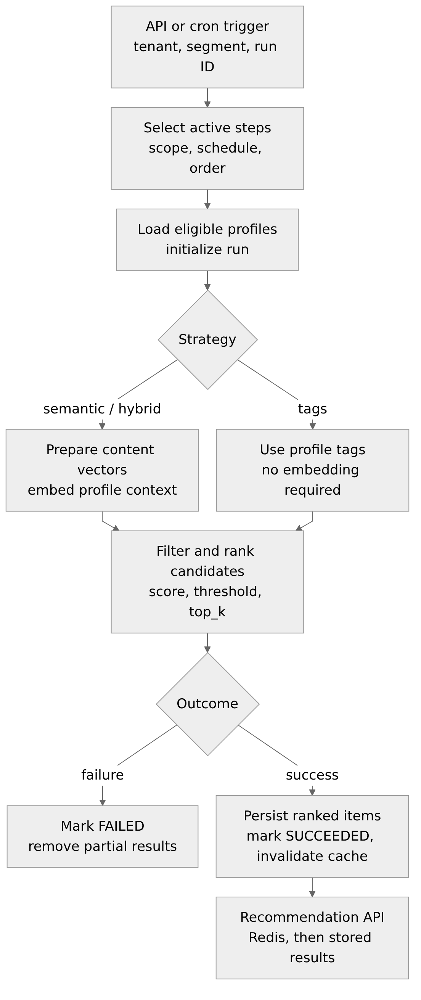
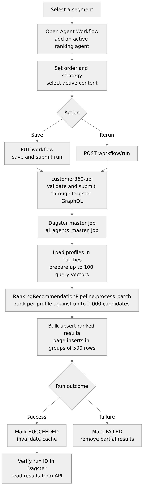

## Abstract

This paper documents the implemented Customer 360 personalization and content
recommendation workflow, from tenant-scoped segment configuration to results
served by the recommendation API. The production path runs through the
`ai_agents_runners` Dagster master job. Active `ranking_recommendation` steps
rank explicitly selected, tenant-owned content for eligible profiles using
tag, semantic, or hybrid strategies. This paper describes orchestration,
candidate validation, scoring, embedding lifecycle, persistence, API behavior,
and operational testing. Other model types are not dispatched, and persona
records are not currently ranking inputs; the description distinguishes
implemented behavior from scaffolded or prospective capabilities.

**Keywords:** Customer 360, Personalization, Content Recommendation, Ranking,
Dagster, Tenant Isolation, Semantic Similarity

---

# 1. Introduction

This paper describes the implemented recommendation flow from segment
configuration to the API response. It is intended for operators configuring a
segment and engineers implementing, operating, or troubleshooting the workflow.

The production path runs through the `ai_agents_runners` Dagster master job. It
is not the separate compatibility `personalization_job`, which remains a
scaffold.

## 1.1 Scope and Current Behavior

The current workflow:

- selects active, tenant-scoped workflow steps in execution order from
  [cdp_agent_workflow](../../customer360-database/database-schema.sql#L2885);
- supports API-triggered runs and cron-triggered runs;
- dispatches active `ranking_recommendation` agents for eligible segment
  members;
- ranks explicitly selected, tenant-owned
  [cdp_content_items](../../customer360-database/database-schema.sql#L2586)
  using tags, semantic similarity, or a hybrid score;
- persists run status and ranked items per profile; and
- serves the latest successful persisted results through the Customer 360 API.

Other model types are logged and skipped; this workflow does not dispatch them.

## 1.2 Methodology of the Personalization Flow and Its Correctness

This section describes the implemented ranking method, rather than a proposed
persona model. The flow was checked against the
[workflow API](../../customer360-api/core/routers/agent_workflow_api.py),
[Dagster definitions](./dagster_defs.py), [runner queries](./runner.py),
[ranking SQL](./agent_pipeline/agent_types/ranking_recommendation.py), and the
[workflow/recommendation migration](../../customer360-database/migrations/006_cdp_agent_workflow.sql).
The sample below is synthetic and adapted from the unit-test fixtures.

### 1.2.1 Implementation Method

1. **Trigger and plan.** The workflow API submits a tenant/segment run to
   Dagster; the cron sensor submits a scheduled run. The master job passes its
   Dagster run ID through execution so persisted recommendations can be traced
   to that run. The runner joins
   [cdp_agent_workflow](../../customer360-database/database-schema.sql#L2885)
   to
   [cdp_ai_agents](../../customer360-database/database-schema.sql#L1909),
   selects active workflow steps and active agents, applies the requested
   tenant/segment scope, and orders steps by `execution_order`. Cron runs also
   match the effective step-or-agent schedule. Only
   `ranking_recommendation` steps are dispatched.
2. **Audience selection.** For each step, the runner selects profiles whose
   tenant matches the step, whose status is active, and whose stored
   `segmentation_tags` contain the active segment's `segment_tag`. Thus the
   runner consumes materialized segment membership; it does not re-execute the
   segment's `sql_rules` or `final_generated_sql` during recommendation runs.
   Profile selection is implemented by the tenant-scoped query in
   [runner.py](./runner.py).
3. **Candidate validation and ranking.** A ranking step uses only its
   configured `candidate_content_item_ids`. The database trigger checks that
   candidate IDs are distinct and exist under the workflow tenant; the ranking
   query independently filters for that tenant, active content, a matching
   domain (`all` or the profile domain), and the selected IDs. The `tags`
   strategy scores the fraction of profile tags matched by each candidate:

   $$
   \operatorname{tag\_score}(c)=
   \begin{cases}
   0, & \operatorname{cardinality}(T_p)=0,\\[2pt]
   \dfrac{|\operatorname{distinct}(T_c)\cap\operatorname{set}(T_p)|}
         {\operatorname{cardinality}(T_p)}, & \operatorname{cardinality}(T_p)>0,
   \end{cases}
   $$

   where $T_p$ is the profile tag array and $T_c$ is the candidate tag array.
   The numerator counts distinct candidate tags present in the profile array;
   the denominator is the profile array's cardinality.
   The semantic strategy maps cosine distance to a bounded score,
   $\operatorname{clamp}(1-\operatorname{distance}/2,0,1)$. The hybrid strategy
   combines semantic and tag scores using the configured weights normalized by
   their sum. A configured `minimum_score` filters results; remaining rows are
   sorted by score, publication time, and content ID before `top_k` is applied
   independently for each profile. The runner ranks bounded profile batches
   through one set-based query per batch. These formulas and filters are in
   [ranking_recommendation.py](./agent_pipeline/agent_types/ranking_recommendation.py).
4. **Persistence.** The runner writes a run record and bulk-upserts per-profile
   recommendation rows for each profile batch. The migration constrains run
   status, score ranges, ranking strategy, and tenant-consistent references to
   the run, profile, and content item. On failure, the runner marks the run
   failed and removes its partial recommendations; on success, it marks the
   run successful and invalidates the tenant's recommendation cache. The read
   API serves persisted successful results rather than performing ranking
   during the request.

### 1.2.2 Worked Synthetic Example

The following values reuse the tenant, segment, candidate IDs, profile domain,
and profile tags from
[`test_ranking_pipeline_scores_and_returns_explicit_candidates_in_order`](./tests/test_ranking_recommendation.py).
Candidate tag arrays and the active segment row are synthetic source rows; they
are not production customer data. The candidate tags are chosen to illustrate
the matched tags and scores supplied by that test's fake database cursor.

Here `T`, `S`, `C1`, and `C2` abbreviate the fixture's tenant, segment, and two
content-item IDs, respectively.

| Record | Compact synthetic values |
| --- | --- |
| Segment `S` | Tenant `T`; active; `segment_tag = loyal` |
| Profile | Tenant `T`; active; domain `retail`; tags `loyal, vip` |
| Workflow step | Active `product_recommendation` (`ranking_recommendation`); order 1; candidates `C1, C2`; `limit = 1` |
| Candidate `C1` | Tenant `T`; active; domain `retail`; tags/matches `loyal, vip`; score `2 / 2 = 1.0` |
| Candidate `C2` | Tenant `T`; active; domain `retail`; tags/matches `vip`; score `1 / 2 = 0.5` |

The profile is eligible because it contains the active segment tag `loyal`.
The configuration defaults to the `tags` strategy, and `limit: 1` is accepted
as the result-count setting. Score-descending order and `top_k = 1` return `C1`
at rank 1, with reason `segment_tag_overlap`, as expected by the ranking unit
test.

### 1.2.3 Correctness Rationale and Evidence Limits

The ranking and persistence contract is internally consistent for its stated
inputs for three reasons:

- **Scope is explicit.** Tenant, active-status, domain, segment-membership, and
  selected-candidate checks are applied before a candidate can be ranked.
  Workflow candidate validation and composite foreign keys provide additional
  database safeguards.
- **Scores and ordering are bounded and reproducible.** The strategies produce
  scores in the 0–1 range, `minimum_score` and `top_k` are validated, and the
  SQL defines deterministic tie-breaking. The recommendation table also checks
  score/rank ranges and permitted strategies.
- **Results are traceable.** Recommendation rows are keyed to a run and profile;
  the runner tests verify the run ID is passed through, successful results are
  persisted per profile, and failed-run rows are removed.

These are implementation-level correctness checks, not evidence of improved
conversion, causal impact, or recommendation quality in production. The
ranking and runner tests use fake database connections: they check generated
SQL, parameters, outputs, and persistence calls, but do not execute the
migration or ranking query against PostgreSQL.

One runtime condition also remains to be verified. The migration forces
row-level security on `cdp_agent_workflow` and its policy requires
`app.tenant_id`. The runner's `_load_steps` query adds a tenant predicate for
API runs but does not set that session variable; cron runs call the same query
without a tenant predicate. Unless the deployed database role bypasses RLS or
the connection initializes the tenant context externally, RLS can hide the
workflow rows. A single tenant context would also limit cron to that tenant,
so an all-tenant cron scan needs an authorized service-role mechanism or
per-tenant iteration. The unit tests do not cover this database-session
behavior, so end-to-end access under the deployed runner role should be
confirmed before claiming that the RLS-protected workflow lookup is proven.

# 2. Personalization Flow: End-to-End Execution

At a business level, the configured workflow selects eligible profiles in a
segment, ranks the chosen content for each profile, and makes successful
recommendations available to the API. At runtime, the Dagster job coordinates
the work asynchronously.

The orchestration is implemented in [dagster_defs.py](./dagster_defs.py) and
[runner.py](./runner.py). The shared model-type dispatcher is in
[pipelines.py](./agent_pipeline/pipelines.py); ranking logic is in
[ranking_recommendation.py](./agent_pipeline/agent_types/ranking_recommendation.py).

1. **Trigger the run.** An API request supplies a tenant and optionally one
   segment. The cron sensor submits a run that checks eligible workflow
   schedules. Dagster assigns a run ID; recommendation records use this same ID.
2. **Build the execution plan.** The runner joins active
   [cdp_agent_workflow](../../customer360-database/database-schema.sql#L2885)
   steps to active registered
   [cdp_ai_agents](../../customer360-database/database-schema.sql#L1909),
   applies the requested tenant and segment scope, and orders steps by
   `execution_order`. Cron runs use the workflow schedule override when present,
   otherwise the registered agent's schedule. This path executes only
   `ranking_recommendation` steps; other model types are logged and skipped.
3. **Select the audience.** For each tenant/segment pair, the runner loads
   active Customer 360 master profiles (the unified customer profiles) from
   [cdp_master_profiles](../../customer360-database/database-schema.sql#L685)
   that belong to the active
   [cdp_segments](../../customer360-database/database-schema.sql#L2833)
   row. A profile belongs to the segment when its `segmentation_tags` contains
   the segment's `segment_tag`. The tenant ID scopes profile selection,
   candidate reads, and all writes; tenant ownership is rooted in
   [sys_tenant](../../customer360-database/database-schema.sql#L34).
4. **Prepare ranking inputs.** The `tags` strategy does not require embeddings.
   For `semantic` and `hybrid`, the runner checks that each selected candidate
   belongs to the tenant and is active. It generates or refreshes a canonical
   content vector when the source text, model, contract version, or vector
   dimensions have changed. Profile queries use the profile's domain, segment
   tags, and optional `semantic_query`; they do not include personally
   identifiable information (PII). The runner embeds at most 100 profile
   queries per batch. The configured embedding provider must produce 384- or
   768-dimensional vectors.
5. **Rank content in batches.** The runner sends up to 100 profiles, their
   domains, tags and optional query vectors, plus the step's shared selected
   candidate IDs and configuration to `execute_agent_pipeline_batch`. The
   registry dispatches `RankingRecommendationPipeline.process_batch`, which
   validates shared inputs once and scores each profile independently in one
   set-based query. The query rechecks tenant ownership, active status,
   selected IDs, and domain (`all` or the profile's domain), applies
   `minimum_score`, and returns at most `top_k` items per profile in the
   existing deterministic order.
6. **Persist the outcome.** The runner creates or resets a `RUNNING` row in
   [cdp_profile_recommendation_runs](../../customer360-database/database-schema.sql#L3864),
   then bulk-upserts each batch of per-profile ranked items into
   [cdp_profile_recommendations](../../customer360-database/database-schema.sql#L3882).
   On success, it marks the run `SUCCEEDED` and invalidates the tenant's
   recommendation cache. On failure, it marks the run `FAILED`, removes partial
   rows for that run, and propagates the error.
7. **Serve results.** `GET /api/v1/content-items/recommended` reads stored
   results; the request does not run ranking. The API checks Redis first. On a
   cache miss, it queries successful runs, merges eligible segment results,
   deduplicates content items, and returns the response. A successful
   recommendation run or relevant content mutation invalidates the tenant
   cache.

## 2.1 Runtime Flow
{height=85%}

The following sections describe workflow configuration, ranking behavior,
persistence, and the recommendation read API. Each table name links to its
`CREATE TABLE` definition in
[database-schema.sql](../../customer360-database/database-schema.sql).

# 3. Manual Test Walkthrough

Use this walkthrough to verify the customer-facing flow and the backend
execution path. The segment detail view and workflow editor are implemented in
[segment-details.html](../../customer360-frontend/static/templates/segment/segment-details.html)
and
[ai-agent-workflow.js](../../customer360-frontend/static/js/ai-agent-workflow.js).

{height=85%}

## 3.1 Test Procedure

1. **Confirm prerequisites.** Use an active segment with active profiles in the
   authenticated tenant. The segment's `segment_tag` must appear in each test
   profile's `segmentation_tags`. Confirm that the agent catalog has an active
   agent with `model_type = ranking_recommendation` and that the tenant has
   active content items.
2. **Open the workflow editor.** In the Segments page, open the target
   segment's details, select **Agent Workflow**, and click **Add agent**.
   Choose the active ranking agent, keep the step enabled, and set its
   execution order.
3. **Set ranking options and candidates.** For an initial smoke test, use
   `{"strategy": "tags", "top_k": 8}`; this does not require an embedding
   provider. Select at least one active content item or product. Each candidate
   must belong to the tenant and have domain `all` or the test profile's
   domain. Semantic and hybrid tests also require a supported embedding
   provider configured to generate 384- or 768-dimensional vectors.
4. **Save once to configure and run.** Click **Save workflow**. The UI sends
   `PUT /api/v1/segments/{segment_id}/workflow` with the complete ordered
   `steps` list. This is a full replacement of the segment workflow, not a
   partial update. The API validates and saves the configuration, then submits
   a Dagster run. The response includes `X-Dagster-Run-Id`; the UI displays
   **Saved · run queued**. Do not also call the run endpoint for the same test
   unless a second run is intended.
5. **Rerun without editing (optional).** To execute a saved workflow again,
   call `POST /api/v1/segments/{segment_id}/workflow/run` with the authenticated
   tenant context and a body such as
   `{"event": {"event_name": "personalization.manual_test"}}`. The API returns
   `202 Accepted` with `{"run_id": "...", "status": "submitted"}`. A manual
   API run is not held until the cron schedule; schedule matching applies to
   cron runs.
6. **Trace execution.** The API submits the run asynchronously to Dagster
   through
   [agent_workflow_api.py](../../customer360-api/core/routers/agent_workflow_api.py)
   and
   [dagster_client.py](../../customer360-api/core/utils/dagster_client.py).
   It does not call the Python ranking handler in the request process. Dagster
   starts `ai_agents_master_job` in the backend `ai_agents_runners` code
   location. The runner loads eligible profiles, prepares embeddings when
   required, and dispatches ranking batches of up to 100 profiles. The pipeline
   registry dispatches `ranking_recommendation` to
   [RankingRecommendationPipeline](./agent_pipeline/agent_types/ranking_recommendation.py),
   which applies the tenant, candidate, status, and domain filters before
   ranking.
7. **Verify the result.** Use `run_id` to find the run in the Dagster UI.
   `submitted` confirms that Dagster accepted the run; it does not mean the run
   has completed. After the run succeeds, call
   `GET /api/v1/content-items/recommended?master_profile_id=<profile_uuid>&segment_id=<segment_uuid>&limit=8`
   for an active profile in the segment. The response contains persisted
   recommendations for eligible items, or an empty list when none are eligible.

If saving returns `503` because Dagster could not accept the run, the workflow
may already be saved; retry with `POST /api/v1/segments/{segment_id}/workflow/run`.
If ranking fails, inspect the Dagster run and confirm the profile is an active
segment member, candidates are active and tenant-owned, their domains match,
and the selected strategy has the required embedding configuration.

## 3.2 Automated Unit Tests

Run the ranking handler tests from `customer360-backend`. The command measures
statement and branch coverage for the handler and fails unless both reach
100%:

```sh
PYTHONPATH=.:../customer360-dao/src pytest -q \
  ai_agents_runners/tests/test_ranking_recommendation.py \
  --cov=ai_agents_runners.agent_pipeline.agent_types.ranking_recommendation \
  --cov-branch --cov-report=term-missing --cov-fail-under=100
```

The test cases are in
[test_ranking_recommendation.py](./tests/test_ranking_recommendation.py).

# 4. Agent Registry: [cdp_ai_agents](../../customer360-database/database-schema.sql#L1909)

Agent definitions are global and use `agent_code` as their stable primary key.
For workflow selection, the runner uses the agent code, `model_type`, `status`,
and `schedule_definition`. Only agents with `status = 'ACTIVE'` are selected.

The registry also stores `model_name`, `input_features`, `hyperparameters`,
`required_variables`, `system_instructions`, and prompt metadata. These fields
are metadata for consumers that need them; the current ranking path does not
pass them to its handler. In particular, `model_name` does not prove that a
trained artifact is available. Runtime dispatch uses the implementation
registered for the supported `model_type`.

The database supports `ranking_recommendation` as the model type used for
content/product ranking. The seeded recommendation agent is
`product_recommendation`; its current lifecycle status must still be checked
at runtime rather than assumed from seed data.

# 5. Segment Workflow: [cdp_agent_workflow](../../customer360-database/database-schema.sql#L2885)

Workflow rows are tenant-owned and attach one registered agent from
[cdp_ai_agents](../../customer360-database/database-schema.sql#L1909) to one
tenant-owned
[cdp_segments](../../customer360-database/database-schema.sql#L2833) row under
[sys_tenant](../../customer360-database/database-schema.sql#L34).

| Field | Purpose |
| --- | --- |
| `execution_order` | Positive, unique position within the tenant/segment workflow; lower values run first. |
| `is_active` | Controls whether the workflow step is eligible to run. |
| `schedule_definition` | Optional five-field cron override; if unset, the agent's schedule is used for cron runs. |
| `configuration` | JSON object containing strategy-specific settings. |
| `candidate_content_item_ids` | Selected content UUIDs for ranking; the API accepts up to 1,000 unique IDs per step. |

The runner processes active steps in ascending `execution_order` and ignores
inactive agents. API-triggered runs are immediate; schedule matching is applied
to cron runs.

# 6. Candidate Selection and Ranking

## 6.1 Candidate Catalog and Tenant Checks

Candidate IDs refer to
[cdp_content_items](../../customer360-database/database-schema.sql#L2586).
Each row belongs to a tenant and stores its item type (`news`, `video`,
`product`, or `article`), display and call-to-action fields, segment tags,
status, and publication metadata.

The workflow editor offers candidate selection only for
`ranking_recommendation` agents. The API validates that each selected ID exists
in the authenticated tenant; the database also enforces tenant ownership and
distinct IDs. An active ranking step must contain at least one candidate. The
runner evaluates only the selected IDs; it does not search the full catalog.
At runtime, candidates must also be active and have domain `all` or the
profile's domain.

## 6.2 Profile Inputs and Configuration

For each profile, the handler requires a non-blank `input_data.domain` and
accepts `input_data.segmentation_tags` as a list of non-blank strings (default
`[]`). Semantic and hybrid strategies also receive a profile embedding and an
embedding model key from the runner. Profile context is built from the domain,
segment tags, and optional `semantic_query`; it does not contain PII.

| Setting | Default | Validation and behavior |
| --- | --- | --- |
| `strategy` | `tags` | One of `tags`, `semantic`, or `hybrid`. |
| `top_k` (or `limit`) | `8` | Integer from 1 to 100; maximum result count. |
| `minimum_score` | `0` | Number from 0 to 1; lower-scoring candidates are excluded. |
| `semantic_weight` | `0.7` | Number from 0 to 1; used by `hybrid`. |
| `tag_weight` | `0.3` | Number from 0 to 1; used by `hybrid`. Hybrid weights must sum to more than 0. |
| `semantic_query` | empty | Optional text appended to the profile query; maximum 2,000 characters. |

For `semantic`, the handler uses semantic weight 1 and tag weight 0. For `tags`,
it uses tag weight 1 and semantic weight 0. The configured hybrid weights are
normalized when the two scores are combined.

### Execution Limits and Batch Behavior

The runner ranks at most 100 profiles per batch. Each batch uses one set-based
ranking query and one bulk recommendation upsert; insert statements are paged
at 500 rows. Profile-query embeddings are prepared a batch at a time. The
runner still loads the segment's profile IDs, domains, and tags as a list, but
does not retain embeddings or ranked results for the full audience.

The workflow accepts up to 1,000 selected content IDs per step, while `top_k`
remains capped at 100. At 100,000 profiles and 1,000 selected items, one step
can require 1,000 ranking queries and up to 100 million profile-item score
comparisons. Semantic and hybrid scoring also compare each eligible vector at
384 or 768 dimensions. Batching bounds intermediate memory and reduces
per-profile database and embedding overhead; it does not reduce the exact
profile-item scoring work from \(O(P \times C)\); semantic and hybrid vector
calculations are additionally \(O(P \times C \times D)\). Actual work is
usually lower after tenant, status, domain, embedding, and selected-ID filters.
Production runtime and provider cost should be benchmarked at the expected
audience size.

## 6.3 Scoring and Result Ordering

- **Tags:** the number of matched profile tags divided by the number of profile
  tags; the score is 0 when the profile has no tags.
- **Semantic:** `1 - cosine distance / 2`, clamped to the range 0–1.
- **Hybrid:** the weighted average of the tag and semantic scores. If the
  profile has no tags, the handler uses the semantic score when its weight is
  positive.

Candidates below `minimum_score` are excluded. Results are sorted by score
descending, publication time descending (null values last), and content ID as
the deterministic tie-breaker. Each result includes a one-based rank, the
strategy scores, matched tags, a reason code, and the content display fields.
Scores are strategy-specific ranking values, not calibrated probabilities.

## 6.4 Embedding Lifecycle

Semantic and hybrid ranking require the configured `DOCS_EMBEDDING_PROVIDER`
to be `openai` or `gemini`. The runner supports 384- and 768-dimensional
vectors. For selected content, it generates or refreshes a vector when the
canonical text, provider/model, contract version, or dimension is stale.
Migration
[`008_content_embedding_contract.sql`](../../customer360-database/migrations/008_content_embedding_contract.sql)
preserves legacy 384- and 768-dimensional vectors and clears other sizes.

Products are ranked through their linked content items in the current
workflow. Product-table vector columns are reserved for possible future direct
product ranking.

## 6.5 Persistence and Failure Handling

The runner records run status in
[cdp_profile_recommendation_runs](../../customer360-database/database-schema.sql#L3864)
and per-profile ranked items in
[cdp_profile_recommendations](../../customer360-database/database-schema.sql#L3882).
The read API serves these persisted records; it does not run ranking during the
request.

If ranking produces no eligible results, the step fails rather than relaxing
its filters or inventing a fallback. Failure diagnostics distinguish
tenant-missing candidates, inactive content, profile-domain mismatch,
unavailable embeddings, and scores below `minimum_score`. The error includes
counts at each filter stage and the tenant, segment, agent, and profile
identifiers. The detailed diagnostic query runs only on the failure path and
uses the same tenant and selected candidate IDs.

# 7. Recommendation Read API

The Customer 360 API exposes the persisted recommendations through:

```http
GET /api/v1/content-items/recommended?master_profile_id=<uuid>&limit=8
```

`master_profile_id` is required. `limit` defaults to 8 and must be from 1
through 50. The API derives tenant scope from the authenticated request; a
caller cannot request another tenant's data. Optional `segment_id` and
`item_type` parameters restrict the result set.

For each profile, the API reads the latest successful run for each active
segment the profile belongs to. It then merges results across those segments
and keeps only the strongest recommendation for duplicate content items.
Returned items must still match the profile domain and refer to active
workflow, agent, and content records.

A missing or inactive profile returns `404`. A valid profile with no eligible
persisted recommendations receives an empty list. Each result includes the
content display fields and `matched_tags`, `segment_id`, `agent_code`, `rank`,
`score`, `semantic_score`, `tag_score`, `strategy`, `reason`, and
`generated_at`.

The API checks Redis before querying persisted results. Cache keys are scoped
to the tenant, profile, and request filters. Content mutations and successful
recommendation runs invalidate the tenant's recommendation cache; other
changes become visible within `CACHE_TTL_SECONDS`. Set `CACHE_ENABLED=false`
to bypass the cache while debugging.

The route is implemented in
[content_api.py](../../customer360-api/core/routers/content_api.py), and its
tenant-scoped query is in
[content_repository.py](../../customer360-api/core/repositories/content_repository.py).

# 8. Current and Future Profile Inputs

The current ranking contract reads only:

- the profile's domain and segmentation tags from
  [cdp_master_profiles](../../customer360-database/database-schema.sql#L685);
- segment membership from
  [cdp_segments](../../customer360-database/database-schema.sql#L2833); and
- explicitly selected content candidates from
  [cdp_content_items](../../customer360-database/database-schema.sql#L2586).

It does not currently use persona-match records from
[cdp_customer_personas](../../customer360-database/database-schema.sql#L1475)
or shared persona definitions from
[cdp_persona_archetypes](../../customer360-database/database-schema.sql#L1430).
Additional analytics or persona fields stored on a master profile are also
outside the current ranking input contract.

Any future handler that adds these inputs must define tenant-scoped reads and
apply relevant consent, suppression, inventory, campaign-eligibility, and
domain constraints before returning a recommendation.

# 9. Data Ownership and Engineering Guardrails

The ranking handler validates its profile inputs and configuration, evaluates
only the step's selected candidates within the step tenant, and returns ranked
items. The runner—not the ranking handler—persists per-profile results under
the Dagster run ID and updates run status.

The workflow must not:

- read or write data across tenant boundaries;
- rewrite identity links or source events;
- treat an unavailable handler or model as a successful default;
- rank candidates outside the configured, tenant-eligible set;
- send campaigns or notifications directly; or
- overwrite another handler's output without an explicit ownership contract.

# 10. Conclusion

The implemented workflow connects tenant-scoped segment configuration to
persisted content rankings that the recommendation API can serve. Its current
contract is limited to active `ranking_recommendation` steps, explicitly
selected eligible content, and the documented tag, semantic, and hybrid
strategies. Tenant ownership, deterministic ordering, and explicit failure
handling define the operational boundaries of this implementation.

## References

- [AI runner orchestration](./README.md)
- [Workflow schema](../../customer360-dao/src/leo_customer360_dao/models/agent_workflow.py)
- [Workflow migration](../../customer360-database/migrations/006_cdp_agent_workflow.sql)
- [Agent registry schema](../../customer360-database/database-schema.sql)
- [Content item model](../../customer360-dao/src/leo_customer360_dao/models/content.py)
