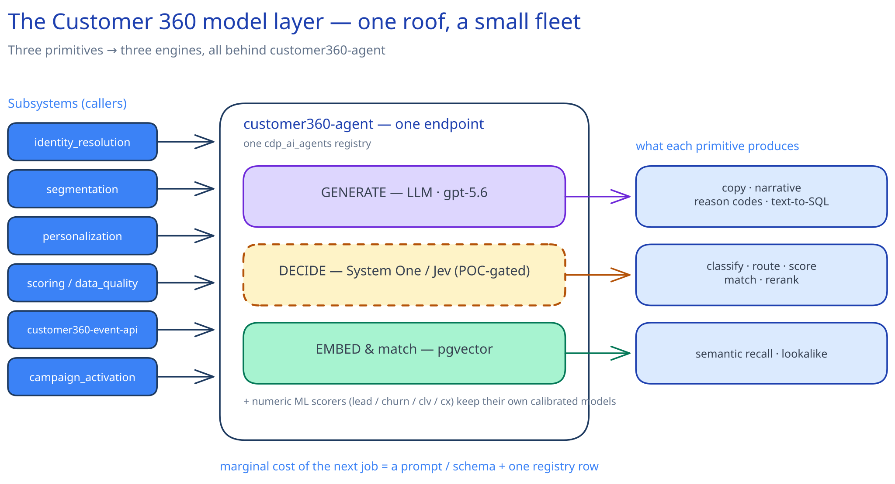
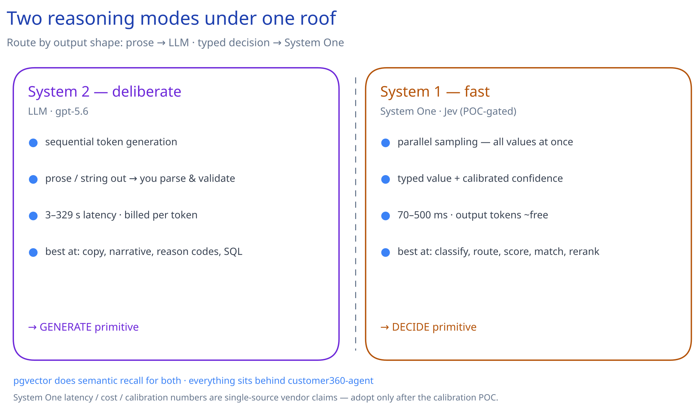
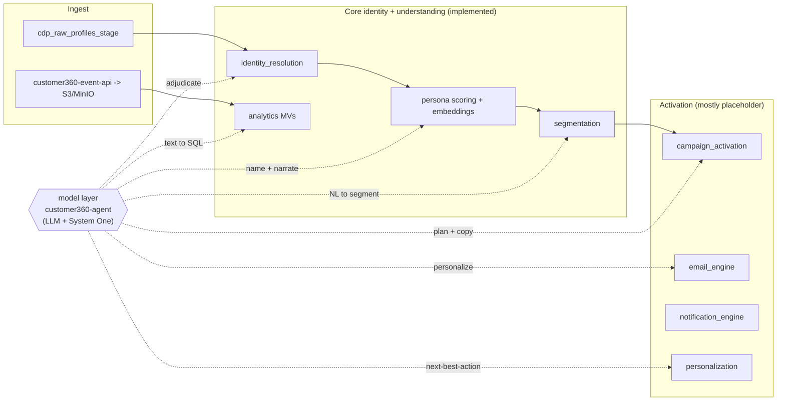
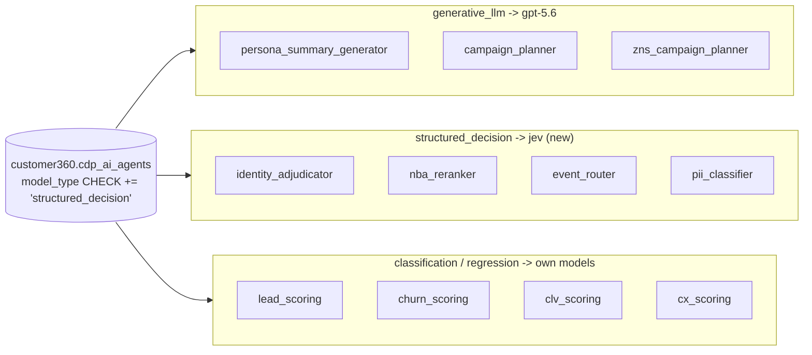
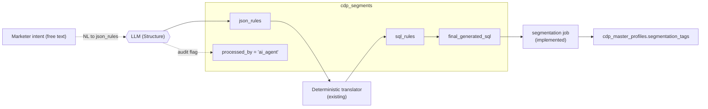
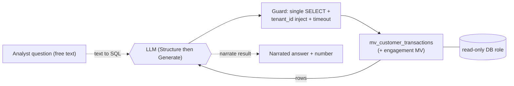
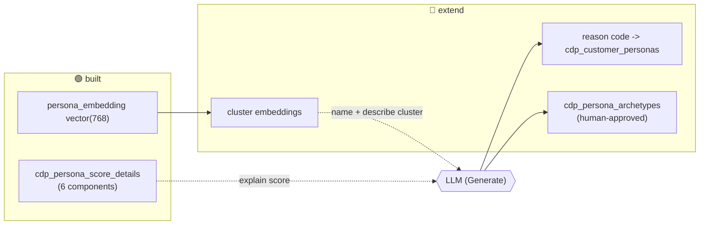
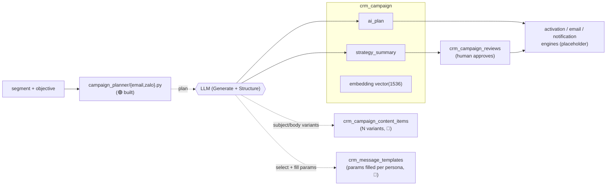
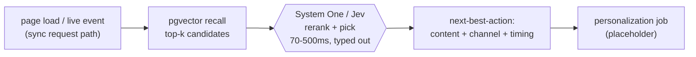
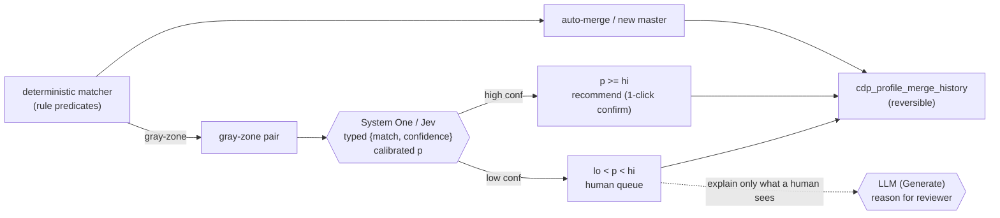

# The Customer 360 Model Layer: One Roof, a Small Fleet

### Where each AI engine earns its keep across LEO Customer 360

> Research note · LEO CDP `leo-customer360` · 2026-09-23
> Merges and supersedes `one-model-across-customer360.md` and
> `system-one-models-jev-in-customer360.md`.
>
> ⚠️ **Provenance caveat.** This paper discusses two engine classes. The LLM
> layer is running code today. The **System One / Jev** layer is a *proposal*
> whose every performance, cost, and accuracy figure is a **single-source vendor
> claim** (TypeSafe.ai, *"Introducing System One Models and Jev"*) and is marked
> **[unverified]**. Nothing about that layer should be adopted before the
> calibration/latency POC in §7.

## Abstract

LEO Customer 360 is not an "AI product" bolted onto a database; it is a
composable CDP whose schema and services were already shaped for models to plug
into. `database-init/data-view-for-llm.sql` builds materialized views "optimized
for LLM-based text-to-SQL"; `customer360.cdp_segments` carries a `processed_by`
flag whose legal values are `('human', 'ai_agent')`; `customer360.crm_campaign`
reserves `ai_plan JSONB`, `strategy_summary`, and a `vector(1536)` embedding
column; `customer360-agent/` exposes one unified, provider-agnostic model
endpoint (LiteLLM); and `customer360.cdp_ai_agents` is a single registry that
seeds every ML / rules / LLM agent as a row.

This paper answers one question: **given the engines available to us, where
across the whole platform does each one earn its keep?** The thesis has two
moves. First (the original argument): a single foundation model should be a
*horizontal reasoning layer* — wired once through `customer360-agent`, reused by
every subsystem — not a feature glued into one screen. Second (the refinement):
that reasoning model is the wrong shape for a large class of *fast, typed
decisions* the platform also needs, so a **System One decision model** (Jev)
belongs in a second horizontal seat beside it. The result is three engines under
one roof, mapped to the three primitives the platform already factors its work
into — at the marginal cost of a prompt/schema and a registry row per new job.

---

## 1. Framing

### 1.1 Three primitives, three engines

Every model-touching use case in the platform is one of three primitives pointed
at a different subsystem's data:

| Primitive | What it does | Engine | Already available? |
|---|---|---|---|
| **Generate** | Free text out (copy, summaries, narratives, reason codes, SQL) | LLM `gpt-5.6` | Yes — `campaign_planner/{email,zalo}.py` |
| **Structure / Decide** | Records in → **typed** decision out (classify, route, score, match, rerank) | **System One / Jev** *(proposed)* | Partial — planners emit `ai_plan`; the rest designed, not wired |
| **Embed & match** | Text → `vector(768/1536)` for semantic search | `pgvector` | Yes — `persona_embedding`, `crm_campaign.embedding`, pgvector installed |

Numeric ML scorers (`lead`/`churn`/`clv`/`cx`) are a fourth family that keeps its
own calibrated models — never swapped for a language model. The whole point:
**the marginal cost of the tenth use case is a prompt/schema, not a new model.**

### 1.2 Two reasoning modes

The **Generate** and **Structure/Decide** primitives are not the same model in
two moods — they are two different classes of model. A chat LLM ("System 2")
deliberates in prose: sequential token generation, string output you parse and
validate, seconds of latency, per-token billing. A System One model ("System 1",
Jev) decides in microseconds: parallel sampling, a **typed value plus a
calibrated confidence**, sub-second latency, near-zero output cost. Route by
output shape — prose to the LLM, typed decisions to System One.

The load-bearing claim for the System One layer is **calibration** — that a
reported confidence of 0.9 really does mean ~90% accuracy. The platform's
guardrails repeatedly need a *trustworthy* confidence threshold (route
low-confidence to a human); today those ride on an LLM's uncalibrated
"I'm 90% sure." Calibration is exactly what the POC in §7 must prove.

### 1.3 Subsystem map

The Dagster workspace (`customer360-backend/`) has nine code locations; three are
implemented, six are runnable placeholders (`scoring`, `data_synch`,
`email_engine`, `notification_engine`, `campaign_activation`, `personalization`)
— exactly where the model layer's output belongs.

### 1.4 The registry that makes this literal

`customer360.cdp_ai_agents` is a **single catalog** for every model the platform
runs, keyed by a stable `agent_code`, with a `model_type` CHECK and the actual
`model_name` per row. The seed loads the generative and numeric agents today; the
System One layer extends the same table rather than breaking it — add one value
to the `model_type` CHECK (`structured_decision`) and each Jev-backed job becomes
a row, exactly like the others. Task agents store their live `system_instructions`,
`required_variables`, and an integer `instruction_version`; prompt *history* lives
in the `customer360-agent` prompt store, not Postgres.

*Three `model_type` families, one catalog: `gpt-5.6` for generation, `jev` for
typed decisions, purpose-built numeric models for calibrated scoring. Wiring note:
`customer360-agent` routes through LiteLLM (chat-shaped); a System One call is a
typed function call, not a chat completion, so it needs a **thin dedicated
client** alongside LiteLLM — the same shape as the existing packaged agent/DAO
clients.*

---

## 2. Use cases, grounded per subsystem

Each use case names the **real tables/files** it reads and writes, the **engine**
it uses, and its **status** (🟢 built · 🟡 designed, not wired · 🔵 net-new).

### 2.1 Segmentation — Natural-language → segment (Generate + Decide · 🟡)

**The flagship case, because the schema already asks for it.** `cdp_segments`
stores `json_rules` (QueryBuilder tree), `sql_rules`, `final_generated_sql`, and a
`processed_by` column whose CHECK literally allows `'ai_agent'`. The seat is
reserved; nothing sits in it.

- **Flow:** marketer types *"Gen Z shoppers in HCMC who purchased in the last 30
  days but didn't open the last 3 emails."* → the **LLM** emits a QueryBuilder
  `json_rules` tree → deterministic translator produces `sql_rules` /
  `final_generated_sql` → segmentation job (implemented) computes membership and
  writes `segmentation_tags` onto `cdp_master_profiles`. **System One** fits the
  *leaf* work (classify a field/operator, extract a value with confidence); the
  full nested tree is sequence-shaped and stays with the LLM.
- **Guardrail:** the model never emits raw SQL that runs. It emits the `json_rules`
  tree; the existing translator produces SQL; `tenant_id` is injected server-side.
  Set `processed_by='ai_agent'` so every AI-authored segment is auditable.

### 2.2 Analytics — Text-to-SQL over the LLM materialized views (Generate · 🟡)

`data-view-for-llm.sql` already flattens AI/ML scores + behavioral summaries into
`mv_customer_transactions` (and an engagement MV) with the comment *"optimized for
LLM-based text-to-SQL"*. The denormalization — the hard part — is done. SQL is
sequential text generation, so this stays on the **LLM**, not System One.

- **Flow:** *"Average predictive CLV of churn-risk-tier = high customers who bought
  in Q2?"* → LLM → SQL against the MV → execute read-only → LLM narrates the number.
- **Guardrails:** a dedicated **read-only** DB role; mandatory `tenant_id` predicate
  injected after generation; statement timeout; reject anything that isn't a single
  `SELECT`.

### 2.3 Persona — name, summary, and reason codes (Generate · 🟢 + 🔵 extend)

Persona name synthesis and summary generation are already LLM-native; lookalike
discovery already uses the `vector(768)` `persona_embedding`. The gap is
*explanation*, which is pure **Generate**.

- **🔵 reason codes:** the 6-component persona score (`cdp_persona_score_details`)
  is numeric and opaque. Feed the breakdown to the LLM → *"High Value / Medium Risk
  — strong 12-month spend but two recent support escalations."* Store next to
  `cdp_customer_personas`. Makes the existing math trustable without changing it.
- **🔵 archetype discovery:** cluster `persona_embedding`, then have the LLM name and
  describe each cluster to propose new `cdp_persona_archetypes` rows — human-approved.

### 2.4 Campaign activation & messaging — plan, copy, personalize (Generate · 🟢 + 🔵)

`campaign_planner/{email,zalo}.py` already turns a segment + objective into an
`ai_plan` and template. `crm_campaign` holds `ai_plan`, `strategy_summary`, approval
columns, and a `vector(1536)` embedding. The activation/email/notification engines
are placeholders — the output has somewhere to land but nothing lands it yet.

- **🔵 subject/copy variants:** generate N variants per campaign for A/B; store as
  `crm_campaign_content_items`.
- **🔵 per-persona param fill:** Zalo ZNS is template-based. The model doesn't author
  the message — it selects the approved `crm_message_templates` row and fills params
  per recipient. Respects the "ZNS is pre-approved templates" constraint exactly.
- **🔵 strategy narrative:** populate `strategy_summary` so a reviewer reads *why*
  before approving (`crm_campaign_reviews`).

### 2.5 Personalization & next-best-action (Decide · 🔵, best System One fit)

`cdp_content_items` (news/video/product/article, each tagged with `segment_tags` +
CTA) and profile/persona embeddings are the two halves of a recommender. The unlock
is **latency**: at 70–500 ms [unverified] a System One rerank can run
*synchronously in the request path* (personalize on page load / on event), which a
3–329 s LLM cannot.

- **Flow:** `pgvector` recalls candidates cheaply (top-k over the whole catalog);
  **System One** reranks and picks the next-best-action (content, channel, timing)
  with a one-line reason. Lands in the `personalization` placeholder job.
- **Why hybrid:** embeddings do cheap recall; the decision model reasons only over
  the top-k, so cost scales with k, not catalog size.

### 2.6 Identity resolution — gray-zone adjudication + normalization (Decide · 🔵, textbook fit)

Identity resolution is deterministic today (rule predicates → auto-merge or new
master). Rules stay in the driver's seat. Two narrow places benefit from a model —
and the adjudication one is the **textbook System One case**: a pairwise match with
a *calibrated* confidence.

- **Gray-zone adjudication:** for candidate pairs *between* auto-merge and
  clearly-distinct, **System One** returns typed `{match, confidence}`; the calibrated
  `p` drives the gate — high-confidence pairs become a 1-click recommendation,
  low-confidence go to a human queue. The **LLM** writes the `reason` only for the
  cases a human will actually see. The model never silently merges; merges remain
  reversible via `cdp_profile_merge_history`.
- **Field normalization at ingest:** Vietnamese name/address variants and
  transliteration are generative rewriting → **LLM**, run *before* the rule
  predicates so the matcher sees cleaner keys.

### 2.7 Scoring — reason codes and cold-start, not replacement (mixed · 🔵)

`cdp_master_profiles` carries `predictive_clv`, `churn_probability`,
`churn_risk_tier`, `engagement_score`. The scorers are registered
(`lead`/`churn`/`clv`/`cx`), each `classification`/`regression` with its **own**
`model_name` and a cron schedule — *not* pointed at a language model. **Do not**
replace a calibrated numeric model with an LLM. Two legitimate model roles remain:

- **Generate — reason codes:** the LLM produces a human-readable explanation per
  score, and drafts/validates `cdp_scoring_models` configs from a plain-language spec.
- **Decide — cold-start:** a System One model is *itself* a calibrated decision
  model, so before a scorer has enough labeled history to train, Jev can emit a
  provisional calibrated score. Once the trained model exists, the `cdp_ai_agents`
  row swaps its `model_name` — a one-row change, not a rewrite.

### 2.8 Data quality / `data_synch` (Decide · 🔵, placeholder job)

At ingest, **System One** can classify a new `sys_data_source`'s columns —
suggesting source→schema **field mappings** and flagging likely **PII columns** —
and the LLM can explain anomalies the analytics job surfaces. Every suggestion is a
proposal a human confirms; never an automatic write to the golden record.

### 2.9 Governance, review & support (mixed · 🔵, cross-cutting)

- **Generate:** summarize `sys_audit_log` bursts into an incident-style narrative.
- **Decide:** a pre-flight **compliance check** on message templates — does the copy
  risk PII leakage, does the target segment intersect `crm_suppression_list`, is
  channel consent present? System One classifies each check; the LLM drafts the
  reviewer's narrative for `crm_campaign_reviews`. A human still signs off.

---

## 3. Inventory — what exists vs. the opportunity

| Subsystem | Primitive → Engine | Status | Effort to first value |
|---|---|---|---|
| Persona name + summary | Generate → LLM | 🟢 built | — |
| Lookalike (embeddings) | Embed → pgvector | 🟢 built | — |
| Campaign plan + template | Generate → LLM | 🟢 built | — |
| **NL → segment** | Structure → LLM | 🟡 schema ready | **Low** (translator + prompt) |
| **Text-to-SQL analytics** | Generate → LLM | 🟡 MVs ready | **Low** (read-only role + prompt) |
| Persona / scoring reason codes | Generate → LLM | 🔵 new | Low |
| Campaign copy variants / param fill | Generate → LLM | 🔵 new | Low–Med |
| **Content reco / next-best-action** | Decide → System One | 🔵 new | Medium |
| **Identity gray-zone adjudication** | Decide → System One | 🔵 new | Medium |
| **Event routing** | Decide → System One | 🔵 new | Medium |
| **PII / data-quality classification** | Decide → System One | 🔵 new | Low–Med |
| Cold-start scoring | Decide → System One | 🔵 new | Medium |
| Field normalization | Generate → LLM | 🔵 new | Medium |
| Governance summaries / compliance | Generate + Decide | 🔵 new | Low |

**The two 🟡 rows are the headline for the LLM layer** — highest value *and* lowest
effort, because the schema/MV work is done and they wait only on a prompt + a thin
translator/guard. **The bolded Decide rows are the case for the System One layer** —
high-frequency, latency- or cost-sensitive, confidence-gated jobs the LLM
structurally can't serve well. Adopting the Decide rows is gated on §7.

---

## 4. Guardrails

One shared model layer touching every subsystem concentrates risk. Non-negotiables:

1. **Tenant isolation is server-side, always.** The model may *suggest* a query or
   rule tree; `tenant_id` is injected by the API after generation, never trusted
   from model output.
2. **The model proposes, deterministic code disposes.** NL→segment emits a validated
   `json_rules` tree, not runnable SQL. Text-to-SQL runs under a read-only role with
   a statement timeout and a single-`SELECT` allow-list. Identity adjudication
   triages; it never merges.
3. **PII minimization in prompts.** Redact/tokenize direct identifiers before they
   enter a prompt, especially for external providers (LLM *or* System One). LiteLLM's
   provider switch makes "local model for PII-heavy calls" a config, not a rewrite; a
   self-hosted System One option is strongly preferred for PII-heavy decisions.
4. **Prompt-injection defense.** Profile fields, campaign text, and source data are
   attacker-influenceable. Treat all record content as untrusted data in a fenced
   section; never let record text change the instruction. A typed, calibrated answer
   over poisoned input is still wrong.
5. **Auditability is already modeled.** `cdp_ai_agents.instruction_version` pins the
   current revision per agent; `processed_by='ai_agent'`, `ai_plan`, and the review
   tables give a paper trail for every AI-authored artifact.
6. **Human-in-the-loop on writes to the golden record.** Anything that mutates
   `cdp_master_profiles`, activates a segment, or sends a campaign passes an approval
   gate. Reads and drafts are cheap and safe; writes are gated.

**System One additions (because that layer is unproven here):**

7. **All System One numbers are one vendor's blog** — 40–200× speedup, `$0.042/M`,
   "output free", "zero type errors", "calibrated" are **[unverified]** hypotheses to
   test (§7), not facts to design around.
8. **Wrong tool for generation.** SQL, copy, narratives, VN transliteration stay on
   the LLM. Over-rotating a chat workload onto a decision model is as wrong as the
   reverse.
9. **Calibration is domain-specific.** Vendor calibration on their eval set is not
   calibration on our Vietnamese CDP distribution — re-measure a reliability curve on
   our data before any confidence gate trusts it.

---

## 5. Evaluation

| Use case | Metric | How |
|---|---|---|
| NL → segment | Rule-tree correctness | Golden NL→`json_rules` pairs; executes-to-same-members |
| Text-to-SQL | Execution accuracy | Golden Q→A set over MVs; result-set match, not string match |
| Persona / scoring reason codes | Faithfulness | Do stated reasons match the dominant score components? |
| Campaign plan/copy | Human approval rate | % of `ai_plan`/drafts approved without edit in `crm_campaign_reviews` |
| Identity adjudication | Calibration + P/R | ECE/reliability on labeled gray-zone; precision/recall at the gate |
| Content reco | Engagement lift | A/B vs. rules-only recommendations via tracking events |

Because everything routes through `customer360-agent`, evaluation is centralized:
log `(engine, prompt/instruction_version, inputs, output, confidence, latency_ms,
downstream outcome)` once and it covers every use case.

---

## 6. Recommended sequence

**Track A — the LLM layer (ship now; schema is ready):**

1. **NL → segment** and **text-to-SQL analytics** — schema + MVs ready; ship a
   translator + read-only role + versioned prompt. Highest value/effort ratio in the
   platform.
2. **Reason codes** for persona and scoring — pure Generate, no new writes,
   immediately makes existing numbers trustable.
3. **Campaign copy variants + per-persona param fill** — extends the working planner
   into the placeholder engines.

**Track B — the System One layer (behind the §7 gate):**

4. **Identity gray-zone adjudication POC** — labels come free from
   `cdp_profile_merge_history` + the review queue; fully human-gated. Proves (or
   kills) the calibration claim before anything real-time depends on it.
5. **Real-time next-best-action** — the latency killer-app; fills the
   `personalization` job.
6. **Event routing + PII / data-quality classification** — the high-volume,
   output-free-cost story.
7. **Cold-start scoring fallback** — Jev scores until a numeric model is trained,
   then the registry row swaps `model_name`.

---

## 7. The System One gate (do this before adopting Track B)

Every latency/cost/accuracy/calibration figure for System One is a single-source
vendor claim. Run **one** POC with existing ground truth — **identity gray-zone
adjudication** — and let it decide the whole layer.

| Question | Metric | Method |
|---|---|---|
| Is it actually calibrated on *our* data? | **ECE** / reliability diagram | Score a labeled gray-zone set; bin predicted `p` vs observed accuracy |
| Fast enough for the request path? | Latency **p50 / p95** | End-to-end from `customer360-agent`, warm and cold |
| Cheaper than the LLM path? | **Cost / 1k decisions** | vs the current LLM structured call on the same batch |
| Good enough at the gate? | **Precision / recall** at chosen `hi`/`lo` | vs human labels, on the gray-zone slice only |

**Adoption gate:** proceed *only if* calibration holds (low ECE) **and** latency +
cost beat the LLM by the margin the real-time cases need. If calibration fails, the
"trust the confidence" premise collapses and we keep the LLM — the POC is designed
to find that out cheaply.

---

## 8. Conclusion

The most useful thing the model layer can do for LEO Customer 360 is **not** a new
feature — it is to become a shared horizontal capability the platform was already
built to accept. The schema reserved the seats (`processed_by='ai_agent'`,
`ai_plan`, LLM-optimized MVs, embedding columns, the `cdp_ai_agents` registry), and
`customer360-agent` provides the single, provider-agnostic endpoint. Map the three
primitives to three engines — **Generate → LLM `gpt-5.6`**, **Structure/Decide →
System One (`jev`)**, **Embed & match → `pgvector`** — with numeric scorers keeping
their own models, all behind one endpoint and one catalog.

The LLM layer is ready to ship: prompts, thin deterministic translators, and
guardrails, not model research. The System One layer is a conditional bet — it buys
sub-second latency, near-zero output cost, and calibrated confidence the chat model
structurally can't, but on vendor claims we haven't verified. So the contribution is
testable: wire the adapter, register the agent, run the identity-adjudication
calibration POC. If it holds, Customer 360 gains a fast, typed decision layer beside
its reasoning model at the marginal cost of a schema and a row. If it doesn't, we
learned that for the price of one POC and kept the LLM. Either way, the architecture
— one endpoint, one registry, primitive-shaped use cases — is exactly what makes
running a small fleet of models cheap.
