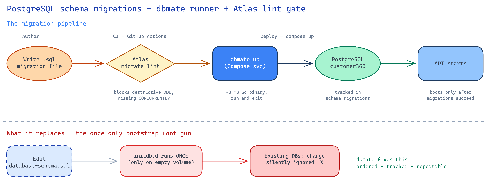

# SQL Migration Tooling — Recommendation

**Project:** LEO Customer 360 · **DB:** PostgreSQL 16 (PostGIS + pgvector) · **Deploy:** Docker Compose · **Date:** 2026-08-24 · **Status:** Proposal

---

## TL;DR

> **Run migrations with [`dbmate`](https://github.com/amacneil/dbmate); gate them in CI by applying + replaying on an ephemeral Postgres (idempotency).**

Both are single Go binaries that run-and-exit — ideal for our Docker Compose setup on VNG Cloud VMs.



*Top: the new pipeline. Bottom: the once-only `initdb.d` bootstrap it replaces.*

---

## The problem

Our schema is bootstrapped by Postgres' `/docker-entrypoint-initdb.d`, which **runs once — only on an empty volume**. Any later change to `database-schema.sql` is **silently ignored on existing databases** (dev, UAT, prod). We're already patching around this by hand (`database-init/migrations/001_harden_tenant_rls_policies.sql`).

A migration tool fixes it: **ordered, tracked, repeatable** SQL changes with a "where is this DB now" pointer.

---

## Why dbmate (and not the obvious alternatives)

Our schema is **raw SQL** — 63 tables with RLS tenant policies, PostGIS, pgvector, `CREATE EXTENSION`, and `DO $$` blocks. That single fact decides the tool:

| Tool | Runtime | RAM/run | Image | Verdict |
|---|---|---|---|---|
| **dbmate** | Go binary | ~30–80 MB | **~8 MB** | ✅ **Runner** — runs our raw SQL verbatim; maps to `NNN_*.sql`; run-and-exit |
| Atlas *(lint)* | Go binary | ~30–80 MB | ~60 MB | ⚠️ **evaluated, not adopted** — `migrate lint` is Pro-only since v0.38, and its dev-replay chokes on our DML/RLS/DO-block migrations (same misfit as using it to run) |
| Alembic | Python | ~60–120 MB | in-app | ❌ autogenerate needs SQLAlchemy **models**; can't model RLS/PostGIS/pgvector — you'd write raw SQL in Python for zero gain |
| Flyway / Liquibase | JVM | 200–400 MB | ~250–300 MB | ❌ JVM footprint contradicts our least-RAM goal; best features are paid |

**Alembic** is the "obvious" Python pick — declined on purpose: our schema isn't in ORM models, so its headline feature has nothing to work with. **Flyway/Liquibase** are excellent but JVM-heavy — the one thing we're optimizing against.

---

## How it fits our repo

**Directory** — promote the folder we already started into a dbmate tree:

```
database-init/db/
├── README.md             # runbook
├── schema.sql            # dbmate-generated snapshot (dbmate dump; commit the diff)
└── migrations/
    ├── 20260824090000_baseline_schema.sql             # = database-schema.sql (frozen baseline)
    ├── 20260824090100_harden_tenant_rls_policies.sql  # = existing 001_*.sql, re-headed
    ├── 20260824090200_seed_core_data.sql              # = init-core-database.sql (idempotent seed)
    └── 20260824090300_data_views.sql                  # = data-view-for-llm.sql (materialized views)
```

> **Status: implemented (dev + prod).** The `migrate` service is wired into
> `docker-compose.yml` and gates `api` / `dagster` / `cir-demo-seed`; CI has a
> `migrations` job that applies from zero **and** replays on a populated DB to
> assert idempotency (both blocking). **Atlas lint was dropped** — it went
> Pro-only in v0.38 and, more fundamentally, its dev-replay chokes on our
> DML-heavy / RLS / DO-block migrations (the same reason Atlas isn't the runner).
> The Terraform/bastion **prod path**
> (`deployments/postgres/run-sql.sh`) now applies the app schema with dbmate **on
> the bastion** (extensions/keycloak-db stay on psql). Verified locally: all four
> migrations apply from zero, re-run is a clean no-op, and rollback is guarded
> against accidental data loss. See `database-init/db/README.md`.

**Migration file** — plain SQL with up/down markers:

```sql
-- migrate:up
ALTER TABLE customer360.cdp_master_profiles ADD COLUMN loyalty_tier VARCHAR(20);
-- migrate:down
ALTER TABLE customer360.cdp_master_profiles DROP COLUMN loyalty_tier;
```
> Concurrent index? Add `-- migrate:up transaction:false` (it cannot run inside a transaction).

**Docker Compose** — a one-shot `migrate` service that runs before the API and exits:

```yaml
  migrate:
    image: ghcr.io/amacneil/dbmate:2
    depends_on:
      postgres: { condition: service_healthy }
    environment:
      DATABASE_URL: "postgres://${DB_USER:-postgres}:${DB_PASSWORD}@postgres:5432/${DB_NAME:-customer360}?sslmode=disable&search_path=customer360"
    volumes:
      - ./database-init/db:/db:ro
    command: ["up"]
    restart: "no"

  customer360-api:
    depends_on:
      migrate: { condition: service_completed_successfully }   # API waits for migrations
```

**CI (GitHub Actions)** — the `migrations` job builds the postgres image, applies from zero on an ephemeral Postgres, then wipes tracking and replays on the populated DB asserting `0 pending` (idempotency). Both blocking.

**Baseline** — our DDL already uses `IF NOT EXISTS`, so the baseline migration is naturally idempotent: `dbmate up` once on existing DBs seeds `schema_migrations` as a no-op; fresh DBs build from zero. Then remove the schema files from `initdb.d` (keep only extensions).

**Scope:** `customer360` → dbmate. **`db_keycloak` → leave alone** (Keycloak self-migrates). `ads-server` → its own migrations dir.

> **Future (K8s):** if we move to VKS, the same image runs as a k8s `Job` / initContainer — no change to the migration files.

---

## Rollout (incremental, revertible)

1. **Baseline** — convert `database-schema.sql` → first migration; re-head `001_*.sql`.
2. **Local** — add the Compose `migrate` service; verify a fresh volume builds identical schema.
3. **Stop double-init** — drop schema from `initdb.d` (keep extensions).
4. **Existing envs** — `dbmate up` once on dev → UAT (idempotent no-op seeds tracking).
5. **CI** — apply-from-zero + idempotency replay on an ephemeral Postgres (both blocking).
6. **CD** — run the `migrate` service before the API on deploy.

---

## Runbook

```bash
dbmate new add_loyalty_tier    # scaffold a timestamped up/down migration
dbmate up                      # apply all pending
dbmate down                    # roll back the last (dev)
dbmate status                  # show pending
dbmate dump                    # refresh committed schema.sql (commit the diff)
```

**Rules:** migrations are append-only (never edit an applied one); every `up` needs a real `down`; commit `schema.sql` with each migration; never manage Keycloak's DB.

---

## References
[dbmate](https://github.com/amacneil/dbmate) · [Atlas lint](https://atlasgo.io/versioned/lint) · [Postgres init scripts](https://hub.docker.com/_/postgres) · [PostgreSQL RLS](https://www.postgresql.org/docs/16/ddl-rowsecurity.html)
