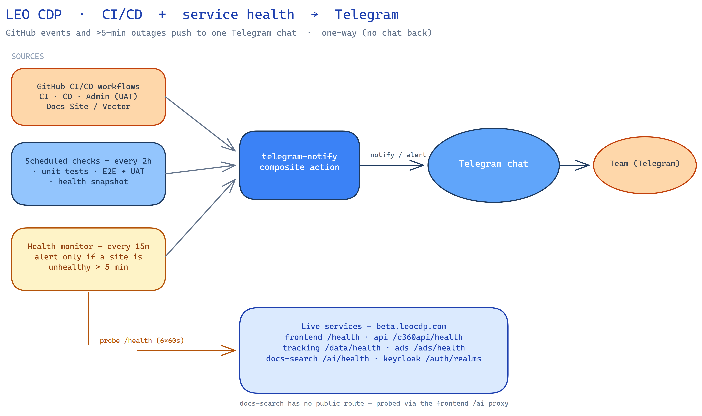

# CI/CD → Telegram notifications + service health alerts

Plan and reference for the Telegram tooling added to `leo-customer360`: push every
CI/CD event to Telegram, run tests on a schedule, and alert when any live service
stays unhealthy for more than 5 minutes.

> The LLM chat bot is **out of scope for now** and has been removed. The Telegram
> bot token is used one-way here — workflows push messages; nothing chats back.



Source: [`cicd-telegram-chatbot.excalidraw`](./cicd-telegram-chatbot.excalidraw)

## Goals

1. **Notify all CI/CD events to Telegram** — every start and finish of the
   platform workflows lands in a Telegram chat.
2. **Scheduled tests every 2 hours** — unit tests + E2E against UAT, reported to
   the same chat.
3. **Health alerting** — probe all public services; if any stays unhealthy for
   **more than 5 minutes**, alert Telegram naming exactly which are down.

## Components

| Component | Path | Role |
| --- | --- | --- |
| Telegram notify action | `.github/actions/telegram-notify/action.yml` | Composite action; the single place that calls the Telegram Bot API. No-ops with a warning when secrets are missing (never fails a job). |
| CI/CD notifier | `.github/workflows/telegram-cicd-notify.yml` | `workflow_run` fan-in over all CI/CD workflows (`requested` + `completed`) → Telegram. |
| Scheduled checks | `.github/workflows/scheduled-checks.yml` | `cron: 0 */2 * * *`: unit tests + E2E → UAT + a health snapshot, one summary → Telegram. |
| Health monitor | `.github/workflows/health-monitor.yml` | `cron: */15`: probes all services; alerts Telegram only when a URL is unhealthy **> 5 min**. |

### 1. Composite action — `telegram-notify`

One reusable step used by all three workflows. Inputs: `bot-token`, `chat-id`,
`message`. It URL-encodes the text, truncates to Telegram's 4096-char limit, and
posts to `sendMessage`. Missing token/chat id → warning + skip, so PRs from forks
(which lack secrets) don't turn red.

### 2. CI/CD notifier — `telegram-cicd-notify.yml`

Triggered by `workflow_run` on the workflows named in its list. **The names must
match each workflow's `name:` field, not its filename** — currently:

```
CI · CD · Admin (UAT) · Docs Site · Docs Vector Refresh
```

Fires on `requested` (start) and `completed` (finish); the finish message shows
the conclusion (success / failure / cancelled) with an icon. To cover a new
workflow, add its `name:` to the list — no edit needed in the workflow itself.
`Scheduled checks` and `Health monitor` are deliberately **not** in the list —
they post their own messages, so adding them would double-message.

### 3. Scheduled checks — `scheduled-checks.yml`

Single job, so the whole run collapses to one Telegram summary:

1. **Unit tests** — runs the same runner set CI gates on (`ads-server`,
   `customer360-api`, `customer360-event-api`, `identity_resolution`, `segmentation`,
   `docs-vector-search`). Each runner self-provisions its venv.
2. **E2E → UAT** — mirrors CI's E2E leg against `https://beta.leocdp.com/c360api`;
   skips cleanly when the Keycloak secrets aren't set.
3. **Health snapshot** — `curl` each service URL once; non-200 = fail.

The job fails (red run) if anything failed, and posts pass/fail per item to
Telegram. Also runnable on demand (`workflow_dispatch`).

### 4. Health monitor — `health-monitor.yml`

Runs every 15 minutes and alerts **only on sustained downtime**, so a transient
blip never pages anyone.

- **Round 0** — probe every URL once; collect the non-200 set.
- **Confirmation** — re-probe *only* that set every 60s for 6 rounds (~6 min
  elapsed). A URL that returns 200 in **any** round is dropped as a blip.
- **Alert** — whatever is still down after the >5-min window is sent to Telegram,
  each URL with its current status code. All-healthy runs send nothing.

No cross-run state is needed — the ">5 min" is measured *inside* one run by the
6-round window. During an ongoing outage each 15-min cycle re-alerts (keeps it
visible); add a dedup marker later if that's too noisy.

## Telegram message format

Every message leads with a status icon — Telegram can't colour text, so the emoji
*is* the colour cue. The icon is set by the composite action's `status` input:

| Status | Icon | When |
| --- | --- | --- |
| `start` | 🔵 | a workflow started |
| `success` | ✅ | a workflow passed / all checks green |
| `failure` | ❌ | a workflow failed, or a check / service is down |
| `warning` | ⚠️ | cancelled / skipped / other non-success |
| `info` | ℹ️ | default (anything else) |

Any state that is **not** `start` or `success` carries a **`Reason:`** line — and,
for the scheduled checks and health monitor, the per-item ✅/❌ breakdown — so the
message says *why*, not just *that* something is off:

- **CI/CD notifier** — `Reason: concluded 'failure' (push on main) — open the run…`
- **Scheduled checks** — `Reason: failed leg(s): unit health — see details below`, then per-suite/URL ✅/❌.
- **Health monitor** — the ❌ list of URLs still failing after the >5-min window.

## Health-check URLs

Default set (all public services fronted by Caddy on `beta.leocdp.com`, each
verified `200`):

| Service | URL |
| --- | --- |
| customer360-frontend (UI) | `https://beta.leocdp.com/health` |
| customer360-api | `https://beta.leocdp.com/c360api/health` |
| customer360-event-api | `https://beta.leocdp.com/data/health` |
| ads-server | `https://beta.leocdp.com/ads/health` |
| docs-vector-search (via frontend `/ai` proxy) | `https://beta.leocdp.com/ai/health` |
| Keycloak (SSO realm) | `https://beta.leocdp.com/auth/realms/customer360` |

Override with the repo variable `HEALTH_CHECK_URLS` (space/newline-separated) —
both the scheduled checks and the health monitor read it.

> **docs-vector-search** has no public route of its own (private `docs` box,
> reached via SSH/tunnel). The customer360-frontend proxies it at `/ai/*`, so
> `…/ai/health` forwards to the service's `/health` — returns `200` when it's up
> and `502` when it's unreachable, which is exactly what a health probe wants.

**Deliberately excluded** (would false-alarm a plain 200 probe):
- Ops dashboards (Dagster `:3000`, Portainer `:9443`, Netdata `:19999`, pgAdmin
  `:5050`, Jaeger `/jaeger`) — on the raw LB IP behind SSO / self-signed TLS, so
  they return 302/redirect or fail cert validation. Monitor these via Portainer /
  Netdata themselves, not an HTTP 200 probe.

## Configuration

### GitHub repo secrets

| Secret | Used by | Purpose |
| --- | --- | --- |
| `TELEGRAM_BOT_TOKEN` | all three workflows | Bot token from @BotFather |
| `TELEGRAM_CHAT_ID` | all three workflows | Destination chat/channel id(s) — one, or many separated by comma / semicolon / whitespace / newline; the message is sent to each |
| `KEYCLOAK_CLIENT_SECRET`, `KC_TEST_USER_PASSWORD` | scheduled checks | Enable the E2E leg (already provisioned for CI) |

### GitHub repo variables (optional)

| Variable | Default | Purpose |
| --- | --- | --- |
| `HEALTH_CHECK_URLS` | the URLs above | Space/newline-separated health endpoints |
| `E2E_*`, `E2E_ALLOW_DATA_WRITES` | same as CI | E2E knobs |

## Setup

1. **Create the bot**: message @BotFather → get `TELEGRAM_BOT_TOKEN`.
2. **Find the chat id**: send the bot a message, open
   `https://api.telegram.org/bot<TOKEN>/getUpdates`, read `chat.id`.
3. **Add repo secrets** `TELEGRAM_BOT_TOKEN` + `TELEGRAM_CHAT_ID` — the three
   workflows start notifying on their next run.

## Design notes (kept intentionally simple)

- **One curl, one place.** The composite action is the only Telegram caller;
  all workflows reuse it.
- **Fan-in over editing every workflow.** `workflow_run` catches all CI/CD
  workflows centrally — no per-workflow notify steps to maintain.
- **Sustained-downtime alerting without a datastore.** The >5-min rule is a
  6-round in-run confirmation window, not cross-run state — nothing to persist.
- **Plain-text messages.** No MarkdownV2 escaping — robust over pretty.
- **Health probes are HTTP-only.** For per-container health, `admin-uat.sh`
  (`db-status`) and the Portainer/Netdata dashboards already exist.
