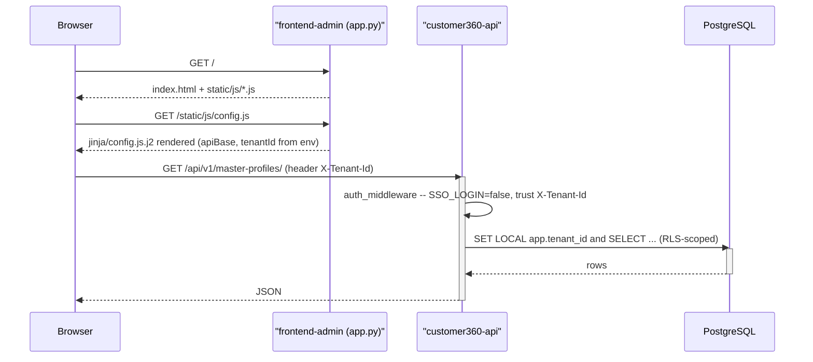

# Customer 360 frontend (static HTML)

`index.html` is a slim shell for a single-page admin (Tailwind CSS + jQuery 3 +
Handlebars templates, all via CDN) that mirrors
`../ui-wireframes/customer-360-profile-details.png`: a searchable master-profile
list and a profile detail dashboard (overview, attributes/segments, engagement
summary, cross-channel activity, timeline, scoring, personalized items). All
data is fetched live from `customer360-api` (FastAPI) which reads PostgreSQL --
nothing is hardcoded in the HTML.

`app.py` is a tiny FastAPI app that just serves this static site (see
[Run](#run) below); it does not talk to the database itself.

## Structure

```
app.py                      FastAPI app that serves index.html + static/ (see Run)
jinja/config.js.j2          Jinja2 template for static/js/config.js, rendered by app.py so
                            FRONTEND_API_HOSTNAME/FRONTEND_TENANT_ID (.env) are baked in
index.html                 slim shell: CDN <script>/<link> tags + empty mount points
static/css/app.css          small CSS additions on top of the Tailwind CDN build
static/js/config.js          API base/tenant config (localStorage) + ajax client
static/js/formatters.js      display formatters, label maps, badge-class helpers
static/js/templates.js       fetches + compiles every static/templates/*.html file
static/js/router.js          small React-Router-style hash router (path patterns, params, redirects)
static/js/list-view.js       Master Profiles list (search/filter/pagination); owns "/profiles"
static/js/profile-detail-view.js Profile detail dashboard (view-model building + loads); owns "/profiles/:id"
static/js/overview-view.js   Reporting overview dashboard; owns "/overview"
static/js/segments-view.js   Segments (Audience Builder) list + detail; owns "/segments", "/segments/:id"
static/js/placeholder-view.js "not implemented yet" routes for journeys, scoring, analytics, data sources, admin
static/js/main.js            bootstraps templates, chrome (tabs/settings modal), starts the router
static/templates/tabs.html               header + nav bar (static)
static/templates/settings-modal.html     API base/tenant settings dialog (static)
static/templates/profiles-list.html      Master Profiles list shell (static)
static/templates/placeholder.html        "not implemented" shell for other nav tabs
static/templates/profiles-rows.html      Handlebars: list <tr> rows
static/templates/profile-details.html    Handlebars: detail grid, includes the partials below
static/templates/identity.html           partial: left profile identity card
static/templates/channels.html           partial: channels & identifiers card
static/templates/overview.html           partial: Profile Overview card
static/templates/segments.html           partial: Attributes & Segments card
static/templates/engagement.html         partial: Engagement Summary card
static/templates/activity.html           partial: Cross-Channel Activity card
static/templates/timeline.html           partial: Timeline card
static/templates/scoring.html            partial: Scoring & Value card
static/templates/personalized-items.html partial: Personalized Items card shell
static/templates/content-items.html      Handlebars: personalized item cards list
```

Each card in the profile detail dashboard is its own template file (registered
as a Handlebars partial by `static/js/templates.js` and included from
`profile-details.html` via `{{> name}}`), so adding/editing a single card never
requires touching the others.

## Admin & API session / auth flow

This UI is a thin, unauthenticated static client -- **it does not implement a
login screen itself**. All session/auth handling actually happens in
`customer360-api` (see `../customer360-api/core/auth.py`), gated by that
service's `SSO_LOGIN` setting (`../customer360-api/.env` /
`core/config.py`):

- **`SSO_LOGIN=false` (local/dev -- the repo default).** There is no login.
  Every request this UI makes just carries an `X-Tenant-Id` header (see the
  `api()` helper in `static/js/config.js`), which `customer360-api` trusts
  directly (`core/auth.py::_apply_dev_tenant_headers`) to set the Postgres
  `app.tenant_id` session variable that Row-Level Security policies key off
  (see `database-schema.sql`). The "Admin" button (top right) opens
  `static/templates/settings-modal.html`, where you edit the API base URL and
  tenant id; `C360.config.save()` persists them to `localStorage`
  (`c360.apiBase` / `c360.tenantId`) and reloads the page. That's the entire
  "session management" this frontend has today -- a tenant selector, not a
  login.

- **`SSO_LOGIN=true` (production).** `customer360-api` requires every
  request except `/health` to carry `Authorization: Bearer <token>`. The
  token is validated against Keycloak's introspection endpoint and cached in
  Redis for its remaining TTL (`auth:token:<token>` --
  `_introspect_with_keycloak`/`_cache_token`), then `(tenant_id, user_id)` is
  resolved either from custom claims on the token or by looking up/
  auto-provisioning a `sys_user` row keyed by the token's `sub` claim
  (`_get_or_create_user_on_login`); that resolved identity is itself cached
  in Redis for 5 minutes (`auth:identity:<sub>`) so it isn't re-derived on
  every call. **This frontend does not yet drive that flow** -- there's no
  Keycloak redirect/login page and no bearer-token storage here. Wiring it
  up means: adding a login step (redirect to Keycloak, handle the callback,
  store the access token), then adding an `Authorization` header next to
  `X-Tenant-Id` inside `api()` in `static/js/config.js`. Every view module
  calls that one function for its ajax requests, so it's the single choke
  point for auth headers -- the natural home for a real login page is the
  already-registered (placeholder) `/admin/users` route, see
  [Routing](#routing-how-it-works-and-how-to-add-a-new-view) below.

What actually runs today end to end (dev mode):



## Routing: how it works, and how to add a new view

The whole UI is one `index.html` page; navigation is a small,
React-Router-inspired hash router (`static/js/router.js`) -- same idea as
`<Route path="...">` + params, just implemented with plain jQuery and no
build step.

- A **path** looks like a React Router path: `"/segments"`,
  `"/segments/:id"` (`:id` is captured as a param).
- Every view module registers the path(s) it owns with
  `C360.router.define(pattern, config)` **at script-load time**. `main.js`
  never lists individual views -- that's the whole point: adding a view
  never touches `main.js` or `router.js`.
- `config` is `{ section, tab, mount }`:
  - `section`: id of the `<section>` this route renders into. The router
    remembers every section id ever registered and hides all-but-the-
    active-one on every navigation, so nobody maintains a hand-written
    "hide every other view" list.
  - `tab`: which nav button (`data-tab`) to highlight while the route is active.
  - `mount(params)`: called to actually load/render the view.
- `C360.router.redirect(fromPath, toPath)` covers a tab whose real content
  lives one level down (e.g. `/datasources` -> `/datasources/connectors`).
- `C360.router.navigate(path)` changes `location.hash`, which re-matches and
  mounts the new route -- this is how row clicks/back buttons navigate,
  instead of code directly toggling elements.

**Real example** -- the Segments list + detail routes, from the bottom of
`static/js/segments-view.js` (registered after `load`/`showDetail` are
defined earlier in the file):

```js
// Owns the "/segments" (list) and "/segments/:id" (detail) routes. Both
// share the single "view-segments" section; showList()/showDetail() toggle
// the two sub-panels nested inside it, the same way a React Router layout
// route renders a child <Outlet/>.
C360.router.define("/segments", {
  section: "view-segments",
  tab: "segments",
  mount: function () { load(); }
});
C360.router.define("/segments/:id", {
  section: "view-segments",
  tab: "segments",
  mount: function (params) { showDetail(params.id); }
});
```

and navigating into the detail route, from that same file's `bindEvents()`:

```js
$(document).on("click", ".segment-row", function () {
  C360.router.navigate("/segments/" + $(this).data("id"));
});
```

**Adding a brand new view** (e.g. turning the "Scoring Models" placeholder
into a real listing + detail view -- `static/js/placeholder-view.js`
currently owns `/scoring` and `/scoring/:id` as placeholders):

1. Create `static/js/scoring-view.js` modeled on `segments-view.js`: a
   `load()`/`loadList()` that calls `C360.config.api(...)` and renders a
   Handlebars template into a new `<section id="view-scoring">` in
   `index.html` (add the section + its shell template under
   `static/templates/`, same pattern as `view-segments`/`segments-list.html`).
2. At the bottom of that file, register its routes:
   ```js
   C360.router.define("/scoring", { section: "view-scoring", tab: "scoring", mount: load });
   C360.router.define("/scoring/:id", { section: "view-scoring", tab: "scoring", mount: function (p) { loadDetail(p.id); } });
   ```
3. Delete the two `/scoring*` entries from the `ENTRIES` array in
   `static/js/placeholder-view.js` (they'd otherwise never match, since
   `placeholder-view.js` loads after `scoring-view.js` -- see next step --
   and the router uses first-match-wins).
4. Add `<script src="static/js/scoring-view.js"></script>` to `index.html`
   (anywhere after `router.js`; order among view modules doesn't matter) and
   call `C360.scoringView.bindEvents()` from `main.js`'s bootstrap, next to
   the other `bindEvents()` calls.

No changes to `router.js` or the tab-click handling in `main.js` are ever
needed for a new view -- the route table living inside each view's own file
is the entire mechanism.

## Run

1. Start `customer360-api` (see `../customer360-api/start.sh`) so it's listening on
   `http://localhost:8000`.
2. Start this app with `./start.sh` (installs/reuses a venv, then runs
   `uvicorn app:app` on `http://localhost:8890`, backgrounded; logs to
   `logs/app.log`, PID in `.uvicorn.pid`). Stop it with `./stop.sh`, or
   restart with `./restart.sh`. `FRONTEND_API_HOSTNAME`/`FRONTEND_TENANT_ID`
   (from `.env`, see `../.env`) are baked into `static/js/config.js` on every
   request by `app.py` (via `jinja/config.js.j2`) -- must be a hostname
   reachable from the **browser**, not just this container.

   Alternatively, serve the folder with any plain static file server (opening
   via `file://` will be blocked by the browser's CORS policy for the
   `static/templates/*.html` and API `fetch`/XHR calls); `static/js/config.js`
   on disk has hardcoded defaults for exactly this case:
   ```bash
   cd core-customer360/frontend-admin
   python3 -m http.server 8890
   ```
3. Open `http://localhost:8890/index.html`, then click the "Admin" button
   (top right) to change the API base URL or the `X-Tenant-Id` dev header
   (used for Postgres Row-Level Security when `SSO_LOGIN=false`) if your
   setup differs from the defaults -- see
   [Admin & API session / auth flow](#admin--api-session--auth-flow) above.

