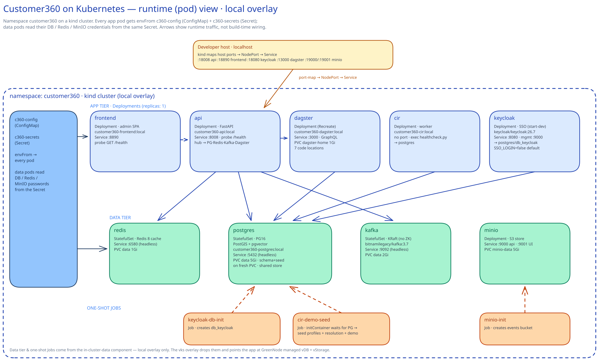

# Customer360 on Kubernetes

Run the **entire** Customer360 stack — Postgres, Redis, Kafka, Keycloak, MinIO,
the API, the Dagster backend workers, the CIR worker, and the admin frontend —
on a local Kubernetes cluster, then reuse the same manifests to deploy the app
tier on **GreenNode VKS** against the managed data tier from `../terraform`.

Kustomize (`base` + `components` + `overlays`), mirroring the `terraform/`
environment pattern.

## Prerequisites

- **Docker**, **[kind](https://kind.sigs.k8s.io/)**, **kubectl** on PATH.
- Windows: run the scripts from **Git Bash** or **WSL** (they are `.sh`).

## Quick start (local)

```bash
cd k8s
cp overlays/local/secret.env.example overlays/local/secret.env   # edit if you like (dev values are fine)
./scripts/up.sh
```

`up.sh` creates the kind cluster, builds + loads the images, applies
`overlays/local`, waits, and prints the URLs:

| Service | URL | Notes |
|---|---|---|
| API (FastAPI) | http://localhost:8008/docs | health `/health` |
| Frontend admin | http://localhost:8890 | |
| Keycloak | http://localhost:8080 | admin console |
| Dagster | http://localhost:3000 | UI + GraphQL |
| MinIO | http://localhost:9000 / :9001 | S3 API / console |

Tear down (destroys local data): `./scripts/down.sh`.

## Layout

```
k8s/
├── kind/cluster.yaml            # kind node with host port-maps for the NodePorts
├── scripts/{up,down,build-load}.sh
├── base/                        # app tier (env-agnostic)
│   ├── api, frontend, dagster, cir, keycloak (+ db-init Job), config, namespace
│   └── kustomization.yaml
├── components/
│   └── in-cluster-data/         # postgres, redis, kafka, minio (+seed) — opt-in
└── overlays/
    ├── local/                   # base + in-cluster-data + NodePorts + :local images
    └── vks/                     # base + managed endpoints + Ingress + registry images
```

## Diagrams

### How Kustomize builds each environment


`base/` (the env-agnostic **app tier**) is reused by both overlays. `overlays/local`
additionally pulls in the `in-cluster-data` **component** and patches in NodePorts +
`:local` images; `overlays/vks` omits that component, adds an Ingress, and repoints
the images at a registry. `kubectl apply -k overlays/<env>` merges base (+ patches +
images + secret) and applies the rendered manifests to the target cluster.
*(Source: [`docs/kustomize-flow.excalidraw`](docs/kustomize-flow.excalidraw) — drop it into [excalidraw.com](https://excalidraw.com) to edit.)*

### Runtime (pod) view — local overlay



Inside the `customer360` namespace, the **app tier** (Deployments, `replicas: 1`)
sits above the **data tier** (StatefulSets + MinIO). `api` is the hub — it reaches
Postgres, Redis, Kafka and Dagster's GraphQL; `cir`, `dagster` and `keycloak` all
share **Postgres** as the system of record. `c360-config` + `c360-secrets` are
injected into every pod via `envFrom`. The host reaches Services through kind's
port-map → NodePort chain, and three one-shot **Jobs** create `db_keycloak`, the
MinIO bucket, and the demo data. The data tier and Jobs exist **only** in the local
overlay — `vks` drops them and points the app at the managed vDB + vStorage.
*(Source: [`docs/pod-view.excalidraw`](docs/pod-view.excalidraw).)*

## local vs vks

| | `overlays/local` | `overlays/vks` |
|---|---|---|
| Data tier | in-cluster (component) | **GreenNode managed vDB + vStorage** (`../terraform`) |
| Images | `:local`, `kind load`ed | pushed to a container registry |
| Access | NodePorts → localhost | Ingress + TLS |
| Auth | `SSO_LOGIN=false` (header auth) | `SSO_LOGIN=true` |
| Secrets | dev values | match the managed services |

## Init & seed behavior

- **DB schema + core seed** are baked into `customer360-postgres:local` and run
  **only on a fresh PVC** (empty data dir). To re-init: `down.sh` (or delete the
  `data-postgres-0` PVC) and bring up again.
- **`keycloak-db-init`** Job creates the `db_keycloak` database (idempotent).
- **`minio-init`** Job creates the events bucket.
- **`cir-demo-seed`** Job loads demo profiles → identity resolution → full demo data.
- **Auth is off by default** (`SSO_LOGIN=false`) so the API accepts
  `X-Tenant-Id` / `X-User-Id` headers — Keycloak still runs, but there is **no
  automated `leocdp` realm/client seed**; create it manually if you set SSO on.

## Common ops

```bash
kubectl -n customer360 get pods
kubectl -n customer360 logs -f deploy/api          # or dagster / cir / frontend
kubectl -n customer360 rollout restart deploy/api
kubectl apply -k overlays/local                    # re-apply after edits
```

## Deploy to GreenNode VKS

1. Provision the managed data tier with `../terraform` (vDB + vStorage).
2. Build the app images and push to your registry; set them in
   `overlays/vks/kustomization.yaml` (`images:` → `newName`/`newTag`).
3. Fill `overlays/vks/patch-config.yaml` (managed DB/Redis/Kafka hosts, S3
   endpoint, public URLs) and `overlays/vks/secret.env` (matching the terraform
   passwords + vStorage S3 key).
4. Set your `ingressClassName`, hostnames and TLS in `overlays/vks/ingress.yaml`.
5. `kubectl apply -k overlays/vks` against your VKS kubeconfig.

The `vks` overlay omits the in-cluster data component, so Postgres/Redis/Kafka/
MinIO are **not** deployed — the app points at the managed services instead.

## Notes / gotchas

- The Dagster image is built from a **new `backend-system/Dockerfile`** (there
  was no compose service for it) running `dagster dev` with the 7 workspace code
  locations; `DAGSTER_HOME` is on a PVC.
- `FRONTEND_API_HOSTNAME` and the Keycloak hostname are **browser-facing** —
  they must be host/public URLs, not in-cluster service names (already handled
  per overlay).
- Managed Redis on vDB does **not** use port 6580 (that's the local image's
  port) — set the real managed port in `overlays/vks/patch-config.yaml`.
- `secret.env` files are gitignored; only `*.example` are committed.
```
